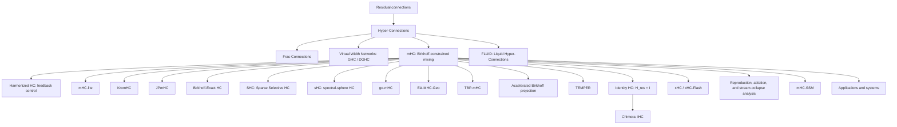

# Awesome Hyper-Connections

A curated and audited reading list for **Hyper-Connections (HC)**, **Manifold-Constrained Hyper-Connections (mHC)**, and closely related multi-residual-stream architectures.

本仓库聚焦 Zhu et al. 提出的 residual-stream Hyper-Connections 谱系：HC、Frac-Connections、GHC/DGHC、mHC、Identity HC/iHC、xHC，以及围绕流形约束、精确参数化、稳定性、系统优化、机制分析和下游应用的后续工作。

> **Last audited:** 2026-08-14
>
> **Coverage:** 61 deduplicated publication items under the policy below: 41 papers that directly develop, analyze, or materially apply HC/mHC, plus 20 adjacent/adoption or formal comparison items in a separate section. Repositories, models, framework integrations, tutorials, and discussions are tracked separately; this snapshot references 112 unique GitHub repository roots, which are not counted as papers.
>
> **Important limitation:** the publication tables are a dated, source-verified snapshot—not a promise of absolute exhaustiveness. Code, model, package, tutorial, and discussion sections are curated discovery aids rather than exhaustive registries: new artifacts can appear continuously, indexes lag, and some models expose HC only in source code or configuration. Please open an issue or PR with a primary source when something is missing.

## Contents

- [Inclusion policy](#inclusion-policy)
- [Background and notation](#background-and-notation)
- [Research lineage](#research-lineage)
- [1. Foundational and core architecture papers](#1-foundational-and-core-architecture-papers)
- [2. Direct mHC parameterizations, constraints, and systems work](#2-direct-mhc-parameterizations-constraints-and-systems-work)
- [3. Mechanistic and representation analysis](#3-mechanistic-and-representation-analysis)
- [4. Architectures, finetuning, inference, and domain applications](#4-architectures-finetuning-inference-and-domain-applications)
- [5. Adjacent and adoption papers](#5-adjacent-and-adoption-papers)
- [Identity HC / iHC provenance](#identity-hc--ihc-provenance)
- [Method comparison](#method-comparison)
- [Current frontier](#current-frontier)
- [Suggested reading order](#suggested-reading-order)
- [Implementations](#implementations)
- [Ecosystem integrations](#ecosystem-integrations)
- [Models, tutorials, and discussions](#models-tutorials-and-discussions)
- [Audit method and known exclusions](#audit-method-and-known-exclusions)
- [Contributing](#contributing)

## Inclusion policy

### Included in the main count

A paper is included when at least one of the following is true:

1. it proposes a new HC/mHC-family connection rule, constraint, parameterization, or systems implementation;
2. it directly analyzes the behavior of HC/mHC residual streams;
3. HC/mHC is a material architectural contribution in the paper rather than a passing baseline;
4. it adapts HC/mHC to a new training regime, inference algorithm, or application domain.

### Separated as adjacent/adoption

Papers are placed in the adjacent section when HC/mHC is important to the experiment or model, when the paper formalizes a broader residual question that explicitly covers HC/mHC, or when it reports a substantive controlled comparison against HC/mHC, but its main contribution is broader than hyper-connections.

### Code and resource labels

- **Author/paper code** is linked by the paper, author, or research group, or clearly hosts the experiments for that paper.
- **Independent implementation** is a third-party reimplementation or extension and is never presented as official code.
- **Ecosystem integration** is HC/mHC support inside a larger training, inference, or kernel framework.
- Forks and mirrors are deduplicated to their upstream repository. Empty repositories, “coming soon” placeholders, and copied single-file stubs without meaningful documentation are omitted.

### Excluded

- papers that only cite HC/mHC;
- unrelated uses of “hyperconnection,” “hyper-connected,” or “HC”;
- hypergraph, networking, neuroscience, and database papers that do not descend from the residual-stream formulation;
- blog posts, social-media experiments, and implementation notes without a formal paper. These may be mentioned for provenance, but are not counted as papers.
- automatically generated research artifacts without stable authorship or independent scholarly review; two such FARS outputs found during the audit are documented below but are not counted.
- model cards, repositories, package pages, tutorials, and technical blogs without a formal paper; these are tracked as resources, not publication items.

## Background and notation

A convenient generic form of the HC-family update is

```text
X_(l+1) = H_res,l X_l + H_post,l^T F_l(H_pre,l X_l),
```

where `X_l` contains `n` parallel residual streams:

- `H_pre` reads and aggregates information from the streams before the Transformer sublayer;
- `H_post` writes the transformed output back to the streams;
- `H_res` transports and mixes residual-stream states across depth.

The literature repeatedly revisits four questions:

1. How many residual streams should be maintained?
2. How should a sublayer read from and write to those streams?
3. What constraint on `H_res` prevents exploding, vanishing, or homogenizing matrix products?
4. How can expanded residual state and dynamic routing be implemented without becoming memory-bandwidth bound?

## Research lineage



## 1. Foundational and core architecture papers

| First public date | Paper | Contribution | Status |
|---|---|---|---|
| 2024-09-29 | **[Hyper-Connections](https://arxiv.org/abs/2409.19606)** — Defa Zhu et al. · [OpenReview](https://openreview.net/forum?id=9FqARW7dwB) | Introduces multiple residual streams and learnable/static or dynamic read, write, and residual-transition mappings. Motivated by the PreNorm/PostNorm trade-off between representation collapse and gradient vanishing. | ICLR 2025 |
| 2025-03-18 | **[Frac-Connections: Fractional Extension of Hyper-Connections](https://arxiv.org/abs/2503.14125)** — Defa Zhu et al. | Partitions an existing hidden state instead of expanding it to `nC`; retains part of HC's routing benefit with substantially lower hidden-state and memory-access overhead. This is the formal paper usually meant by “fraction-HC.” | arXiv preprint |
| 2025-11-14 | **[Virtual Width Networks](https://arxiv.org/abs/2511.11238)** — Seed et al. | Decouples virtual representation width from backbone width and develops generalized/dynamic generalized hyper-connections (GHC/DGHC) for routing between the expanded virtual state and fixed-width backbone. | arXiv preprint |
| 2025-12-31 | **[mHC: Manifold-Constrained Hyper-Connections](https://arxiv.org/abs/2512.24880)** — Zhenda Xie et al. · [ICML/OpenReview version](https://openreview.net/forum?id=mDhyxu8WRb) | Constrains dynamic residual mixing to the Birkhoff polytope of doubly stochastic matrices through Sinkhorn-Knopp normalization and adds large-scale systems optimizations. | ICML 2026 · PMLR 306 |
| 2026-07-16 | **[xHC: Expanded Hyper-Connections](https://arxiv.org/abs/2607.14530)** — Xiangdong Zhang et al. | Makes residual-stream count a practical scaling axis beyond the common `N=4`: temporal feature augmentation enriches write-back, sparse updates modify `k=4` of `N=16` streams, and xHC-Flash reduces memory traffic. | arXiv technical report |
| 2026-07-30 | **[Chimera: Designing and Chinchilla-Scaling Hybrid Visual Diffusion Transformers](https://arxiv.org/abs/2607.28611)** — Chongjian Ge et al. | Formalizes and deploys **Identity Hyper-Connections (iHC)** in a visual diffusion Transformer: `H_res` is fixed to identity while adaptive cross-stream read/write remains. | arXiv preprint |

## 2. Direct mHC parameterizations, constraints, and systems work

| First public date | Paper | What changes relative to mHC? | Status |
|---|---|---|---|
| 2026-01-07 | **[Harmonized Hyper-Connections: Stabilizing Residual Transport Through Feedback on Geometry](https://curv.institute/publications/harmonized-hyper-connections/)** — J. W. Miller · [code](https://github.com/curv-institute/harmonized-hyper-connections) | Replaces hard per-layer manifold projection with feedback control over the applied composite gain, aiming to retain selective amplification while bounding depth-composed transport. | CURV Institute research-paper preprint |
| 2026-01-09 | **[mHC-lite: You Don't Need 20 Sinkhorn-Knopp Iterations](https://arxiv.org/abs/2601.05732)** — Yongyi Yang, Jianyang Gao · [OpenReview](https://openreview.net/forum?id=5IJX6kvOif) | Replaces iterative Sinkhorn projection with an exact convex combination of permutation matrices. Double stochasticity holds by construction, but the complete permutation basis scales factorially with stream count. | ICLR 2026 GRaM workshop poster |
| 2026-01-10 | **[Operator-Constrained Residual Connections: A Mathematical Framework for Manifold-Constrained Hyper-Connections](https://papers.ssrn.com/sol3/papers.cfm?abstract_id=6048614)** — Miquel Noguer I Alonso | Gives an operator-theoretic treatment of non-expansive residual mixing, Birkhoff closure under composition, norm control, and conditions separating residual-path stability from the nonlinear blocks. | SSRN preprint · DOI 10.2139/ssrn.6048614 |
| 2026-01-29 | **[KromHC: Manifold-Constrained Hyper-Connections with Kronecker-Product Residual Matrices](https://arxiv.org/abs/2601.21579)** — Wuyang Zhou et al. · [OpenReview](https://openreview.net/forum?id=TI7Q2o6EIa) | Factorizes the residual mixer as Kronecker products of smaller doubly stochastic matrices, preserving exact constraints while reducing the stated parameter complexity from `O(n^3 C)` toward `O(n^2 C)`. | ICML 2026 |
| 2026-02-20 | **[JPmHC Dynamical Isometry via Orthogonal Hyper-Connections](https://arxiv.org/abs/2602.18308)** — Biswa Sengupta et al. | Controls Jacobian spectra using operator-norm-bounded manifolds, including bistochastic, Stiefel, and Grassmann variants; introduces Cayley-transform orthogonal mixing and implicit differentiation. | arXiv preprint |
| 2026-02-20 | **[Sparse Selective Hyper-Connections: A Unified Framework for Stable and Efficient Deep Residual Learning](https://doi.org/10.1109/SoutheastCon63549.2026.11476522)** — Shrey Modi et al. · [code](https://github.com/rahvis/shc) | Introduces sparse selective routing with exact permutation mixtures and orthogonal/Cayley alternatives, targeting lower routing and cache cost. This uppercase **SHC** is distinct from the later lowercase **sHC** spectral-sphere method. | IEEE SoutheastCon 2026 |
| 2026-03-02 | **[Birkhoff-Exact Hyper-Connections: Exact Spectral Stability for Deep Residual Networks](https://openreview.net/forum?id=jpIjkN1B1Q)** — Hyunjun Kim | Uses exact Birkhoff-von Neumann mixtures rather than approximate Sinkhorn projection and studies spectral stability at extreme depth. | ICLR 2026 Sci4DL workshop |
| 2026-03-21 | **[Beyond the Birkhoff Polytope: Spectral-Sphere-Constrained Hyper-Connections](https://arxiv.org/abs/2603.20896)** — Zhaoyi Liu et al. | Proposes **sHC**, replacing the nonnegative Birkhoff polytope with a spectral-norm sphere. It permits negative/subtractive interactions, avoids Sinkhorn, and targets identity degeneration and expressivity limits. | arXiv preprint |
| 2026-04-02 | **[go-mHC: Direct Parameterization of Manifold-Constrained Hyper-Connections via Generalized Orthostochastic Matrices](https://arxiv.org/abs/2604.02309)** — Torque Dandachi, Sophia Diggs-Galligan | Gives an exact generalized-orthostochastic parameterization with `O(d^3)` scaling and a parameter that interpolates between an efficient boundary and fuller Birkhoff expressivity. | arXiv preprint |
| 2026-05-07 | **[The EΔ-MHC-Geo Transformer: Adaptive Geodesic Operations with Guaranteed Orthogonality](https://arxiv.org/abs/2605.06729)** — Arash Shahmansoori | Combines mHC, Cayley rotations, and a learned rotation/reflection gate to obtain input-adaptive orthogonal residual operators, including access to transformations excluded by a finite Cayley map. | Independent arXiv preprint |
| 2026-05-20 | **[TBP-mHC: Full Expressivity for Manifold-Constrained Hyper Connections through Transportation Polytopes](https://arxiv.org/abs/2605.21724)** — Anton Lyubinin | Introduces Transportation Birkhoff Polytope and recursive parameterizations with `(n-1)^2` degrees of freedom, aiming for exact double stochasticity and full Birkhoff-polytope expressivity without factorial enumeration. | arXiv preprint |
| 2026-05-26 | **[Accelerating Birkhoff Projection for Manifold-Constrained Hyper-Connections](https://arxiv.org/abs/2606.07574)** — Chenrui Wang, Yixuan Qiu | Specializes practical `4×4` projection to a low-dimensional dual problem, solves it with Newton's method, uses implicit differentiation, and implements a warp-level CUDA solver. | arXiv preprint |
| 2026-08-08 | **[TEMPER: Tensorized Efficient Manifold-constrained Parameterization for Expressive Residual Routing](https://arxiv.org/abs/2608.07851)** — Yuxuan Gu et al. | Tensorizes the generators for pre-read, residual mixing, and post-write maps, preserving token-dependent manifold routing while reducing parameter growth as stream count increases. | arXiv preprint |

## 3. Mechanistic and representation analysis

| First public date | Paper | Focus | Status |
|---|---|---|---|
| 2026-03-03 | **[A Critical Analysis and Reproducibility Study of Manifold-Constrained Hyper-Connections](https://doi.org/10.5281/zenodo.18852696)** — Thomas Jego | Small-scale, single-GPU reproduction comparing baseline, HC, and mHC. It confirms the doubly stochastic stability behavior but reports high plain-PyTorch overhead and no small-scale performance win, explicitly limiting the conclusions to its 124M/WikiText-2 setup. | Zenodo preprint/reproducibility report |
| 2026-03-16 | **[Ablate and Rescue: A Causal Analysis of Residual Stream Hyper-Connections](https://arxiv.org/abs/2603.14833)** — William Peng et al. · [workshop version](https://openreview.net/pdf/889bf10b5800e7dcd4f801ae277ecfb253e8da0e.pdf) | Releases an open mHC language model and introduces stream-level ablation-and-rescue interventions to distinguish redundancy from asymmetric stream utilization. | ICLR 2026 SciForDL workshop |
| 2026-06-02 | **[Analyzing Stream Collapse in Hyper-Connections: From Diagnosis to Mitigation](https://arxiv.org/abs/2606.03483)** — Ekaterina Alimaskina et al. | Finds residual mixers often remain close to identity while signal and interpretable features concentrate in a dominant stream; proposes symmetry-breaking initialization to improve utilization. | arXiv preprint |

## 4. Architectures, finetuning, inference, and domain applications

| First public date | Paper | HC/mHC role | Status |
|---|---|---|---|
| 2025-09-18 | **[FlowNet: Modeling Dynamic Spatio-Temporal Systems via Flow Propagation](https://arxiv.org/abs/2511.05595)** — Yutong Feng et al. · [OpenReview](https://openreview.net/forum?id=3jjeQNeCsl) | Uses adaptive depth/width Hyper-Connections to cascade flow-allocation and MLP modules in a physics-inspired spatio-temporal architecture. | NeurIPS 2025 |
| 2025-12-27 | **[Bright 4B: Scaling Hyperspherical Learning for Segmentation in 3D Brightfield Microscopy](https://arxiv.org/abs/2512.22423)** — Amil Khan et al. | Wraps attention and Soft-MoE blocks with dynamic HyperConnections in a 4B-parameter, hyperspherical 3D microscopy segmentation model. | arXiv preprint |
| 2026-01-05 | **[mHC-GNN: Manifold-Constrained Hyper-Connections for Graph Neural Networks](https://arxiv.org/abs/2601.02451)** — Subhankar Mishra | Adapts Birkhoff-constrained multi-stream mixing to GNNs and studies over-smoothing, expressivity, and depth up to 128 layers. | arXiv preprint |
| 2026-01-22 | **[White-Box mHC: Electromagnetic Spectrum-Aware and Interpretable Stream Interactions for Hyperspectral Image Classification](https://arxiv.org/abs/2601.15757)** — Yimin Zhu et al. | Introduces ES-mHC, where residual streams correspond to physically meaningful electromagnetic-spectrum groups and structured interaction matrices expose information flow. | arXiv preprint |
| 2026-02-12 | **[IntTravel: A Real-World Dataset and Generative Framework for Integrated Multi-Task Travel Recommendation](https://arxiv.org/abs/2602.11664)** — Huimin Yan et al. | Extends HC into Task-Guided Information Persistence: task gates modulate HC read and residual maps inside an HSTU decoder for multi-task recommendation. | arXiv preprint; deployed at Amap |
| 2026-03-03 | **[mHC-HSI: Clustering-Guided Hyper-Connection Mamba for Hyperspectral Image Classification](https://arxiv.org/abs/2603.03418)** — Yimin Zhu et al. | Combines clustering-guided Mamba with mHC and interprets residual matrices as soft cluster-membership maps. The arXiv record explicitly notes text overlap with White-Box mHC. | arXiv preprint |
| 2026-03-20 | **[Hyper-Connections for Adaptive Multi-Modal MRI Brain Tumor Segmentation](https://arxiv.org/abs/2603.19844)** — Lokendra Kumar, Shubham Aggarwal | Uses dynamic HC as a drop-in residual replacement in several 3D segmentation architectures and analyzes modality-sensitive routing. | arXiv preprint |
| 2026-04-11 | **[mHC-DEIM: Object Detection for Shelf Scenes under Dense Arrangement, Multi-Angle Inclination and Low-Illumination](https://papers.ssrn.com/sol3/papers.cfm?abstract_id=6557880)** — Mingxiao Sun et al. | Integrates Birkhoff-constrained mHC residual maps into the Transformer component of DEIM for dense retail-object detection. | SSRN preprint · DOI 10.2139/ssrn.6557880 |
| 2026-04-22 | **[HRM-Net: Hybrid Road Mapping Network for Automated Mine Haul Road Extraction from Remote Sensing Imagery](https://doi.org/10.3390/rs18091264)** — Loghman Moradi, Kamran Esmaeili | Replaces residual connections with mHC in efficient-attention encoder blocks and the convolutional fusion decoder, with ablations for mine-road continuity. | Remote Sensing 2026 |
| 2026-04-23 | **[Hyperloop Transformers](https://arxiv.org/abs/2604.21254)** — Abbas Zeitoun et al. | Adds hyper-connections at loop boundaries of recurrent/weight-tied Transformer blocks, targeting parameter-efficient language modeling with minimal extra cost. | arXiv preprint |
| 2026-05-06 | **[FLUID: Continuous-Time Hyperconnected Sparse Transformer for Sink-Free Learning](https://arxiv.org/abs/2605.04421)** — Waleed Razzaq, Yun-Bo Zhao · [paper code, deprecated](https://github.com/itxwaleedrazzaq/fluid-transformer) | Replaces ordinary residuals with input-dependent **Liquid Hyper-Connections** inside a continuous-time Transformer with liquid attention dynamics. | arXiv preprint |
| 2026-05-08 | **[mHC-SSM: Manifold-Constrained Hyper-Connections for State Space Language Models with Stream-Specialized Adapters](https://arxiv.org/abs/2605.08300)** — Abdulvahap Mutlu et al. · [code](https://github.com/abdulvahapmutlu/mhc-slm) | Transfers static mHC mixing to state-space language models and adds lightweight stream-specialized adapters before aggregation and after the SSM block. | arXiv preprint |
| 2026-05-24 | **[Real-Time Hardware-Free HIFU Interference Suppression via Teacher-Student Diffusion Framework](https://arxiv.org/abs/2509.01557v2)** — Dejia Cai et al. · [code](https://github.com/caidejia/HIFU-mHC-Diff) | Introduces mHC-Diff, an `n=4` Birkhoff-constrained mHC U-Net teacher distilled to a one-step student for real-time ultrasound interference suppression. | MICCAI 2026; mHC content first appeared in arXiv v2 |
| 2026-06-25 | **[HyperDFlash: Hyper-Connection-Aligned Block Speculative Decoding with Gated Residual Reduction](https://arxiv.org/abs/2606.26744)** — Luxi Lin et al. | Designs a speculative drafter around the target model's multi-path HC residual state and reuses its HC head for lightweight gated reduction. | arXiv preprint |
| 2026-06-27 | **[Learning Spatio-Temporal Foundation Models from Pure Synthetic Data](https://arxiv.org/abs/2607.16251)** — Yutong Feng et al. | NeoST cascades all major encoder, latent-reasoner, and adapter components through original Hyper-Connections, using expansion rate four throughout the model. | arXiv preprint |
| 2026-07-20 | **[Manifold-Constrained Hyper-Connections for Parameter-Efficient Finetuning](https://arxiv.org/abs/2607.18130)** — Valentijn Oldenburg et al. | Treats residual routing as a PEFT axis around frozen OLMo-2 backbones; reports that identity residual mixing often helps and that mHC+LoRA can outperform either alone in some settings. | arXiv preprint |
| 2026-07-27 | **[Semi-Supervised Structural Prior-Guided Network for Space Target Component Segmentation in ISAR Images](https://doi.org/10.3390/s26154769)** — Yonghua He et al. | Introduces a gated mHC Vision Transformer encoder with parallel feature streams and adaptive gating inside an ISAR segmentation system. | Sensors 2026 |
| 2026-08-06 | **[Beyond Residual Connections: Manifold-Constrained Hyper-Connections for Robust Speaker Representation Learning](https://arxiv.org/abs/2608.05549)** — Zezhong Jin et al. | Replaces residual connections with mHC in ECAPA-TDNN, ResNet-34, Res2Net, and E-Res2Net for speaker recognition. | arXiv preprint |
| 2026-08-13 | **[Resource-efficient Semantic Coding Schemes with Manifold-constrained Hyper-connections](https://arxiv.org/abs/2608.13253)** — Jingwen Fu, Ming Xiao | Builds an mHC semantic encoder with an entropy bottleneck for semantic and task-oriented wireless communication; analyzes coding length and compares residual, unconstrained-HC, and mHC systems under noisy and fading channels. | arXiv preprint |

## 5. Adjacent and adoption papers

These papers are relevant, but are **not** treated as new HC-family connection rules.

| First public date | Paper | Why it is adjacent rather than core |
|---|---|---|
| 2025-02-10 | **[DeepCrossAttention: Supercharging Transformer Residual Connections](https://arxiv.org/abs/2502.06785)** — Mike Heddes et al. | Proposes cross-depth attention rather than HC, but reports controlled LM1B/C4 comparisons against dynamic Hyper-Connections, including stack-size ablations. |
| 2025-02-13 | **[You Do Not Fully Utilize Transformer's Representation Capacity](https://arxiv.org/abs/2502.09245)** — Gleb Gerasimov et al. | Introduces LIMe and treats HC as a formal roughly 1B-parameter/50B-token baseline, reporting quality, parameter, FLOP, step-time, and memory comparisons. |
| 2025-02-13 | **[MUDDFormer: Breaking Residual Bottlenecks in Transformers via Multiway Dynamic Dense Connections](https://arxiv.org/abs/2502.12170)** — Da Xiao et al. | MUDD is a different dense cross-layer routing rule, but the ICML 2025 work includes HC in its 405M–1.4B scaling comparisons. |
| 2026-01-03 | **[Geometric and Dynamic Scaling in Deep Transformers](https://arxiv.org/abs/2601.01014)** — Haoran Su, Chenyu You | Proposes a Manifold-Geometric Transformer combining manifold-constrained HC with Deep Delta Learning, but the arXiv record explicitly labels it **“Research Proposal Only”** and provides an evaluation protocol rather than completed experiments. |
| 2026-01-08 | **[SyneState: Inducing Machine Synesthesia via Manifold-Constrained Hyper-Connections](https://doi.org/10.5281/zenodo.18180051)** — Graeme Fawcett | Conceptual/technical proposal applying Birkhoff-constrained mixing to cross-modal binding; useful as an application idea, but not an evaluated HC architecture paper. |
| 2026-01-12 | **[Conditional Memory via Scalable Lookup: A New Axis of Sparsity for Large Language Models](https://arxiv.org/abs/2601.07372)** — Xin Cheng et al. | The main contribution is Engram conditional memory; mHC is materially used as the multi-stream backbone rather than introduced as a new connection method. |
| 2026-01-16 | **[Testing the Platonic Representation Hypothesis via Representation-Controlled Tokenization](https://curv.institute/publications/universal-tokenizer-prh/)** — J. W. Miller | Uses Harmonized Hyper-Connections as one component in a representation-controlled tokenizer stack; the main contribution is the tokenizer/representation hypothesis. |
| 2026-01-30 | **[Avoiding Premature Collapse: Adaptive Annealing for Entropy-Regularized Structural Inference](https://arxiv.org/abs/2601.23039)** — Yizhi Liu | Studies annealing and Sinkhorn fixed-point stability, using mHC training as an important test case rather than proposing a new residual topology. |
| 2026-03-02 | **[Transformers Provably Learn to Internalize Chain-of-Thought](https://openreview.net/forum?id=gFdDXKfGbn)** — Yixiao Huang et al. · [later arXiv version](https://arxiv.org/abs/2605.28600) | The ICLR 2026 Latent & Implicit Thinking workshop version formalizes position-wise Hyper-Connections in its construction. The later arXiv text instead uses “gated connections” and retains HC mainly as related work, so the version distinction matters. |
| 2026-04-01 | **[CliffSearch: Structured Agentic Co-Evolution over Theory and Code for Scientific Algorithm Discovery](https://arxiv.org/abs/2604.01210)** — Youssef Mroueh et al. | The main contribution is an agentic scientific-discovery loop; Transformer hyper-connection evolution is one of its three benchmark-grounded studies. |
| 2026-04-26 | **[Can an MLP Absorb Its Own Skip Connection?](https://arxiv.org/abs/2604.23705)** — Antonij Mijoski, Marko Karbevski | Studies skip absorption broadly, but its reduction for invertible linear skip maps explicitly covers HC and manifold-constrained HC. |
| 2026-04-26 | **[DeepSeek-V4: Towards Highly Efficient Million-Token Context Intelligence](https://arxiv.org/abs/2606.19348)** — DeepSeek-AI | A major model report that adopts mHC as one of several architectural/optimization upgrades; important evidence of deployment, but not a new HC paper. |
| 2026-04-27 | **[How Much Is One Recurrence Worth? Iso-Depth Scaling Laws for Looped Language Models](https://arxiv.org/abs/2604.21106v2)** — Kristian Schwethelm et al. | The scaling-law paper added an HC case study in v2, reporting that hyper-connections raise its recurrence-equivalence exponent from `0.46` to `0.65`; HC was absent from v1. |
| 2026-05-05 | **[Transformers with Selective Access to Early Representations](https://arxiv.org/abs/2605.03953)** — Skye Gunasekaran et al. | SATFormer is an early-representation retrieval method, but dynamic Hyper-Connections are a formal baseline across matched 130M, 340M, and 760M runs with quality, throughput, and memory results. |
| 2026-05-18 | **[SNLP: Layer-Parallel Inference via Structured Newton Corrections](https://arxiv.org/abs/2605.17842)** — Ligong Han et al. | Uses the residual mixing matrix of mHC-style architectures to define HC Newton corrections for layer-parallel inference; the main contribution is a broader numerical-solver framework. |
| 2026-05-20 | **[Most Transformer Modifications Still Do Not Transfer at 1–3B: A 2020–2026 Update to Narang et al. (2021) with Downstream Evaluation and a Noise Floor](https://arxiv.org/abs/2605.20798)** — Yang Zhao et al. | Benchmarks an output-side two-lane HyperConnections reimplementation under a controlled 1.2B/3B recipe, finding uniform underperformance at 1.2B and divergence at 3B. It is a substantive negative comparison, but omits the original method's full input-side lane mixing. |
| 2026-05-31 | **[CART: Context-Anchored Recurrent Transformer](https://arxiv.org/abs/2606.01495)** — Chad A. Capps | Uses a HyperConnection blend inside its recurrent core and reports a negative ablation: under this recipe the HC machinery is individually vestigial. The paper's main focus is recurrent-model efficiency and stability. |
| 2026-06-06 | **[DeRes: Decoupling Residual Stability and Adaptivity for Scalable CTR Prediction](https://arxiv.org/abs/2606.07980)** — Wenzhuo Cheng et al. | Proposes a different dual-path residual rule, but formally compares against mHC and analyzes accumulated spectral attenuation in doubly stochastic residual products. |
| 2026-07-30 | **[From Expert Reduction to Behavioral Divergence: Tracing Numerical State through Sparse MoE Inference](https://arxiv.org/abs/2607.28097)** — Tianyang Zhu | Uses native DeepSeek-V4-Flash to trace floating-point expert-reduction differences through post-mHC and persistent state. The contribution is numerical runtime conformance rather than a new HC rule, but it identifies post-mHC as a reproducible intra-token boundary. |
| 2026-08-10 | **[Motif 3: Technical Report](https://arxiv.org/abs/2608.09119)** — Junghwan Lim et al. | The 314B MoE model adopts a modified mHC alongside GDLA, expert-specific activations, and multi-token prediction; this is adoption evidence, not a standalone HC method. |

## Identity HC / iHC provenance

**Identity HC is a variant/ablation, not a standalone paper.**

1. The later ICML 2026 version of **[mHC](https://openreview.net/forum?id=mDhyxu8WRb)** contains an ablation named **Identity HC**.
2. Its defining simplification is

   ```text
   H_res,l = I
   ```

3. Dynamic/adaptive `H_pre` and `H_post` remain. Therefore, the sublayer can still read an input-dependent mixture of streams and write the result back with input-dependent weights. What disappears is the explicit `n×n` residual-state transition and its Sinkhorn projection.
4. **[Chimera](https://arxiv.org/abs/2607.28611)** later uses the full name **Identity Hyper-Connections (iHC)** and deploys the design as an architectural component.

Recommended citation convention:

- cite the later mHC/ICML version for the **Identity HC ablation provenance**;
- cite Chimera for the explicit **Identity Hyper-Connections (iHC)** terminology and its use in a model architecture.

Informal posts reporting large Identity-HC experiments are not counted as papers in this repository.

## Method comparison

| Method | Residual transition / constraint | Cross-stream interaction | State-width / systems profile | Main trade-off |
|---|---|---|---|---|
| Residual connection | Fixed identity | Single stream | `C` | Stable but rigid |
| HC | Unconstrained learned/dynamic `H_res` | Adaptive read, write, and residual mixing | About `nC` residual state | Expressive, but deep products can be unstable and memory traffic grows |
| Frac-Connections | Routing among hidden-state fractions | Interaction among partitions | About `C` residual state | Lower memory cost, but less virtual-width capacity |
| GHC / DGHC | Generalized carry/read/write maps | Flexible virtual-to-backbone routing | Configurable virtual width | General formulation; more routing machinery |
| mHC | Doubly stochastic `H_res` via Sinkhorn | Full residual mixing plus adaptive read/write | `nC` plus projection/routing overhead | Stable large-scale training, but projection and I/O add cost |
| Harmonized HC | Feedback-controlled applied composite gain | Unconstrained local routing under a global gain budget | Controller plus composite-gain tracking | Preserves selective amplification, but evidence is currently limited to an institutional preprint and controlled retrieval experiments |
| mHC-lite / BE-HC | Exact Birkhoff construction | Full constrained residual mixing | Avoids iterative Sinkhorn; complete permutation bases can scale poorly | Exactness versus combinatorial basis size |
| Sparse Selective HC (SHC) | Sparse permutation/orthogonal routing | Selective multi-stream exchange | Targets lower routing and cache cost | Sparse structure improves efficiency but restricts available routes |
| KromHC | Kronecker-factorized exact doubly stochastic mixer | Structured residual mixing | Better stream-count scaling | Efficiency at the cost of factorized structure |
| go-mHC / TBP-mHC | Exact direct parameterizations | More complete Birkhoff coverage | No iterative Sinkhorn | Parameterization complexity and implementation maturity |
| TEMPER | Tensor-network generators feeding manifold routing | Token-dependent read/mix/write maps | Reduces generator parameter growth at larger stream counts | Rank/efficiency trade-off and newer implementation ecosystem |
| JPmHC / EΔ-MHC-Geo | Orthogonal or spectrum-controlled manifolds | Rotation/reflection-style mixing | Geometry-dependent | Strong Jacobian/norm control with additional geometric machinery |
| sHC | Spectral-sphere constraint; negative entries allowed | Additive and subtractive mixing | Avoids Sinkhorn and permutation enumeration | More expressive feasible set under a different stability constraint |
| Identity HC / iHC | `H_res = I` | No direct residual-transition mixing; adaptive read/write remain | Removes dynamic `n×n` mixer and Sinkhorn | Simplicity and stability versus giving up explicit residual-stream exchange |
| xHC | Large-`N` sparse update with dense access | Rich read/write; subset of streams updated per layer | Demonstrated at `N=16`; xHC-Flash reduces memory traffic | Makes stream count scalable while retaining a wider persistent state |

## Current frontier

As of **2026-08-14**, the main research directions are:

- **Does learned residual mixing matter?** Identity HC/iHC and stream-collapse results suggest that adaptive read/write may provide much of the benefit even when `H_res` is identity or close to identity.
- **How should stability be imposed?** Birkhoff, permutation mixtures, Kronecker structure, orthogonal manifolds, spectral spheres, transportation polytopes, and identity transitions encode different assumptions about signal preservation and expressivity.
- **Can stability be controlled instead of projected?** Harmonized HC reframes the problem as feedback on applied composite gain, while the reproduction report emphasizes the gap between mathematical constraint behavior and end-to-end cost on commodity implementations.
- **Can stream count become a genuine scaling axis?** xHC addresses the information and cubic-routing bottlenecks that prevented useful scaling beyond four streams.
- **Can routing generators scale with stream count?** TEMPER tensorizes the dynamic generators, complementing work on exact residual-matrix parameterizations and sparse stream updates.
- **Are all streams actually used?** Causal ablations and stream-collapse diagnostics reveal dominant-stream behavior and motivate symmetry-breaking or specialization mechanisms.
- **Can HC be hardware-efficient?** Projection solvers, fused kernels, sparse stream updates, recomputation, and HC-aware inference are increasingly central rather than secondary implementation details.

The newest direct method located in this audit is **TEMPER**, submitted on **2026-08-08**. The newest direct application is the **resource-efficient semantic-coding** paper submitted on **2026-08-13**; the newest adoption report remains **Motif 3**, submitted on **2026-08-10**.

## Suggested reading order

1. **Hyper-Connections** — original motivation and multi-stream formulation.
2. **Frac-Connections** and **Virtual Width Networks** — memory-efficient and generalized virtual-width views.
3. **mHC** — instability of unconstrained products, Birkhoff constraints, and systems engineering.
4. **Operator-Constrained Residual Connections**, **Harmonized HC**, **mHC-lite**, **KromHC**, **JPmHC**, **SHC/sHC**, **go-mHC**, **TBP-mHC**, and **TEMPER** — compare theory, feedback control, exactness, geometry, sparsity, expressivity, and scaling.
5. **A Critical Analysis and Reproducibility Study**, **Ablate and Rescue**, and **Analyzing Stream Collapse** — examine cost, reproducibility, and actual stream use.
6. **Identity HC/iHC** and **xHC** — compare two recent extremes: eliminating residual mixing versus scaling to many streams.
7. **FLUID**, **mHC-SSM**, and the application/systems papers — evaluate transfer beyond LLM pre-training.

## Implementations

No standalone official training repository from the original HC authors or DeepSeek's mHC paper was located in this audit. The labels below are therefore explicit: **author/paper code** and **independent implementation** are not interchangeable.

### Author, paper, and research-group code

| Repository | Related work and scope | Label |
|---|---|---|
| [smlab-niser/mhc-gnn](https://github.com/smlab-niser/mhc-gnn) | mHC-GNN experiments, including very deep GNNs | Research-group code |
| [curv-institute/harmonized-hyper-connections](https://github.com/curv-institute/harmonized-hyper-connections) | HC/mHC/Harmonized-HC retrieval experiments, logs, and plots | Author/institute code |
| [FFTYYY/mhc-lite](https://github.com/FFTYYY/mhc-lite) | mHC-lite plus HC/mHC comparison configurations | Author code |
| [itstorque/go-mHC](https://github.com/itstorque/go-mHC) | Official go-mHC implementation with generalized-orthostochastic parameterization, spectral/convergence studies, and a small GPT validation harness | Author code |
| [GSIL-UCalgary/mHC_HyperSpectral](https://github.com/GSIL-UCalgary/mHC_HyperSpectral) | Hyperspectral mHC application code | Research-group/application code |
| [wz1119/KromHC](https://github.com/wz1119/KromHC) | KromHC experiments with HC, mHC, and mHC-lite baselines | Author code |
| [rahvis/shc](https://github.com/rahvis/shc) | Sparse Selective Hyper-Connections implementation | Author code |
| [itxwaleedrazzaq/fluid-transformer](https://github.com/itxwaleedrazzaq/fluid-transformer) · [torch-nac](https://github.com/itxwaleedrazzaq/torch-nac) · [keras-nac](https://github.com/itxwaleedrazzaq/keras-nac) | Original FLUID/Liquid-HC paper repository plus its active PyTorch and Keras successor libraries | Author code; original repo deprecated |
| [abdulvahapmutlu/mhc-slm](https://github.com/abdulvahapmutlu/mhc-slm) | mHC-SSM and stream-specialized adapter experiments | Author code |
| [alyubinin/tbp-mHC](https://github.com/alyubinin/tbp-mHC) | TBP/RTBP parameterizations and experiments accompanying TBP-mHC | Author code |
| [yixuan/mHC-proj](https://github.com/yixuan/mHC-proj) | Newton Birkhoff projection, implicit backward pass, and warp-level CUDA | Author code |
| [brain-lab-research/hc-stream-collapse](https://github.com/brain-lab-research/hc-stream-collapse) | Stream-collapse diagnostics and symmetry-breaking experiments | Research-group code |
| [caidejia/HIFU-mHC-Diff](https://github.com/caidejia/HIFU-mHC-Diff) | mHC-UNet teacher/student training, one-step inference, sample data, and checkpoint instructions for mHC-Diff | Author code |
| [aHapBean/xHC](https://github.com/aHapBean/xHC) | xHC paper, figures, and benchmark artifacts; source code was not present at the audit date | Author project/paper artifacts; code not released |
| [LieveEberson/mHC-PEFT](https://github.com/LieveEberson/mHC-PEFT) · [valentijn7/mHC_PEFT](https://github.com/valentijn7/mHC_PEFT) | Upstream experiments and maintained publication snapshot for mHC/KromHC/LoRA finetuning around OLMo-2 | Author code |
| [Int-SR/IntTravel](https://github.com/Int-SR/IntTravel) | IntTravel dataset samples plus preprocessing and sequence-construction code; not a full release of the production model | Author dataset/preprocessing |
| [deepseek-ai/Engram](https://github.com/deepseek-ai/Engram) | Official Engram paper repository; Engram models use mHC as the multi-stream backbone | Official adoption code |
| [MotifTechnologies/motif3-training-example](https://github.com/MotifTechnologies/motif3-training-example) | Motif 3 training example with modified-mHC layers and kernels | Official adoption code |
| [SandAI-org/MAGI-2-preview](https://github.com/SandAI-org/MAGI-2-preview) | MAGI-2 Preview inference stack with four-stream mHC handlers and kernels | Official adoption/model code |
| [SkyeGunasekaran/SATFormer](https://github.com/SkyeGunasekaran/SATFormer) | SATFormer training code with an explicit dynamic-HC baseline and matched residual-routing comparisons | Author code / adjacent benchmark |
| [Caiyun-AI/MUDDFormer](https://github.com/Caiyun-AI/MUDDFormer) | Official JAX training and PyTorch inference code for the MUDDFormer comparison paper | Author code / adjacent benchmark |
| [corl-team/lime](https://github.com/corl-team/lime) | Official LIMe implementation used in comparisons against HC | Author code / adjacent benchmark |
| [whale-agent-lab/colibri](https://github.com/whale-agent-lab/colibri) · [upstream](https://github.com/JustVugg/colibri) | Exact Colibri runtime fork cited by *From Expert Reduction to Behavioral Divergence* for tracing DeepSeek-V4 numerical state through post-mHC; retained despite normal fork deduplication because the paper's runtime snapshot is material | Paper-linked runtime fork |

### Independent reference implementations and kernels

| Repository | Scope |
|---|---|
| **[tokenbender/mHC-manifold-constrained-hyper-connections](https://github.com/tokenbender/mHC-manifold-constrained-hyper-connections)** | Mature research-oriented PyTorch/nanoGPT implementation with FineWeb10B configurations, baseline/HC/mHC comparisons, Sinkhorn and orthostochastic projection options, identity mixing, value residuals, tests, and ablations. **Independent, not DeepSeek official.** |
| [ncbajaj/manifold-constrained-hyper-connections](https://github.com/ncbajaj/manifold-constrained-hyper-connections) | Paper-oriented PyTorch HC/mHC wrapper with explicit pre/post/residual mappings, interchangeable manifold projections, a Transformer example, and a 25-test suite. |
| [lucidrains/hyper-connections](https://github.com/lucidrains/hyper-connections) | Installable PyTorch library tracking HC, mHC, and multiple later variants. Independent implementation. |
| [joey00072/ohara — mHC experiments](https://github.com/joey00072/ohara/tree/master/experiments/mHC) | Runnable residual/HC/mHC language-model experiments with training and benchmark entry points. |
| [hjc18/mHC-transformers](https://github.com/hjc18/mHC-transformers) | Hugging Face Qwen3/Llama integration with reported multi-billion-token experiments. |
| [WithNucleusAI/mHC-triton](https://github.com/WithNucleusAI/mHC-triton) | Fused Triton mHC implementation with autograd and benchmarks. |
| [AndreSlavescu/mHC.cu](https://github.com/AndreSlavescu/mHC.cu) | CUDA implementation with tests, benchmarks, and a training harness. |
| [ParadoxZW/mHC_Ascend](https://github.com/ParadoxZW/mHC_Ascend) | Ascend 910B1 forward/backward implementation. |
| [hicann/ops-transformer/experimental/mhc](https://github.com/hicann/ops-transformer/tree/master/experimental/mhc) | AscendC experimental `mhc_pre`, `mhc_post`, and `mhc_res` operators. |
| [sehaxe/burn-mhc](https://github.com/sehaxe/burn-mhc) | Rust/Burn crate implementing the principal mHC equations with training support. |
| [Epistates/pmetal — pmetal-mhc](https://github.com/Epistates/pmetal/tree/main/crates/pmetal-mhc) | Rust/Metal forward, backward, mixed-precision, and fused kernels. |
| [svdrecbd/mhc-mlx](https://github.com/svdrecbd/mhc-mlx) | MLX/Metal implementation. |
| [machiabeli/mlx-mhc](https://github.com/machiabeli/mlx-mhc) | MLX/PyPI implementation with fused Sinkhorn. |
| [KennyStryker/manifold-constrained-hyper-connections](https://github.com/KennyStryker/manifold-constrained-hyper-connections) | `mhc-pytorch` package. |
| [Chenhao-Guan/deepseek-mhc](https://github.com/Chenhao-Guan/deepseek-mhc) | Static and dynamic mHC, ResNet integration, and a documented test suite. |
| [dhcode-cpp/mHC-pytorch](https://github.com/dhcode-cpp/mHC-pytorch) | Educational notebook and Chinese implementation walkthrough. |
| [MarcoDotIO/mhc-deepseek-implementation](https://github.com/MarcoDotIO/mhc-deepseek-implementation) | PyTorch implementation with Hugging Face GPT-2 conversion and tests. |
| [unixsysdev/qwen3-mhc](https://github.com/unixsysdev/qwen3-mhc) | Qwen3-0.6B conversion, training, and analysis. |
| [Ch-Kumar-Kartik/mhc_based_qwen](https://github.com/Ch-Kumar-Kartik/mhc_based_qwen) | Qwen3 warm-start conversion, equivalence checks, and training. |
| [wtoth/hyper-connections](https://github.com/wtoth/hyper-connections) | Original HC replication in ImageNet/ViT experiments. |
| [Malav-P/hyper-connections](https://github.com/Malav-P/hyper-connections) | Installable implementation of original static HC with fully connected and multi-head-attention wrappers plus tests; not mHC. |
| [Lawrence-Godfrey/mhc-resnet-in-jax](https://github.com/Lawrence-Godfrey/mhc-resnet-in-jax) | JAX/NNX ResNet tutorial and CIFAR-100 experiment. |
| [tokenbender/nanogpt-attnres-repro](https://github.com/tokenbender/nanogpt-attnres-repro) | Correctness-first nanoGPT comparison of baseline, mHC, and full/block Attention Residuals. |
| [Realmbird/mhc-interp](https://github.com/Realmbird/mhc-interp) | Mechanistic-interpretability pipeline for matched residual, mHC, and mHC-lite checkpoints. |

Additional compact educational implementations, kept separate from the more extensively documented projects above: [Parsa744/ManifoldConstrainedHyperConnections](https://github.com/Parsa744/ManifoldConstrainedHyperConnections), [Aaryyan777/mHC-Implementation](https://github.com/Aaryyan777/mHC-Implementation), [richardhahahaha/mHC](https://github.com/richardhahahaha/mHC), [Kareem404/hyper-connections](https://github.com/Kareem404/hyper-connections), [amruthaajish17/Micro-mHC-Transformer](https://github.com/amruthaajish17/Micro-mHC-Transformer), [autumn-DL/HyperConnectionsModelWrapper](https://github.com/autumn-DL/HyperConnectionsModelWrapper), and [aamir-gmail/MC-Hyper-Connections-Implementation](https://github.com/aamir-gmail/MC-Hyper-Connections-Implementation).

Experimental hybrids and application repositories without a separately verified formal paper: [BurnyCoder/mHCAttnRes](https://github.com/BurnyCoder/mHCAttnRes), [jdoliner/demhc](https://github.com/jdoliner/demhc), [2308087369/mHC-iTransformer](https://github.com/2308087369/mHC-iTransformer), [MohamedKhalidmk/HTAN](https://github.com/MohamedKhalidmk/HTAN), [WYH302/MC-SAM](https://github.com/WYH302/Manifold-Constrained-Hyper-Connections-and-Prompting-for-SAM-in-Camouflaged-Scene-Segmentation), [ashishjv1/mHC](https://github.com/ashishjv1/mHC) (nanoGPT, Muon, and an mHC-inspired A/B-mixer variant with tests), [hemantsingh443/HyperMuon](https://github.com/hemantsingh443/HyperMuon) (mHC+Muon notebook, logs, and checkpoints), [zhaoyingjun/Tiny-R2](https://github.com/zhaoyingjun/Tiny-R2) (runnable DeepSeek-V4-style hybrid), and [aamir-gmail/MC-hyper-connections-and-Engrams](https://github.com/aamir-gmail/MC-hyper-connections-and-Engrams) (experimental mHC+Engram models and results).

Package and API indexes for implementations above: [`hyper-connections` on PyPI](https://pypi.org/project/hyper-connections/) · [conda-forge](https://anaconda.org/conda-forge/hyper-connections) · [`mhc-pytorch`](https://pypi.org/project/mhc-pytorch/) · [`mhc-mlx`](https://pypi.org/project/mhc-mlx/) · [`sparse-hyper-connections`](https://pypi.org/project/sparse-hyper-connections/) · [`pmetal-mhc` docs](https://docs.rs/crate/pmetal-mhc/0.4.0).

## Ecosystem integrations

These are implementation/adoption evidence inside larger projects, not official repositories for the original papers.

| Project | HC/mHC integration |
|---|---|
| [DeepSeek TileKernels](https://github.com/deepseek-ai/TileKernels) | Official DeepSeek TileLang mHC kernels, modeling wrappers, tests, and benchmarks. |
| [DeepSeek DeepGEMM](https://github.com/deepseek-ai/DeepGEMM/blob/main/csrc/apis/hyperconnection.hpp) | Hyper-connection GEMM APIs used by the DeepSeek-V4 stack. |
| [TileLang mHC examples](https://github.com/tile-ai/tilelang/tree/main/examples/deepseek_mhc) | Fused DeepSeek-style mHC pre/post kernel examples in the upstream TileLang project. |
| [LinkedIn Liger-Kernel](https://github.com/linkedin/Liger-Kernel/blob/main/src/liger_kernel/transformers/mhc.py) | Fused mHC Transformer API. |
| [ROCm AITER](https://github.com/ROCm/aiter/blob/main/aiter/ops/triton/fusions/mhc.py) | AMD Triton mHC fusion. |
| [FlashInfer](https://github.com/flashinfer-ai/flashinfer/blob/main/flashinfer/mhc.py) | CUDA/JIT `mhc_pre` and `mhc_post` kernels and a public four-stream API. |
| [NVIDIA TransformerEngine](https://github.com/NVIDIA/TransformerEngine/blob/main/transformer_engine/pytorch/triton/mhc.py) | Triton mHC projection, Sinkhorn, aggregate/expand-combine forward/backward wrappers, and tests. |
| [FlagGems](https://github.com/flagos-ai/FlagGems/tree/master/src/flag_gems/fused/mhc) | Multi-backend fused mHC pre/post, backward, Sinkhorn, tests, and benchmarks. |
| [TileOPs](https://github.com/tile-ai/TileOPs/blob/main/src/tileops/ops/mhc.py) | Tile-based mHC kernels with tests and benchmarks. |
| [NVIDIA Megatron-LM PR #2943](https://github.com/NVIDIA/Megatron-LM/pull/2943) | Basic mHC training support merged into `dev`, not current default `main`; the [main follow-up PR #3430](https://github.com/NVIDIA/Megatron-LM/pull/3430) closed unmerged. See the [design issue](https://github.com/NVIDIA/Megatron-LM/issues/2919). |
| [NVIDIA TensorRT-LLM](https://github.com/NVIDIA/TensorRT-LLM/blob/main/tensorrt_llm/_torch/modules/mhc/hyper_connection.py) | PyTorch mHC inference module. |
| [NVIDIA NeMo AutoModel](https://github.com/NVIDIA-NeMo/Automodel/blob/main/docs/guides/llm/dsv4-flash.md) | DeepSeek-V4 finetuning path with four Sinkhorn-mixed HC streams. |
| [Google MaxText](https://github.com/AI-Hypercomputer/maxtext/blob/main/src/maxtext/layers/mhc.py) | JAX/Flax mHC layer. |
| [PaddlePaddle PaddleFleet](https://github.com/PaddlePaddle/PaddleFleet/blob/develop/src/paddlefleet/transformer/hyper_connection.py) | Full mHC propagation and differentiable Sinkhorn implementation on the active `develop` branch. |
| [PaddlePaddle PaddleFormers](https://github.com/PaddlePaddle/PaddleFormers/blob/develop/examples/best_practices/DeepSeek-V4/dsv4_practice.md) | DeepSeek-V4 training and finetuning with mHC and fused mHC kernels. |
| [Ascend MindSpeed-LLM](https://github.com/Ascend/MindSpeed-LLM/blob/master/mindspeed_llm/fsdp2/models/deepseek_v4/modeling_deepseek_v4.py) | Ascend/FSDP2 DeepSeek-V4 model path using NPU mHC operators. |
| [MindSpore Hyper-Parallel](https://github.com/mindspore-ai/hyper-parallel/blob/master/hyper_parallel/core/shard/ops/parallel_mhc_pre_sinkhorn.py) | Parallel mHC Sinkhorn sharding and backward rules. |
| [Hugging Face Transformers](https://github.com/huggingface/transformers/blob/main/src/transformers/models/deepseek_v4/modeling_deepseek_v4.py) | `DeepseekV4HyperConnection` model integration. |
| [vLLM](https://github.com/vllm-project/vllm/tree/main/vllm/models/deepseek_v4) | DeepSeek-V4 inference integration. |
| [MetaX vLLM backend](https://github.com/MetaX-MACA/vLLM-metax) | DeepSeek-V4 mHC reference and accelerator-backend operators for MetaX hardware. |
| [vLLM XPU Kernels](https://github.com/vllm-project/vllm-xpu-kernels/tree/main/csrc/xpu/mhc) | Intel XPU mHC kernels. |
| [SGL Kernel XPU](https://github.com/sgl-project/sgl-kernel-xpu/blob/main/python/sgl_kernel/mhc.py) | Intel XPU mHC split/Sinkhorn and pre/post operators with benchmark support. |
| [SGLang](https://github.com/sgl-project/sglang/blob/main/python/sglang/kernels/ops/layernorm/mhc.py) | Fused mHC/layer-normalization operators. |
| [ExLlamaV3](https://github.com/turboderp-org/exllamav3/blob/master/exllamav3/modules/hyperconnections.py) | DeepSeek-V4 FP32 parallel residual streams, Sinkhorn mixing, and fused CUDA `hc_mix`. |
| [llama.cpp / ggml](https://github.com/ggml-org/llama.cpp/blob/master/src/models/deepseek4.cpp) | DeepSeek-V4 hyper-connection model integration across ggml backends. |
| [LMDeploy](https://github.com/InternLM/lmdeploy/blob/main/lmdeploy/pytorch/models/deepseek_v4.py) | DeepSeek-V4 model path with mHC. |
| [vLLM Ascend](https://github.com/vllm-project/vllm-ascend/tree/main/csrc/moe/hc_pre) · [open PR #13705](https://github.com/vllm-project/vllm-ascend/pull/13705) · [review snapshot](https://github.com/fwerkor/vllm-ascend-deepseek-v4-310p) | Existing Ascend `hc_pre` kernels plus an open, unmerged DeepSeek-V4/Hyper-Connection support patch; the snapshot is linked for patch provenance, not treated as a separate upstream integration. |
| [DeepLink DLBlas](https://github.com/DeepLink-org/DLBlas/tree/main/dlblas/kernels/ascend/deepseek_mhc) | Ascend Triton mHC pre/post kernels. |
| [ByteDance-Seed VeOmni](https://github.com/ByteDance-Seed/VeOmni/tree/main/veomni/ops/kernels/mhc) | DeepSeek-V4 training support with eager or TileKernels mHC backends. |
| [Tencent KsanaLLM](https://github.com/Tencent/KsanaLLM/blob/main/csrc/layers/mhc_layer.h) | C++ mHC inference layer. |
| [xLLM](https://github.com/xLLM-AI/xllm/blob/main/xllm/core/kernels/mlu/hyper_connection.cpp) | Fused DeepSeek-V4 mHC kernels and layers for Cambricon MLU. |
| [vmlx-swift](https://github.com/osaurus-ai/vmlx-swift/blob/main/Libraries/MLXLLM/Models/DeepseekV4.swift) | Native Swift/MLX DeepSeek-V4 with four-stream Sinkhorn mHC and smoke tests. |
| [MLX-VLM](https://github.com/Blaizzy/mlx-vlm/blob/main/mlx_vlm/models/deepseek_v4/hyper_connection.py) | Apple-Silicon DeepSeek-V4 mHC inference layer. |
| [PipeNetwork DeepSeek-V4 MLX](https://github.com/PipeNetwork/deepseek-v4-mlx) | End-to-end MLX port with four-stream/20-step Sinkhorn HyperConnections and dedicated tests. |
| [OMLX](https://github.com/jundot/omlx/blob/main/omlx/patches/deepseek_v4/hyper_connection.py) | Apple-Silicon DeepSeek-V4 mHC patch and kernels. |
| [Together XoRL](https://github.com/togethercomputer/xorl/blob/main/src/xorl/ops/dsv4/hyper_connection.py) | DeepSeek-V4 hyper-connection operator and model integration. |
| [lucidrains/x-transformers](https://github.com/lucidrains/x-transformers/blob/main/x_transformers/x_transformers.py) | General Transformer library exposing HC/mHC configuration through the independent `hyper-connections` package. |
| [OpenPipe ART](https://github.com/OpenPipe/ART/blob/main/src/art/megatron/dsv4/hyper_connection.py) | DeepSeek-V4/Megatron hyper-connection module. |
| [Axolotl](https://github.com/axolotl-ai-cloud/axolotl/blob/main/src/axolotl/integrations/kernels/libs/dsv4/mhc.py) | DeepSeek-V4 mHC kernel integration. |
| [LightSeek TokenSpeed](https://github.com/lightseekorg/tokenspeed/blob/main/python/tokenspeed/runtime/layers/deepseek_v4_mhc.py) | DeepSeek-V4 Triton mHC pre/post runtime operators. |
| [AMD Primus](https://github.com/AMD-AGI/Primus) | AMD/ROCm DeepSeek-V4 training stack with HyperConnection modules, Triton HC expand/glue/collapse/Sinkhorn kernels, and tests. |

## Models, tutorials, and discussions

### Models, demos, and benchmarks

- [DeepSeek-V4 official model collection](https://huggingface.co/collections/deepseek-ai/deepseek-v4) · [Transformers documentation](https://huggingface.co/docs/transformers/model_doc/deepseek_v4) — official DeepSeek-V4 checkpoints and model documentation for the principal large-scale mHC deployment.
- [openPangu-2.0-Flash](https://huggingface.co/openpangu/openPangu-2.0-Flash) — official 92B-A6B model whose model card and configuration explicitly enable four-stream mHC.
- [Motif 3 model collection](https://huggingface.co/collections/Motif-Technologies/motif-3) — official Base, release, preview, and quantized checkpoints for the modified-mHC 314B MoE family; derived checkpoints are treated as one model family.
- [MAGI-2 Preview](https://huggingface.co/sand-ai/MAGI-2-preview) · [source](https://github.com/SandAI-org/MAGI-2-preview) — official 114B audio-video MoE model with a full four-stream Sinkhorn mHC inference path.
- [wgpeng/mhc-780m](https://huggingface.co/wgpeng/mhc-780m) — open mHC language model released with *Ablate and Rescue*.
- [Goedel-mHC-1B](https://huggingface.co/GoedelMachines/Goedel-mHC-1B) — open 1.009B mHC research checkpoint trained on 20B FineWeb-Edu tokens; performance claims here remain model-card-reported.
- [HuggingFaceTB nanowhale](https://huggingface.co/HuggingFaceTB/nanowhale-100m-base) · [training code](https://github.com/huggingface/nanowhale) — educational 100M mHC model family trained on 2.6B tokens; the card warns that it is undertrained and recommends FP32 because BF16 can overflow in the HC path.
- [Susono-10B-A1B-Base](https://huggingface.co/puwaer/Susono-10B-A1B-Base) — hobby/undertrained mHC-lite hybrid checkpoint, retained with the model card's base-only caveat.
- [Manifold Dial](https://bassrehab.github.io/mhc-visualizer/) · [source/Colab](https://github.com/bassrehab/mhc-visualizer) — interactive visualization of residual-matrix composition and Sinkhorn projection.
- [DeepSeek mHC Paper Learning Tool](https://kenhuangus.github.io/mhc-learning-tool/index.html) — interactive residual-stream, routing-matrix, Sinkhorn, and Birkhoff visualizer.
- [Sinkhorn adaptive-annealing demo](https://huggingface.co/spaces/leon0923/torch-sinkhorn-asc-demo) — paper-associated interactive demo for *Avoiding Premature Collapse*.
- [enochyearn/mhc-vs-resnet-mlx](https://github.com/enochyearn/mhc-vs-resnet-mlx) — MLX depth-stability comparison between mHC and conventional residual networks.
- [Realmbird matched checkpoint collection](https://huggingface.co/collections/Realmbird/mhc-model-diff) · [analysis code](https://github.com/Realmbird/mhc-interp) — residual/mHC/mHC-lite checkpoints and an interpretability workflow.

### Technical explainers

- [Subhadip Mitra: DeepSeek's mHC and the Manifold Dial](https://subhadipmitra.com/blog/2026/deepseek-mhc-manifold-constrained-hyper-connections/)
- [Ivo Verhoeven: mHC, from residuals to exact alternatives](https://www.ivoverhoeven.nl/blog/mhc/)
- [Jianyu Huang: mHC technical notes](https://jianyuh.github.io/deepseek/2026/01/06/mHC.html)
- [Taylor Kolasinski: independent mHC reproduction, part 1](https://taylorkolasinski.com/notes/mhc-reproduction/) · [part 2](https://taylorkolasinski.com/notes/mhc-reproduction-part2/) · [visualizations](https://taylorkolasinski.com/viz/) — short-run multi-seed reproduction notes with public experiment tracking; not evidence for long-horizon extrapolations.
- [Silke Plessers: Manifold-Constrained Hyperconnections](https://silkeplessers.github.io/deep-learning/transformers/2026/01/13/Manifold_Constrained_Hyperconnections.html)
- [DataCamp: DeepSeek mHC overview](https://www.datacamp.com/blog/deepseek-mhc)
- [Sebastian Raschka's LLM Architecture Gallery: mHC](https://sebastianraschka.com/llm-architecture-gallery/mhc/)
- [LLM Architecture KB: original Hyper-Connections](https://lizeman.github.io/llm-arch-kb/residual/hyper-connections/)
- [NucleusAI: a faster mHC in Triton](https://dev.withnucleus.ai/blog/mhc-triton)
- [AlphaXiv: mHC paper overview](https://www.alphaxiv.org/overview/2512.24880)
- [A physics perspective on mHC](https://toooold.com/2026/01/05/mhc-physics.html)
- [中文：手撕 mHC](https://zhuanlan.zhihu.com/p/1990683672337223894)

### Videos and community discussion

- [Jia-Bin Huang: How Residual Connections Are Getting an Upgrade](https://youtu.be/jYn_1PpRzxI)
- [AI Papers Academy: mHC Explained](https://www.youtube.com/watch?v=HmhV76_3nuA)
- [Parsa: mHC implementation walkthrough](https://www.youtube.com/watch?v=zDdfvtou-ag)
- [Bilibili: mHC paper walkthrough](https://www.bilibili.com/video/BV15YrVBYEVP/)
- [Bilibili: mHC, Sinkhorn, and kernel fusion](https://www.bilibili.com/video/BV1dWiWBDEfD/)
- [Bilibili: comprehensive mHC explanation](https://www.bilibili.com/video/BV1jdkpBaEwU/)
- [Original HC discussion on r/MachineLearning](https://www.reddit.com/r/MachineLearning/comments/1hiiktb)
- [mHC paper discussion on r/MachineLearning](https://www.reddit.com/r/MachineLearning/comments/1q11e11/r_new_paper_by_deepseek_mhc_manifoldconstrained/)
- [mHC discussion on r/LocalLLaMA](https://www.reddit.com/r/LocalLLaMA/comments/1q0zk1u/deepseek_new_paper_mhc_manifoldconstrained/)

## Audit method and known exclusions

The 2026-08-14 audit used entity-level deduplication and searched:

1. arXiv title/abstract/full-text variants for `Hyper-Connections`, `hyper connections`, `mHC`, `manifold-constrained`, `Birkhoff`, and `residual streams`;
2. forward citation networks of the original HC and mHC papers, followed by primary-source verification;
3. OpenReview, PMLR, IEEE/Crossref, Zenodo, institutional publication pages, and author/project pages;
4. GitHub repository and source-code search for paper titles, method names, common class names, kernels, and DeepSeek-V4 integrations;
5. Hugging Face Hub collections/models/Spaces plus PyPI, conda-forge, crates/docs.rs, technical documentation, blogs, videos, and discussion indexes for non-paper resources;
6. manual deduplication of arXiv/venue versions, model quantizations, forks, renamed repositories, vendored framework copies, and successor repositories;
7. an incremental post-2026-08-12 sweep of new arXiv records, full-text HC/mHC comparison hits, GitHub repositories, source paths, and open integration PRs, with candidate repository files inspected on their current default branches.

For revised papers, **First public date** means the first publicly verifiable version that actually contains the HC/mHC-relevant material. This is why mHC-Diff is dated from arXiv v2 and the recurrence-scaling case study from v2, while FlowNet uses its earlier NeurIPS/OpenReview publication date rather than its later arXiv deposit.

Publication rows aim for source-verified coverage under the policy above. Repositories and other artifacts are intentionally selective: inclusion favors upstream or author-linked projects, runnable implementations, substantive tests/benchmarks, stable model artifacts, and useful technical documentation. A GitHub keyword hit alone is insufficient.

Not counted under the paper policy:

- [Attention Residuals](https://arxiv.org/abs/2603.15031), [SiameseNorm](https://arxiv.org/abs/2602.08064), [Multi-Gate Residuals](https://arxiv.org/abs/2605.23259), and [Diffusion-Adaptive Routing](https://arxiv.org/abs/2605.20708) are related residual-routing work, but do not develop or materially apply the HC/mHC residual-stream mechanism.
- [Deep Delta Learning](https://arxiv.org/abs/2601.00417) is an input to later hybrid proposals, not itself an HC paper.
- [TextResNet](https://arxiv.org/abs/2602.08306) maps mHC-inspired stability ideas into discrete textual optimization rather than implementing the neural residual-stream mechanism; it is kept outside the publication count under the present scope.
- *An Application of Manifold-Constrained Hyper-Connection in a PWA for Sovereign Debt Restructuring* uses “mHC” for a learned latent representation manifold rather than the Birkhoff-constrained parallel residual-stream mechanism.
- *Manifold-Constrained Hyper-Connections: A Geometric Framework for Revolutionizing AI Training Stability* (DOI `10.13140/RG.2.2.26203.22568`) uses a different hypernetwork/manifold-weight-generation concept and is a terminology false positive.
- `gm24med/MHC` and its `mhc` package use a sliding history-window skip over prior layer states rather than Zhu/DeepSeek-style persistent parallel residual streams, so they are not listed as paper-faithful reference implementations.
- `thainamhoang/muonHC` describes a planned Hyperloop-mHC climate experiment, but its README explicitly says the mHC module still requires implementation; it is omitted as a placeholder at this audit date.
- `stephane-hairy/rlm-mhc` expands and contracts temporary flows inside a layer and then returns to a single residual stream, rather than maintaining the paper's persistent parallel residual state; it is therefore not listed as an mHC reference implementation.
- Forks and exact-content copies found around the tokenbender, lucidrains, KromHC, and mHC-GNN repositories are deduplicated to their upstreams. The paper-linked `whale-agent-lab/colibri` fork is the stated exception because the cited runtime snapshot is part of the numerical experiment.
- [Orthostochastic Residual Mixing for Manifold-Constrained Hyper-Connections](https://analemma.ai/papers/523b5fe7-e78c-4d60-ac87-e4b164d85f4a/) and [Range-Capped Sinkhorn for Reliable Manifold-Constrained Hyper-Connections](https://analemma.ai/papers/28c3de0a-db8b-464d-a8e5-f4099b1ceba7/) are explicitly generated by an automated research system. They are linked for traceability but excluded from the publication count pending stable authorship and independent verification.

## Contributing

Pull requests and issues are welcome. For a new entry, please include:

- exact title and authors;
- first public date and current venue/status;
- a primary source link, preferably arXiv, OpenReview, proceedings, project page, or an author repository;
- one or two sentences explaining how the work changes, analyzes, or materially uses HC/mHC;
- one category: core architecture, direct variant, systems, mechanistic analysis, application, or adjacent/adoption.

For a repository or resource, also include its upstream/fork status, whether it is author-associated or independent, the related paper/method, and enough evidence to distinguish runnable code from a placeholder.

Please do not add a paper solely because it contains the word “hyperconnection” or cites arXiv:2409.19606 / arXiv:2512.24880. The residual-stream HC mechanism must be a material part of the work.
