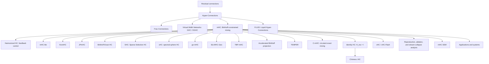

# Awesome Hyper-Connections

A curated and audited reading list for **Hyper-Connections (HC)**, **Manifold-Constrained Hyper-Connections (mHC)**, and closely related multi-residual-stream architectures.

本仓库聚焦 Zhu et al. 提出的 residual-stream Hyper-Connections 谱系：HC、Frac-Connections、GHC/DGHC、mHC、Identity HC/iHC、xHC，以及围绕流形约束、精确参数化、稳定性、系统优化、机制分析和下游应用的后续工作。

> **Last audited:** 2026-08-20
>
> **Coverage:** one chronological table contains 65 deduplicated formal records under the policy below: 62 counted publication items (41 direct papers/formal manuscripts plus 21 adjacent/adoption or formal-comparison items) and 3 explicitly indexed-but-not-counted proposal/runtime records. A separate two-part, time-sorted index covers all 119 unique GitHub repository roots referenced by this snapshot, split into training/research and inference/serving; repositories are not counted as papers.
>
> **Important limitation:** the publication table is a dated, source-verified snapshot—not a promise of absolute exhaustiveness. Code, model, package, tutorial, and discussion sections are curated discovery aids rather than exhaustive registries: new artifacts can appear continuously, indexes lag, and some models expose HC only in source code or configuration. Please open an issue or PR with a primary source when something is missing.

## Contents

- [Inclusion policy](#inclusion-policy)
- [Background and notation](#background-and-notation)
- [Research lineage](#research-lineage)
- [Papers and formal records (chronological)](#papers-and-formal-records-chronological)
- [Identity HC / iHC provenance](#identity-hc--ihc-provenance)
- [Method comparison](#method-comparison)
- [Current frontier](#current-frontier)
- [Suggested reading order](#suggested-reading-order)
- [Repository index — last default-branch commit](#repository-index--last-default-branch-commit)
  - [Training / research HC-mHC repositories](#training--research-hc-mhc-repositories-90)
  - [Inference / serving HC-mHC repositories](#inference--serving-hc-mhc-repositories-29)
- [Models, tutorials, and discussions](#models-tutorials-and-discussions)
- [Audit method and known exclusions](#audit-method-and-known-exclusions)
- [Contributing](#contributing)

## Inclusion policy

### Included as direct research

A paper is included in the direct count when it reports completed experiments, proofs, or mechanism analysis and at least one of the following is true:

1. it proposes a new HC/mHC-family connection rule, constraint, parameterization, or systems implementation;
2. it directly analyzes the behavior of HC/mHC residual streams;
3. HC/mHC is a material architectural contribution in the paper rather than a passing baseline;
4. it adapts HC/mHC to a new training regime, inference algorithm, or application domain.

### Separated as adjacent/adoption

Papers receive the **Adjacent/Adoption** track when HC/mHC is important to the experiment or model, when the paper formalizes a broader residual question that explicitly covers HC/mHC, or when it reports a substantive controlled comparison against HC/mHC, but its main contribution is broader than hyper-connections.

### Indexed but not counted

Concept proposals without completed experiments or proofs, and runtime studies in which an HC/mHC tensor is only an observed pipeline boundary rather than the research target, receive the **Indexed · Not counted** track and are excluded from the 62-publication count.

### Code and resource labels

- **Author/paper code** is linked by the paper, author, or research group, or clearly hosts the experiments for that paper.
- **Independent implementation** is a third-party reimplementation or extension and is never presented as official code.
- **Ecosystem integration** is HC/mHC support inside a larger training, inference, or kernel framework.
- **Paper/runtime artifact** is tied to a relevant paper or exact experiment but is not represented as an HC/mHC implementation unless its current source tree contains one.
- Forks and mirrors are deduplicated to their upstream repository. Empty repositories, “coming soon” placeholders, and copied single-file stubs without meaningful documentation are omitted.

### Excluded

- papers that only cite HC/mHC;
- unrelated uses of “hyperconnection,” “hyper-connected,” or “HC”;
- hypergraph, networking, neuroscience, and database papers that do not descend from the residual-stream formulation;
- blog posts, social-media experiments, and implementation notes without a formal paper. These may be mentioned for provenance, but are not counted as papers.
- automatically generated research artifacts without stable authorship or independent scholarly review; two such FARS outputs found during the audit are documented below but are not counted.
- model cards, repositories, package pages, tutorials, and technical blogs without a formal paper; these are tracked as resources, not publication items.

## Background and notation

A convenient generic form of the HC-family update is

```text
X_(l+1) = H_res,l X_l + H_post,l^T F_l(H_pre,l X_l),
```

where `X_l` contains `n` parallel residual streams:

- `H_pre` reads and aggregates information from the streams before the Transformer sublayer;
- `H_post` writes the transformed output back to the streams;
- `H_res` transports and mixes residual-stream states across depth.

The literature repeatedly revisits four questions:

1. How many residual streams should be maintained?
2. How should a sublayer read from and write to those streams?
3. What constraint on `H_res` prevents exploding, vanishing, or homogenizing matrix products?
4. How can expanded residual state and dynamic routing be implemented without becoming memory-bandwidth bound?

## Research lineage



## Papers and formal records (chronological)

All **65 formal records** are kept in one global timeline: **62 counted publications** (41 direct and 21 adjacent/adoption) plus 3 explicitly indexed-but-not-counted records. The **Track** column preserves the curation boundary that the previous topic-specific tables represented. Rows are sorted by first public date descending (newest first); same-day records are sorted by title.

| First public date | Track | Paper | Contribution / HC/mHC relevance | Status |
|---|---|---|---|---|
| 2026-08-17 | Direct · Method/Systems | **[Circulant Hyper-Connections: Exact Manifold Constraints, the Stream-Collapse Theorem, and Depth-Robust Residual Mixing](https://github.com/contactsebi/circulant-hyper-connections/blob/main/paper/paper.pdf)** — Sebastian Zwick · [source and experiments](https://github.com/contactsebi/circulant-hyper-connections) | Studies contraction toward uniform stream averaging under uniformly positive Sinkhorn mixers, then replaces the full mixer with a softmax-weighted convex combination of cyclic permutations. The resulting C-mHC mixer is exactly doubly stochastic, uses `n` coefficients, is Fourier-diagonalizable, and adds a leaky depth-scaled schedule intended to preserve stream diversity. | Repository-hosted author manuscript; no arXiv, DOI, or independent review located; proofs and deliberately small-scale TinyShakespeare validation |
| 2026-08-14 | Adjacent/Adoption | **[A Lightweight Manifold-Aware State Space Model for Efficient Seismic Signal Classification at the Edge](https://doi.org/10.32604/cmes.2026.083624)** — Pingan Peng et al. | H-NET-mHC applies a per-channel static `2×2` Sinkhorn/Birkhoff mixer to fuse the current state and a Mamba update. It is an mHC-inspired localized fusion, not the original persistent `n×C` multi-stream recurrence, so it is kept adjacent despite a substantive application and ablation. | — |
| 2026-08-13 | Direct · Application | **[Resource-efficient Semantic Coding Schemes with Manifold-constrained Hyper-connections](https://arxiv.org/abs/2608.13253)** — Jingwen Fu, Ming Xiao | Builds an mHC semantic encoder with an entropy bottleneck for semantic and task-oriented wireless communication; analyzes coding length and compares residual, unconstrained-HC, and mHC systems under noisy and fading channels. | arXiv preprint |
| 2026-08-10 | Adjacent/Adoption | **[Motif 3: Technical Report](https://arxiv.org/abs/2608.09119)** — Junghwan Lim et al. | The 314B MoE model adopts a modified mHC alongside GDLA, expert-specific activations, and multi-token prediction; this is adoption evidence, not a standalone HC method. | — |
| 2026-08-08 | Direct · Method/Systems | **[TEMPER: Tensorized Efficient Manifold-constrained Parameterization for Expressive Residual Routing](https://arxiv.org/abs/2608.07851)** — Yuxuan Gu et al. | Tensorizes the generators for pre-read, residual mixing, and post-write maps, preserving token-dependent manifold routing while reducing parameter growth as stream count increases. | arXiv preprint |
| 2026-08-06 | Direct · Application | **[Beyond Residual Connections: Manifold-Constrained Hyper-Connections for Robust Speaker Representation Learning](https://arxiv.org/abs/2608.05549)** — Zezhong Jin et al. | Replaces residual connections with mHC in ECAPA-TDNN, ResNet-34, Res2Net, and E-Res2Net for speaker recognition. | arXiv preprint |
| 2026-07-30 | Direct · Core | **[Chimera: Designing and Chinchilla-Scaling Hybrid Visual Diffusion Transformers](https://arxiv.org/abs/2607.28611)** — Chongjian Ge et al. | Formalizes and deploys **Identity Hyper-Connections (iHC)** in a visual diffusion Transformer: `H_res` is fixed to identity while adaptive cross-stream read/write remains. | arXiv preprint |
| 2026-07-30 | Indexed · Not counted | **[From Expert Reduction to Behavioral Divergence: Tracing Numerical State through Sparse MoE Inference](https://arxiv.org/abs/2607.28097)** — Tianyang Zhu · [exact runtime fork](https://github.com/whale-agent-lab/colibri) | Studies floating-point expert reduction and runtime conformance. Post-mHC is a downstream state-observation boundary, not the method under analysis; the linked Colibri fork is retained only for reproducing that runtime context. | Not counted |
| 2026-07-27 | Direct · Application | **[Semi-Supervised Structural Prior-Guided Network for Space Target Component Segmentation in ISAR Images](https://doi.org/10.3390/s26154769)** — Yonghua He et al. | Introduces a gated mHC Vision Transformer encoder with parallel feature streams and adaptive gating inside an ISAR segmentation system. | Sensors 2026 |
| 2026-07-20 | Direct · Application | **[Manifold-Constrained Hyper-Connections for Parameter-Efficient Finetuning](https://arxiv.org/abs/2607.18130)** — Valentijn Oldenburg et al. | Treats residual routing as a PEFT axis around frozen OLMo-2 backbones; reports that identity residual mixing often helps and that mHC+LoRA can outperform either alone in some settings. | arXiv preprint |
| 2026-07-16 | Direct · Core | **[xHC: Expanded Hyper-Connections](https://arxiv.org/abs/2607.14530)** — Xiangdong Zhang et al. · [project artifacts](https://github.com/aHapBean/xHC) | Makes residual-stream count a practical scaling axis beyond the common `N=4`: temporal feature augmentation enriches write-back, sparse updates modify `k=4` of `N=16` streams, and xHC-Flash reduces memory traffic. | arXiv technical report; project repository had no source code at the audit date |
| 2026-07-12 | Direct · Application | **[Stream-aware Side Adaptation for Large Pre-trained Multimodal Embedding Models in Sequential Recommendation](https://arxiv.org/abs/2607.10909)** — Junchen Fu et al. · [code](https://github.com/GAIR-Lab/Stresa) | Introduces Stresa: SHAF transports historical side memory with identity-preserving Sinkhorn routing, while ReSA applies HC-style pre, post, and residual maps around a bottleneck adapter and propagates the resulting stream-space side state across adapted layers. | ACM Multimedia 2026 |
| 2026-07-06 | Adjacent/Adoption | **[DSpark: Confidence-Scheduled Speculative Decoding with Semi-Autoregressive Generation](https://arxiv.org/abs/2607.05147)** — Xin Cheng et al. | The production speculative-decoding system uses mHC inside all three MoE layers of its parallel draft backbone; mHC is substantive adoption rather than DSpark's research contribution. | — |
| 2026-07-06 | Adjacent/Adoption | **[Layer-Parallel Inference Reduces Encrypted Nonlinear Depth in Transformers](https://arxiv.org/abs/2607.04819)** — Ligong Han et al. | Studies encrypted layer-parallel inference rather than HC itself, but formally evaluates a 0.5B mHC model and reports that its linear HC mixing has the lowest encrypted-error amplification among the tested 0.5B architectures. | — |
| 2026-06-27 | Adjacent/Adoption | **[Learning Spatio-Temporal Foundation Models from Pure Synthetic Data](https://arxiv.org/abs/2607.16251)** — Yutong Feng et al. | NeoST cascades its major components through original Hyper-Connections at expansion rate four, so this is substantive adoption rather than a citation-only hit. The paper provides no HC-specific formulation, modification, or ablation; its contributions are synthetic data, latent reasoning, and training objectives. | — |
| 2026-06-25 | Direct · Application | **[HyperDFlash: Hyper-Connection-Aligned Block Speculative Decoding with Gated Residual Reduction](https://arxiv.org/abs/2606.26744)** — Luxi Lin et al. | Designs a speculative drafter around the target model's multi-path HC residual state and reuses its HC head for lightweight gated reduction. | arXiv preprint |
| 2026-06-06 | Adjacent/Adoption | **[DeRes: Decoupling Residual Stability and Adaptivity for Scalable CTR Prediction](https://arxiv.org/abs/2606.07980)** — Wenzhuo Cheng et al. | Proposes a different dual-path residual rule, but formally compares against mHC and analyzes accumulated spectral attenuation in doubly stochastic residual products. | — |
| 2026-06-03 | Adjacent/Adoption | **[Depth-Attention: Cross-Layer Value Mixing for Language Models](https://arxiv.org/abs/2606.05014)** — Boyi Zeng et al. · [code](https://github.com/LUMIA-Group/Depth-Attention) | Proposes a different cross-layer value-mixing rule, but includes controlled 1.5B/3B mHC baselines plus explicit comparisons of perplexity, downstream accuracy, FLOPs, activation I/O, training time, and long-context persistent state. | — |
| 2026-06-02 | Direct · Analysis | **[Analyzing Stream Collapse in Hyper-Connections: From Diagnosis to Mitigation](https://arxiv.org/abs/2606.03483)** — Ekaterina Alimaskina et al. | Finds residual mixers often remain close to identity while signal and interpretable features concentrate in a dominant stream; proposes symmetry-breaking initialization to improve utilization. | arXiv preprint |
| 2026-05-31 | Adjacent/Adoption | **[CART: Context-Anchored Recurrent Transformer](https://arxiv.org/abs/2606.01495)** — Chad A. Capps | Uses a HyperConnection blend inside its recurrent core and reports a negative ablation: under this recipe the HC machinery is individually vestigial. The paper's main focus is recurrent-model efficiency and stability. | — |
| 2026-05-26 | Direct · Method/Systems | **[Accelerating Birkhoff Projection for Manifold-Constrained Hyper-Connections](https://arxiv.org/abs/2606.07574)** — Chenrui Wang, Yixuan Qiu | Specializes practical `4×4` projection to a low-dimensional dual problem, solves it with Newton's method, uses implicit differentiation, and implements a warp-level CUDA solver. | arXiv preprint |
| 2026-05-24 | Direct · Application | **[Real-Time Hardware-Free HIFU Interference Suppression via Teacher-Student Diffusion Framework](https://arxiv.org/abs/2509.01557v2)** — Dejia Cai et al. · [code](https://github.com/caidejia/HIFU-mHC-Diff) | Introduces mHC-Diff, an `n=4` Birkhoff-constrained mHC U-Net teacher distilled to a one-step student for real-time ultrasound interference suppression. | MICCAI 2026; mHC content first appeared in arXiv v2 |
| 2026-05-20 | Adjacent/Adoption | **[Most Transformer Modifications Still Do Not Transfer at 1–3B: A 2020–2026 Update to Narang et al. (2021) with Downstream Evaluation and a Noise Floor](https://arxiv.org/abs/2605.20798)** — Yang Zhao et al. | Benchmarks an output-side two-lane HyperConnections reimplementation under a controlled 1.2B/3B recipe, finding uniform underperformance at 1.2B and divergence at 3B. This is an original-HC comparison, not mHC, and it omits the original method's full input-side lane mixing. | — |
| 2026-05-20 | Direct · Method/Systems | **[TBP-mHC: Full Expressivity for Manifold-Constrained Hyper Connections through Transportation Polytopes](https://arxiv.org/abs/2605.21724)** — Anton Lyubinin | Introduces Transportation Birkhoff Polytope and recursive parameterizations with `(n-1)^2` degrees of freedom, aiming for exact double stochasticity and full Birkhoff-polytope expressivity without factorial enumeration. | arXiv preprint |
| 2026-05-18 | Adjacent/Adoption | **[SNLP: Layer-Parallel Inference via Structured Newton Corrections](https://arxiv.org/abs/2605.17842)** — Ligong Han et al. | Uses the residual mixing matrix of mHC-style architectures to define HC Newton corrections for layer-parallel inference; the main contribution is a broader numerical-solver framework. | — |
| 2026-05-08 | Direct · Application | **[mHC-SSM: Manifold-Constrained Hyper-Connections for State Space Language Models with Stream-Specialized Adapters](https://arxiv.org/abs/2605.08300)** — Abdulvahap Mutlu et al. · [code](https://github.com/abdulvahapmutlu/mhc-slm) | Transfers static mHC mixing to state-space language models and adds lightweight stream-specialized adapters before aggregation and after the SSM block. | arXiv preprint |
| 2026-05-07 | Direct · Method/Systems | **[The EΔ-MHC-Geo Transformer: Adaptive Geodesic Operations with Guaranteed Orthogonality](https://arxiv.org/abs/2605.06729)** — Arash Shahmansoori | Combines mHC, Cayley rotations, and a learned rotation/reflection gate to obtain input-adaptive orthogonal residual operators, including access to transformations excluded by a finite Cayley map. | Independent arXiv preprint |
| 2026-05-06 | Direct · Application | **[FLUID: Continuous-Time Hyperconnected Sparse Transformer for Sink-Free Learning](https://arxiv.org/abs/2605.04421)** — Waleed Razzaq, Yun-Bo Zhao · [paper code, deprecated](https://github.com/itxwaleedrazzaq/fluid-transformer) | Replaces ordinary residuals with input-dependent **Liquid Hyper-Connections** inside a continuous-time Transformer with liquid attention dynamics. | arXiv preprint |
| 2026-05-05 | Adjacent/Adoption | **[Transformers with Selective Access to Early Representations](https://arxiv.org/abs/2605.03953)** — Skye Gunasekaran et al. | SATFormer is an early-representation retrieval method, but dynamic Hyper-Connections are a formal baseline across matched 130M, 340M, and 760M runs with quality, throughput, and memory results. | — |
| 2026-04-27 | Adjacent/Adoption | **[How Much Is One Recurrence Worth? Iso-Depth Scaling Laws for Looped Language Models](https://arxiv.org/abs/2604.21106v2)** — Kristian Schwethelm et al. | The scaling-law paper added an HC case study in v2, reporting that hyper-connections raise its recurrence-equivalence exponent from `0.46` to `0.65`; HC was absent from v1. | — |
| 2026-04-26 | Adjacent/Adoption | **[Can an MLP Absorb Its Own Skip Connection?](https://arxiv.org/abs/2604.23705)** — Antonij Mijoski, Marko Karbevski | Studies skip absorption broadly, but its reduction for invertible linear skip maps explicitly covers HC and manifold-constrained HC. | — |
| 2026-04-26 | Adjacent/Adoption | **[DeepSeek-V4: Towards Highly Efficient Million-Token Context Intelligence](https://arxiv.org/abs/2606.19348)** — DeepSeek-AI | A major model report that adopts mHC as one of several architectural/optimization upgrades; important evidence of deployment, but not a new HC paper. | — |
| 2026-04-23 | Direct · Application | **[Hyperloop Transformers](https://arxiv.org/abs/2604.21254)** — Abbas Zeitoun et al. | Adds hyper-connections at loop boundaries of recurrent/weight-tied Transformer blocks, targeting parameter-efficient language modeling with minimal extra cost. | arXiv preprint |
| 2026-04-22 | Direct · Application | **[HRM-Net: Hybrid Road Mapping Network for Automated Mine Haul Road Extraction from Remote Sensing Imagery](https://doi.org/10.3390/rs18091264)** — Loghman Moradi, Kamran Esmaeili | Replaces residual connections with mHC in efficient-attention encoder blocks and the convolutional fusion decoder, with ablations for mine-road continuity. | Remote Sensing 2026 |
| 2026-04-11 | Direct · Application | **[mHC-DEIM: Object Detection for Shelf Scenes under Dense Arrangement, Multi-Angle Inclination and Low-Illumination](https://papers.ssrn.com/sol3/papers.cfm?abstract_id=6557880)** — Mingxiao Sun et al. | Integrates Birkhoff-constrained mHC residual maps into the Transformer component of DEIM for dense retail-object detection. | SSRN preprint · DOI 10.2139/ssrn.6557880 |
| 2026-04-02 | Direct · Method/Systems | **[go-mHC: Direct Parameterization of Manifold-Constrained Hyper-Connections via Generalized Orthostochastic Matrices](https://arxiv.org/abs/2604.02309)** — Torque Dandachi, Sophia Diggs-Galligan | Gives an exact generalized-orthostochastic parameterization with `O(d^3)` scaling and a parameter that interpolates between an efficient boundary and fuller Birkhoff expressivity. | arXiv preprint |
| 2026-04-01 | Adjacent/Adoption | **[CliffSearch: Structured Agentic Co-Evolution over Theory and Code for Scientific Algorithm Discovery](https://arxiv.org/abs/2604.01210)** — Youssef Mroueh et al. | The main contribution is an agentic scientific-discovery loop; Transformer hyper-connection evolution is one of its three benchmark-grounded studies. | — |
| 2026-03-21 | Direct · Method/Systems | **[Beyond the Birkhoff Polytope: Spectral-Sphere-Constrained Hyper-Connections](https://arxiv.org/abs/2603.20896)** — Zhaoyi Liu et al. | Proposes **sHC**, replacing the nonnegative Birkhoff polytope with a spectral-norm sphere. It permits negative/subtractive interactions, avoids Sinkhorn, and targets identity degeneration and expressivity limits. | arXiv preprint |
| 2026-03-20 | Direct · Application | **[Hyper-Connections for Adaptive Multi-Modal MRI Brain Tumor Segmentation](https://arxiv.org/abs/2603.19844)** — Lokendra Kumar, Shubham Aggarwal | Uses dynamic HC as a drop-in residual replacement in several 3D segmentation architectures and analyzes modality-sensitive routing. | arXiv preprint |
| 2026-03-16 | Direct · Analysis | **[Ablate and Rescue: A Causal Analysis of Residual Stream Hyper-Connections](https://arxiv.org/abs/2603.14833)** — William Peng et al. · [workshop version](https://openreview.net/pdf/889bf10b5800e7dcd4f801ae277ecfb253e8da0e.pdf) | Releases an open mHC language model and introduces stream-level ablation-and-rescue interventions to distinguish redundancy from asymmetric stream utilization. | ICLR 2026 SciForDL workshop |
| 2026-03-12 | Adjacent/Adoption | **[LPC-SM: Local Predictive Coding and Sparse Memory for Long-Context Language Modeling](https://arxiv.org/abs/2604.03263)** — Keqin Xie | Separates local attention, predictive correction, and dual-timescale memory; mHC is a material block component and its removal is the largest reported Stage-A ablation regression, but the paper's main contribution is the broader long-context architecture. | — |
| 2026-03-03 | Direct · Analysis | **[A Critical Analysis and Reproducibility Study of Manifold-Constrained Hyper-Connections](https://doi.org/10.5281/zenodo.18852696)** — Thomas Jego | Small-scale, single-GPU reproduction comparing baseline, HC, and mHC. It confirms the doubly stochastic stability behavior but reports high plain-PyTorch overhead and no small-scale performance win, explicitly limiting the conclusions to its 124M/WikiText-2 setup. | Zenodo preprint/reproducibility report |
| 2026-03-02 | Direct · Method/Systems | **[Birkhoff-Exact Hyper-Connections: Exact Spectral Stability for Deep Residual Networks](https://openreview.net/forum?id=jpIjkN1B1Q)** — Hyunjun Kim | Uses exact Birkhoff-von Neumann mixtures rather than approximate Sinkhorn projection and studies spectral stability at extreme depth. | ICLR 2026 Sci4DL workshop |
| 2026-02-20 | Direct · Method/Systems | **[JPmHC Dynamical Isometry via Orthogonal Hyper-Connections](https://arxiv.org/abs/2602.18308)** — Biswa Sengupta et al. | Controls Jacobian spectra using operator-norm-bounded manifolds, including bistochastic, Stiefel, and Grassmann variants; introduces Cayley-transform orthogonal mixing and implicit differentiation. | arXiv preprint |
| 2026-02-20 | Direct · Method/Systems | **[Sparse Selective Hyper-Connections: A Unified Framework for Stable and Efficient Deep Residual Learning](https://doi.org/10.1109/SoutheastCon63549.2026.11476522)** — Shrey Modi et al. · [code](https://github.com/rahvis/shc) | Introduces sparse selective routing with exact permutation mixtures and orthogonal/Cayley alternatives, targeting lower routing and cache cost. This uppercase **SHC** is distinct from the later lowercase **sHC** spectral-sphere method. | IEEE SoutheastCon 2026 |
| 2026-02-12 | Direct · Application | **[IntTravel: A Real-World Dataset and Generative Framework for Integrated Multi-Task Travel Recommendation](https://arxiv.org/abs/2602.11664)** — Huimin Yan et al. | Extends HC into Task-Guided Information Persistence: task gates modulate HC read and residual maps inside an HSTU decoder for multi-task recommendation. | arXiv preprint; deployed at Amap |
| 2026-01-30 | Adjacent/Adoption | **[Avoiding Premature Collapse: Adaptive Annealing for Entropy-Regularized Structural Inference](https://arxiv.org/abs/2601.23039)** — Yizhi Liu | Studies annealing and Sinkhorn fixed-point stability, using mHC training as an important test case rather than proposing a new residual topology. | — |
| 2026-01-29 | Direct · Method/Systems | **[KromHC: Manifold-Constrained Hyper-Connections with Kronecker-Product Residual Matrices](https://arxiv.org/abs/2601.21579)** — Wuyang Zhou et al. · [OpenReview](https://openreview.net/forum?id=TI7Q2o6EIa) | Factorizes the residual mixer as Kronecker products of smaller doubly stochastic matrices, preserving exact constraints while reducing the stated parameter complexity from `O(n^3 C)` toward `O(n^2 C)`. | ICML 2026 |
| 2026-01-22 | Direct · Application | **[mHC-HSI: Clustering-Guided Hyper-Connection Mamba for Hyperspectral Image Classification](https://arxiv.org/abs/2603.03418)** — Yimin Zhu et al. · [earlier White-Box mHC version](https://arxiv.org/abs/2601.15757) | Treats the same-author, text-overlapping White-Box mHC / mHC-HSI records as one publication lineage: electromagnetic-spectrum groups form persistent streams, while the residual mixer is interpreted as soft clustering maps for a clustering-guided Mamba. | arXiv preprint lineage; later record carries an arXiv text-overlap note |
| 2026-01-12 | Adjacent/Adoption | **[Conditional Memory via Scalable Lookup: A New Axis of Sparsity for Large Language Models](https://arxiv.org/abs/2601.07372)** — Xin Cheng et al. | The main contribution is Engram conditional memory; mHC is materially used as the multi-stream backbone rather than introduced as a new connection method. | — |
| 2026-01-10 | Direct · Method/Systems | **[Operator-Constrained Residual Connections: A Mathematical Framework for Manifold-Constrained Hyper-Connections](https://papers.ssrn.com/sol3/papers.cfm?abstract_id=6048614)** — Miquel Noguer I Alonso | Gives an operator-theoretic treatment of non-expansive residual mixing, Birkhoff closure under composition, norm control, and conditions separating residual-path stability from the nonlinear blocks. | SSRN preprint · DOI 10.2139/ssrn.6048614 |
| 2026-01-09 | Direct · Method/Systems | **[mHC-lite: You Don't Need 20 Sinkhorn-Knopp Iterations](https://arxiv.org/abs/2601.05732)** — Yongyi Yang, Jianyang Gao · [OpenReview](https://openreview.net/forum?id=5IJX6kvOif) | Replaces iterative Sinkhorn projection with an exact convex combination of permutation matrices. Double stochasticity holds by construction, but the complete permutation basis scales factorially with stream count. | ICLR 2026 GRaM workshop poster |
| 2026-01-08 | Indexed · Not counted | **[SyneState: Inducing Machine Synesthesia via Manifold-Constrained Hyper-Connections](https://doi.org/10.5281/zenodo.18180051)** — Graeme Fawcett | A conceptual cross-modal integration proposal without evaluation; the source describes it as integration work rather than research. | Not counted |
| 2026-01-07 | Direct · Method/Systems | **[Harmonized Hyper-Connections: Stabilizing Residual Transport Through Feedback on Geometry](https://curv.institute/publications/harmonized-hyper-connections/)** — J. W. Miller · [code](https://github.com/curv-institute/harmonized-hyper-connections) | Replaces hard per-layer manifold projection with feedback control over the applied composite gain, aiming to retain selective amplification while bounding depth-composed transport. | CURV Institute research-paper preprint |
| 2026-01-05 | Direct · Application | **[mHC-GNN: Manifold-Constrained Hyper-Connections for Graph Neural Networks](https://arxiv.org/abs/2601.02451)** — Subhankar Mishra | Adapts Birkhoff-constrained multi-stream mixing to GNNs and studies over-smoothing, expressivity, and depth up to 128 layers. | arXiv preprint |
| 2026-01-03 | Indexed · Not counted | **[Geometric and Dynamic Scaling in Deep Transformers](https://arxiv.org/abs/2601.01014)** — Haoran Su, Chenyu You | The arXiv record explicitly says **“Research Proposal Only.”** It specifies a Manifold-Geometric Transformer and evaluation protocol but reports no completed experiment or proof. | Not counted |
| 2025-12-31 | Direct · Core | **[mHC: Manifold-Constrained Hyper-Connections](https://arxiv.org/abs/2512.24880)** — Zhenda Xie et al. · [ICML/OpenReview version](https://openreview.net/forum?id=mDhyxu8WRb) | Constrains dynamic residual mixing to the Birkhoff polytope of doubly stochastic matrices through Sinkhorn-Knopp normalization and adds large-scale systems optimizations. | ICML 2026 (OpenReview); an official PMLR proceedings page was not yet indexed at the audit date |
| 2025-12-27 | Direct · Application | **[Bright 4B: Scaling Hyperspherical Learning for Segmentation in 3D Brightfield Microscopy](https://arxiv.org/abs/2512.22423)** — Amil Khan et al. | Wraps attention and Soft-MoE blocks with dynamic HyperConnections in a 4B-parameter, hyperspherical 3D microscopy segmentation model. | arXiv preprint |
| 2025-11-14 | Direct · Core | **[Virtual Width Networks](https://arxiv.org/abs/2511.11238)** — Seed et al. | Decouples virtual representation width from backbone width and develops generalized/dynamic generalized hyper-connections (GHC/DGHC) for routing between the expanded virtual state and fixed-width backbone. | arXiv preprint |
| 2025-09-18 | Direct · Application | **[FlowNet: Modeling Dynamic Spatio-Temporal Systems via Flow Propagation](https://arxiv.org/abs/2511.05595)** — Yutong Feng et al. · [OpenReview](https://openreview.net/forum?id=3jjeQNeCsl) | Uses adaptive depth/width Hyper-Connections to cascade flow-allocation and MLP modules in a physics-inspired spatio-temporal architecture. | NeurIPS 2025 |
| 2025-03-18 | Direct · Core | **[Frac-Connections: Fractional Extension of Hyper-Connections](https://arxiv.org/abs/2503.14125)** — Defa Zhu et al. | Partitions an existing hidden state instead of expanding it to `nC`; retains part of HC's routing benefit with substantially lower hidden-state and memory-access overhead. This is the formal paper usually meant by “fraction-HC.” | arXiv preprint |
| 2025-02-13 | Adjacent/Adoption | **[MUDDFormer: Breaking Residual Bottlenecks in Transformers via Multiway Dynamic Dense Connections](https://arxiv.org/abs/2502.12170)** — Da Xiao et al. | MUDD is a different dense cross-layer routing rule, but the ICML 2025 work includes HC in its 405M–1.4B scaling comparisons. | — |
| 2025-02-13 | Adjacent/Adoption | **[You Do Not Fully Utilize Transformer's Representation Capacity](https://arxiv.org/abs/2502.09245)** — Gleb Gerasimov et al. | Introduces LIMe and treats HC as a formal roughly 1B-parameter/50B-token baseline, reporting quality, parameter, FLOP, step-time, and memory comparisons. | — |
| 2025-02-10 | Adjacent/Adoption | **[DeepCrossAttention: Supercharging Transformer Residual Connections](https://arxiv.org/abs/2502.06785)** — Mike Heddes et al. | Proposes cross-depth attention rather than HC, but reports controlled LM1B/C4 comparisons against dynamic Hyper-Connections, including stack-size ablations. | — |
| 2024-09-29 | Direct · Core | **[Hyper-Connections](https://arxiv.org/abs/2409.19606)** — Defa Zhu et al. · [OpenReview](https://openreview.net/forum?id=9FqARW7dwB) | Introduces multiple residual streams and learnable/static or dynamic read, write, and residual-transition mappings. Motivated by the PreNorm/PostNorm trade-off between representation collapse and gradient vanishing. | ICLR 2025 |

## Identity HC / iHC provenance

**Identity HC is a variant/ablation, not a standalone paper.**

1. The later ICML 2026 version of **[mHC](https://openreview.net/forum?id=mDhyxu8WRb)** contains an ablation named **Identity HC**.
2. Its defining simplification is

   ```text
   H_res,l = I
   ```

3. Dynamic/adaptive `H_pre` and `H_post` remain. Therefore, the sublayer can still read an input-dependent mixture of streams and write the result back with input-dependent weights. What disappears is the explicit `n×n` residual-state transition and its Sinkhorn projection.
4. **[Chimera](https://arxiv.org/abs/2607.28611)** later uses the full name **Identity Hyper-Connections (iHC)** and deploys the design as an architectural component.

Recommended citation convention:

- cite the later mHC/ICML version for the **Identity HC ablation provenance**;
- cite Chimera for the explicit **Identity Hyper-Connections (iHC)** terminology and its use in a model architecture.

Informal posts reporting large Identity-HC experiments are not counted as papers in this repository.

## Method comparison

| Method | Residual transition / constraint | Cross-stream interaction | State-width / systems profile | Main trade-off |
|---|---|---|---|---|
| Residual connection | Fixed identity | Single stream | `C` | Stable but rigid |
| HC | Unconstrained learned/dynamic `H_res` | Adaptive read, write, and residual mixing | About `nC` residual state | Expressive, but deep products can be unstable and memory traffic grows |
| Frac-Connections | Routing among hidden-state fractions | Interaction among partitions | About `C` residual state | Lower memory cost, but less virtual-width capacity |
| GHC / DGHC | Generalized carry/read/write maps | Flexible virtual-to-backbone routing | Configurable virtual width | General formulation; more routing machinery |
| mHC | Doubly stochastic `H_res` via Sinkhorn | Full residual mixing plus adaptive read/write | `nC` plus projection/routing overhead | Stable large-scale training, but projection and I/O add cost |
| Harmonized HC | Feedback-controlled applied composite gain | Unconstrained local routing under a global gain budget | Controller plus composite-gain tracking | Preserves selective amplification, but evidence is currently limited to an institutional preprint and controlled retrieval experiments |
| mHC-lite / BE-HC | Exact Birkhoff construction | Full constrained residual mixing | Avoids iterative Sinkhorn; complete permutation bases can scale poorly | Exactness versus combinatorial basis size |
| Sparse Selective HC (SHC) | Sparse permutation/orthogonal routing | Selective multi-stream exchange | Targets lower routing and cache cost | Sparse structure improves efficiency but restricts available routes |
| KromHC | Kronecker-factorized exact doubly stochastic mixer | Structured residual mixing | Better stream-count scaling | Efficiency at the cost of factorized structure |
| go-mHC / TBP-mHC | Exact direct parameterizations | More complete Birkhoff coverage | No iterative Sinkhorn | Parameterization complexity and implementation maturity |
| TEMPER | Tensor-network generators feeding manifold routing | Token-dependent read/mix/write maps | Reduces generator parameter growth at larger stream counts | Rank/efficiency trade-off and newer implementation ecosystem |
| C-mHC | Softmax-weighted circulant permutation mixture; exactly doubly stochastic | Translation-equivariant, commutative cyclic mixing | `n` mixer coefficients, one softmax, Fourier-diagonalizable products; full `nC` state remains | Strong structural restriction versus the full Birkhoff polytope; evidence is an unreviewed, small-scale repository manuscript |
| JPmHC / EΔ-MHC-Geo | Orthogonal or spectrum-controlled manifolds | Rotation/reflection-style mixing | Geometry-dependent | Strong Jacobian/norm control with additional geometric machinery |
| sHC | Spectral-sphere constraint; negative entries allowed | Additive and subtractive mixing | Avoids Sinkhorn and permutation enumeration | More expressive feasible set under a different stability constraint |
| Identity HC / iHC | `H_res = I` | No direct residual-transition mixing; adaptive read/write remain | Removes dynamic `n×n` mixer and Sinkhorn | Simplicity and stability versus giving up explicit residual-stream exchange |
| xHC | Large-`N` sparse update with dense access | Rich read/write; subset of streams updated per layer | Demonstrated at `N=16`; xHC-Flash reduces memory traffic | Makes stream count scalable while retaining a wider persistent state |

## Current frontier

As of **2026-08-20**, the main research directions are:

- **Does learned residual mixing matter?** Identity HC/iHC and stream-collapse results suggest that adaptive read/write may provide much of the benefit even when `H_res` is identity or close to identity.
- **How should stability be imposed?** Birkhoff, permutation and circulant mixtures, Kronecker structure, orthogonal manifolds, spectral spheres, transportation polytopes, and identity transitions encode different assumptions about signal preservation and expressivity.
- **Can stability be controlled instead of projected?** Harmonized HC reframes the problem as feedback on applied composite gain, while the reproduction report emphasizes the gap between mathematical constraint behavior and end-to-end cost on commodity implementations.
- **Can stream count become a genuine scaling axis?** xHC addresses the information and cubic-routing bottlenecks that prevented useful scaling beyond four streams.
- **Can routing generators and mixers scale with stream count?** TEMPER tensorizes the dynamic generators, while C-mHC restricts the mixer to a circulant family with only `n` coefficients; both complement exact parameterizations and sparse stream updates.
- **Are all streams actually used?** Causal ablations and stream-collapse diagnostics reveal dominant-stream behavior and motivate symmetry-breaking or specialization mechanisms.
- **Can HC be hardware-efficient?** Projection solvers, fused kernels, sparse stream updates, recomputation, and HC-aware inference are increasingly central rather than secondary implementation details.

The newest direct item located in this audit is the repository-hosted **C-mHC** manuscript posted on **2026-08-17**; the newest externally archived direct method is **TEMPER**, submitted on **2026-08-08**. The newest direct application is the **resource-efficient semantic-coding** paper submitted on **2026-08-13**. The newest adjacent item is **H-NET-mHC**, published online on **2026-08-14**, while the newest large-model adoption report remains **Motif 3**, submitted on **2026-08-10**.

## Suggested reading order

1. **Hyper-Connections** — original motivation and multi-stream formulation.
2. **Frac-Connections** and **Virtual Width Networks** — memory-efficient and generalized virtual-width views.
3. **mHC** — instability of unconstrained products, Birkhoff constraints, and systems engineering.
4. **Operator-Constrained Residual Connections**, **Harmonized HC**, **mHC-lite**, **KromHC**, **JPmHC**, **SHC/sHC**, **go-mHC**, **TBP-mHC**, **TEMPER**, and the repository-hosted **C-mHC** manuscript — compare theory, feedback control, exactness, geometry, sparsity, expressivity, and scaling.
5. **A Critical Analysis and Reproducibility Study**, **Ablate and Rescue**, and **Analyzing Stream Collapse** — examine cost, reproducibility, and actual stream use.
6. **Identity HC/iHC** and **xHC** — compare two recent extremes: eliminating residual mixing versus scaling to many streams.
7. **FLUID**, **mHC-SSM**, **Stresa**, and the application/systems papers — evaluate transfer beyond LLM pre-training.

## Repository index — last default-branch commit

This index contains all **119 deduplicated GitHub repository roots** referenced by this README, split into exactly two non-overlapping blocks:

- **Training / research (90):** repositories with training, finetuning, backward/autograd, distributed-training, or paper-experiment support, plus research, educational, analysis, and manuscript artifacts that are not inference deployments.
- **Inference / serving (29):** inference-first runtimes, serving frameworks, model ports, and forward-only kernels.

A repository that supports both training and inference appears only once under **Training / research**. Within each block, entries are sorted by the latest commit on the current default branch, newest first; same-timestamp entries are sorted by canonical repository name.

Stars and last-commit metadata are exact GitHub snapshots captured on **2026-08-20 06:35 UTC**. Star counts change continuously; the linked number opens the repository's stargazer list.

No standalone official training repository from the original HC authors or DeepSeek's mHC paper was located in this audit. Labels therefore distinguish author/paper code, independent implementations, ecosystem integrations, and other artifacts rather than treating them as interchangeable.

> **Interpretation:** for large framework repositories, the timestamp and Star count reflect the repository as a whole, not only its HC/mHC-specific path. Contextual code and paper links elsewhere in the README remain cross-references; these two tables are the canonical deduplicated repository index.

### Training / research HC-mHC repositories (90)

| Last default-branch commit (UTC) | Repository | Stars | Category | Scope |
|---|---|---:|---|---|
| [2026-08-20 06:28](https://github.com/PaddlePaddle/PaddleFleet/commit/ceef5bdfbb792e9f2661df02581a73577f0e55ce) | [PaddlePaddle/PaddleFleet](https://github.com/PaddlePaddle/PaddleFleet) · [HC path](https://github.com/PaddlePaddle/PaddleFleet/blob/develop/src/paddlefleet/transformer/hyper_connection.py) | [⭐ 23](https://github.com/PaddlePaddle/PaddleFleet/stargazers) | Ecosystem integration | Full mHC propagation and differentiable Sinkhorn implementation on the active `develop` branch. |
| [2026-08-20 06:20](https://github.com/flagos-ai/FlagGems/commit/2d81fd9e8d9f703bc470b5c014c3db81067564b0) | [flagos-ai/FlagGems](https://github.com/flagos-ai/FlagGems) · [HC path](https://github.com/flagos-ai/FlagGems/tree/master/src/flag_gems/fused/mhc) | [⭐ 1,081](https://github.com/flagos-ai/FlagGems/stargazers) | Ecosystem integration | Multi-backend fused mHC pre/post, backward, Sinkhorn, tests, and benchmarks. |
| [2026-08-20 06:07](https://github.com/togethercomputer/xorl/commit/7f6c19a3c98cbd199a3877c9db76a6d852b88bd3) | [togethercomputer/xorl](https://github.com/togethercomputer/xorl) · [HC path](https://github.com/togethercomputer/xorl/blob/main/src/xorl/ops/dsv4/hyper_connection.py) | [⭐ 39](https://github.com/togethercomputer/xorl/stargazers) | Ecosystem integration | DeepSeek-V4 hyper-connection operator and model integration. |
| [2026-08-20 05:58](https://github.com/NVIDIA-NeMo/Megatron-Bridge/commit/2536afa140a1837e60a4397511bb12fdc995b6b1) | [NVIDIA-NeMo/Megatron-Bridge](https://github.com/NVIDIA-NeMo/Megatron-Bridge) · [HC path](https://github.com/NVIDIA-NeMo/Megatron-Bridge/blob/main/src/megatron/bridge/models/deepseek/deepseek_v4_bridge.py) | [⭐ 866](https://github.com/NVIDIA-NeMo/Megatron-Bridge/stargazers) | Ecosystem integration | DeepSeek-V4 bridge enabling HyperConnections/fused mHC, checkpoint mappings, and training recipes. |
| [2026-08-20 05:38](https://github.com/NVIDIA-NeMo/Automodel/commit/da5eba2374743e11238b145e40df0f4ed5444ba9) | [NVIDIA-NeMo/Automodel](https://github.com/NVIDIA-NeMo/Automodel) · [HC path](https://github.com/NVIDIA-NeMo/Automodel/blob/main/docs/guides/llm/dsv4-flash.md) | [⭐ 843](https://github.com/NVIDIA-NeMo/Automodel/stargazers) | Ecosystem integration | DeepSeek-V4 finetuning path with four Sinkhorn-mixed HC streams. |
| [2026-08-20 05:34](https://github.com/tile-ai/tilelang/commit/9f336776eef3b0cfafc0b08ce5248040ae1a26c3) | [tile-ai/tilelang](https://github.com/tile-ai/tilelang) · [HC path](https://github.com/tile-ai/tilelang/tree/main/examples/deepseek_mhc) | [⭐ 7,253](https://github.com/tile-ai/tilelang/stargazers) | Ecosystem integration | Fused DeepSeek-style mHC pre/post kernel examples in the upstream TileLang project. |
| [2026-08-20 04:42](https://github.com/baidu-baige/LoongForge/commit/8718c2368e5ae78ddf63945d2d32f315885ccf22) | [baidu-baige/LoongForge](https://github.com/baidu-baige/LoongForge) · [HC path](https://github.com/baidu-baige/LoongForge/blob/master/loongforge/models/foundation/deepseek_v4/deepseek_v4_config.py) | [⭐ 431](https://github.com/baidu-baige/LoongForge/stargazers) | Ecosystem integration | DeepSeek-V4 training configuration for HC streams, Sinkhorn mixing, and propagation. |
| [2026-08-20 03:07](https://github.com/linkedin/Liger-Kernel/commit/124fb8a2a443c1118f7caeff0203aea78424eb2b) | [linkedin/Liger-Kernel](https://github.com/linkedin/Liger-Kernel) · [HC path](https://github.com/linkedin/Liger-Kernel/blob/main/src/liger_kernel/transformers/mhc.py) | [⭐ 6,573](https://github.com/linkedin/Liger-Kernel/stargazers) | Ecosystem integration | Fused mHC Transformer API. |
| [2026-08-20 03:07](https://github.com/PaddlePaddle/PaddleFormers/commit/b7dd798364753359cd520183060bcb0faa745508) | [PaddlePaddle/PaddleFormers](https://github.com/PaddlePaddle/PaddleFormers) · [HC path](https://github.com/PaddlePaddle/PaddleFormers/blob/develop/examples/best_practices/DeepSeek-V4/dsv4_practice.md) | [⭐ 12,987](https://github.com/PaddlePaddle/PaddleFormers/stargazers) | Ecosystem integration | DeepSeek-V4 training and finetuning with mHC and fused mHC kernels. |
| [2026-08-20 01:58](https://github.com/AMD-AGI/Primus/commit/b8d3cc52c83a64837bbb12357b72362e1d519354) | [AMD-AGI/Primus](https://github.com/AMD-AGI/Primus) | [⭐ 120](https://github.com/AMD-AGI/Primus/stargazers) | Ecosystem integration | AMD/ROCm DeepSeek-V4 training stack with HyperConnection modules, Triton HC expand/glue/collapse/Sinkhorn kernels, and tests. |
| [2026-08-20 00:23](https://github.com/NVIDIA/Megatron-LM/commit/4e1df1b62ccb799269b131046362f1f948ad5308) | [NVIDIA/Megatron-LM](https://github.com/NVIDIA/Megatron-LM) · [HC path](https://github.com/NVIDIA/Megatron-LM/blob/main/megatron/core/transformer/hyper_connection.py) | [⭐ 17,491](https://github.com/NVIDIA/Megatron-LM/stargazers) | Ecosystem integration | Basic PyTorch mHC support is now on default `main` via [PR #4531](https://github.com/NVIDIA/Megatron-LM/pull/4531), merged on 2026-08-18. Earlier [PR #2943](https://github.com/NVIDIA/Megatron-LM/pull/2943) targeted `dev`; the monolithic mainline attempt #3430 closed unmerged before being split into smaller patches. |
| [2026-08-19 23:28](https://github.com/AI-Hypercomputer/maxtext/commit/b18ceac97969a89bfef4cca6bb83af9f7c4eccbf) | [AI-Hypercomputer/maxtext](https://github.com/AI-Hypercomputer/maxtext) · [HC path](https://github.com/AI-Hypercomputer/maxtext/blob/main/src/maxtext/layers/mhc.py) | [⭐ 2,395](https://github.com/AI-Hypercomputer/maxtext/stargazers) | Ecosystem integration | JAX/Flax mHC layer. |
| [2026-08-19 21:39](https://github.com/OpenPipe/ART/commit/98f2a79685d69613ab795648531d9b44f638d307) | [OpenPipe/ART](https://github.com/OpenPipe/ART) · [HC path](https://github.com/OpenPipe/ART/blob/main/src/art/megatron/dsv4/hyper_connection.py) | [⭐ 10,603](https://github.com/OpenPipe/ART/stargazers) | Ecosystem integration | DeepSeek-V4/Megatron hyper-connection module. |
| [2026-08-19 18:48](https://github.com/NVIDIA/TransformerEngine/commit/d4ca825c782c59412e2ddb21c19537004d59fb89) | [NVIDIA/TransformerEngine](https://github.com/NVIDIA/TransformerEngine) · [HC path](https://github.com/NVIDIA/TransformerEngine/blob/main/transformer_engine/pytorch/triton/mhc.py) | [⭐ 3,496](https://github.com/NVIDIA/TransformerEngine/stargazers) | Ecosystem integration | Triton mHC projection, Sinkhorn, aggregate/expand-combine forward/backward wrappers, and tests. |
| [2026-08-19 16:02](https://github.com/huggingface/transformers/commit/94f09cfec149050b5355bab7f207ac69e21f1a02) | [huggingface/transformers](https://github.com/huggingface/transformers) · [HC path](https://github.com/huggingface/transformers/blob/main/src/transformers/models/deepseek_v4/modeling_deepseek_v4.py) | [⭐ 164,275](https://github.com/huggingface/transformers/stargazers) | Ecosystem integration | `DeepseekV4HyperConnection` model integration. |
| [2026-08-19 10:00](https://github.com/mindspore-ai/hyper-parallel/commit/7fc519b31b140249039cb4400e3ae11a2a0c082f) | [mindspore-ai/hyper-parallel](https://github.com/mindspore-ai/hyper-parallel) · [HC path](https://github.com/mindspore-ai/hyper-parallel/blob/master/hyper_parallel/core/shard/ops/parallel_mhc_pre_sinkhorn.py) | [⭐ 7](https://github.com/mindspore-ai/hyper-parallel/stargazers) | Ecosystem integration | Parallel mHC Sinkhorn sharding and backward rules. |
| [2026-08-19 09:11](https://github.com/torchtitan-npu/torchtitan-npu/commit/851f1f3fba4136f7276aac1de4fa8102c34cdb15) | [torchtitan-npu/torchtitan-npu](https://github.com/torchtitan-npu/torchtitan-npu) · [HC path](https://github.com/torchtitan-npu/torchtitan-npu/blob/master/torchtitan_npu/converters/kernels/mhc_prepost.py) | [⭐ 4](https://github.com/torchtitan-npu/torchtitan-npu/stargazers) | Ecosystem integration | DeepSeek-V4 NPU training conversion for mHC pre/post operators; this GitHub repository mirrors the project's GitCode upstream. |
| [2026-08-19 08:56](https://github.com/Ascend/op-plugin/commit/c67b7af8f8f823582e1bc1131cd0c094c6f31d78) | [Ascend/op-plugin](https://github.com/Ascend/op-plugin) · [HC path](https://github.com/Ascend/op-plugin/blob/master/docs/zh/custom_APIs/torch_npu/torch_npu-npu_mhc_pre.md) | [⭐ 12](https://github.com/Ascend/op-plugin/stargazers) | Ecosystem integration | `npu_mhc_pre`/`npu_mhc_post`, backward operators, API documentation, and tests. |
| [2026-08-18 11:47](https://github.com/Ascend/MindSpeed-LLM/commit/53ff1095801f9ce14b14be3e62739e742f8b9067) | [Ascend/MindSpeed-LLM](https://github.com/Ascend/MindSpeed-LLM) · [HC path](https://github.com/Ascend/MindSpeed-LLM/blob/master/mindspeed_llm/fsdp2/models/deepseek_v4/modeling_deepseek_v4.py) | [⭐ 56](https://github.com/Ascend/MindSpeed-LLM/stargazers) | Ecosystem integration | Ascend/FSDP2 DeepSeek-V4 model path using NPU mHC operators. |
| [2026-08-18 08:11](https://github.com/ByteDance-Seed/VeOmni/commit/c465a6302122d4326c3c94c0b80d5b8dd995bacc) | [ByteDance-Seed/VeOmni](https://github.com/ByteDance-Seed/VeOmni) · [HC path](https://github.com/ByteDance-Seed/VeOmni/tree/main/veomni/ops/kernels/mhc) | [⭐ 2,159](https://github.com/ByteDance-Seed/VeOmni/stargazers) | Ecosystem integration | DeepSeek-V4 training support with eager or TileKernels mHC backends. |
| [2026-08-17 08:20](https://github.com/axolotl-ai-cloud/axolotl/commit/13dfcfb6c64f7e8a8b9c30251fdb558a18e43f06) | [axolotl-ai-cloud/axolotl](https://github.com/axolotl-ai-cloud/axolotl) · [HC path](https://github.com/axolotl-ai-cloud/axolotl/blob/main/src/axolotl/integrations/kernels/libs/dsv4/mhc.py) | [⭐ 12,375](https://github.com/axolotl-ai-cloud/axolotl/stargazers) | Ecosystem integration | DeepSeek-V4 mHC kernel integration. |
| [2026-08-17 07:29](https://github.com/liuliu/ccv/commit/6a75c0e8e8baae8a0867c6015bdf6c822afb1c9e) | [liuliu/ccv](https://github.com/liuliu/ccv) · [HC path](https://github.com/liuliu/ccv/tree/unstable/lib/nnc/cmd/hyper_connection) | [⭐ 7,242](https://github.com/liuliu/ccv/stargazers) | Ecosystem integration | Upstream CPU reference plus MPS/MFA/Metal HyperConnection operators and integration tests; the same author's Swift wrapper is not counted separately. |
| [2026-08-17 07:29](https://github.com/joey00072/ohara/commit/c4440160964c6773a71c95c5953c1690622770db) | [joey00072/ohara](https://github.com/joey00072/ohara) · [HC path](https://github.com/joey00072/ohara/tree/master/experiments/mHC) | [⭐ 85](https://github.com/joey00072/ohara/stargazers) | Independent implementation | Runnable residual/HC/mHC language-model experiments with training and benchmark entry points. |
| [2026-08-17 03:07](https://github.com/contactsebi/circulant-hyper-connections/commit/3a1535d94687fc2d2b393cc2c9fcafe469131f32) | [contactsebi/circulant-hyper-connections](https://github.com/contactsebi/circulant-hyper-connections) | [⭐ 0](https://github.com/contactsebi/circulant-hyper-connections/stargazers) | Author code / repository-hosted manuscript | C-mHC manuscript source, proof/numerical scripts, tiny character-LM comparison, figures, and recorded results |
| [2026-08-16 14:32](https://github.com/Lu-Yu-Zhen/Construction-of-the-DeepSeek-V4-architecture-atop-the-MindSpore-framework/commit/5b28eeea719686a8faa4d57ff816ecddcf59ae91) | [Lu-Yu-Zhen/Construction-of-the-DeepSeek-V4-architecture-atop-the-MindSpore-framework](https://github.com/Lu-Yu-Zhen/Construction-of-the-DeepSeek-V4-architecture-atop-the-MindSpore-framework) | [⭐ 2](https://github.com/Lu-Yu-Zhen/Construction-of-the-DeepSeek-V4-architecture-atop-the-MindSpore-framework/stargazers) | Independent implementation | Independent MindSpore DeepSeek-V4 construction with a dedicated mHC module, configurations, and tests. |
| [2026-08-14 10:03](https://github.com/modelscope/mcore-bridge/commit/96d66fbb821f8c1e9eca3e1f58f36d50fedfa397) | [modelscope/mcore-bridge](https://github.com/modelscope/mcore-bridge) · [HC path](https://github.com/modelscope/mcore-bridge/blob/main/src/mcore_bridge/model/modules/transformer_block.py) | [⭐ 94](https://github.com/modelscope/mcore-bridge/stargazers) | Ecosystem integration | Multi-stream propagation/collapse across pipeline stages and mHC-aware recomputation. |
| [2026-08-13 01:11](https://github.com/MohamedKhalidmk/HTAN/commit/2cf3d8f71acc3e8d95166c3f731b55b62d3f45d6) | [MohamedKhalidmk/HTAN](https://github.com/MohamedKhalidmk/HTAN) | [⭐ 0](https://github.com/MohamedKhalidmk/HTAN/stargazers) | Experimental hybrid/application | Localized mHC bottleneck whose streams are initialized and collapsed at each insertion rather than persisted across the full network. |
| [2026-08-12 20:25](https://github.com/alyubinin/tbp-mHC/commit/f84d7843754839ea6fd21428f39e23d49e422b75) | [alyubinin/tbp-mHC](https://github.com/alyubinin/tbp-mHC) | [⭐ 0](https://github.com/alyubinin/tbp-mHC/stargazers) | Author code | TBP/RTBP parameterizations and experiments accompanying TBP-mHC |
| [2026-08-10 02:00](https://github.com/MotifTechnologies/motif3-training-example/commit/f2cad4115bde073bc61dead4dce8db9711db0ab6) | [MotifTechnologies/motif3-training-example](https://github.com/MotifTechnologies/motif3-training-example) | [⭐ 24](https://github.com/MotifTechnologies/motif3-training-example/stargazers) | Official adoption code | Motif 3 training example with modified-mHC layers and kernels |
| [2026-08-09 00:01](https://github.com/lucidrains/x-transformers/commit/90a7454b64d5795ae69d0bb17c8ac67eb4e8a5f8) | [lucidrains/x-transformers](https://github.com/lucidrains/x-transformers) · [HC path](https://github.com/lucidrains/x-transformers/blob/main/x_transformers/x_transformers.py) | [⭐ 5,936](https://github.com/lucidrains/x-transformers/stargazers) | Ecosystem integration | General Transformer library exposing HC/mHC configuration through the independent `hyper-connections` package. |
| [2026-08-07 10:54](https://github.com/sehaxe/burn-mhc/commit/9fce2b257b6510ade4bb7ffc74f2f2f870315b50) | [sehaxe/burn-mhc](https://github.com/sehaxe/burn-mhc) | [⭐ 0](https://github.com/sehaxe/burn-mhc/stargazers) | Independent implementation | Rust/Burn crate implementing the principal mHC equations with training support. |
| [2026-08-03 11:25](https://github.com/whale-agent-lab/colibri/commit/f60e3be9b7f9473d29b340c9868a1ea9cfea7469) | [whale-agent-lab/colibri](https://github.com/whale-agent-lab/colibri) | [⭐ 2](https://github.com/whale-agent-lab/colibri/stargazers) | Paper/runtime artifact | Studies floating-point expert reduction and runtime conformance. Post-mHC is a downstream state-observation boundary, not the method under analysis; the linked Colibri fork is retained only for reproducing that runtime context. |
| [2026-07-21 06:23](https://github.com/valentijn7/mHC_PEFT/commit/cb58ff080609825dd84368f2d049f8f074495e1a) | [valentijn7/mHC_PEFT](https://github.com/valentijn7/mHC_PEFT) | [⭐ 0](https://github.com/valentijn7/mHC_PEFT/stargazers) | Author code | Publication repository for mHC/mHC-lite/KromHC/LoRA finetuning around OLMo-2; the development predecessor is deduplicated here |
| [2026-07-21 02:53](https://github.com/aHapBean/xHC/commit/7890266d5cd648811b6783029ee6b5031cd209db) | [aHapBean/xHC](https://github.com/aHapBean/xHC) | [⭐ 61](https://github.com/aHapBean/xHC/stargazers) | Paper/project artifact | Makes residual-stream count a practical scaling axis beyond the common `N=4`: temporal feature augmentation enriches write-back, sparse updates modify `k=4` of `N=16` streams, and xHC-Flash reduces memory traffic. |
| [2026-07-20 15:57](https://github.com/SkyeGunasekaran/SATFormer/commit/b001648a5c2190012094aeb260daff9c6efcd651) | [SkyeGunasekaran/SATFormer](https://github.com/SkyeGunasekaran/SATFormer) | [⭐ 1](https://github.com/SkyeGunasekaran/SATFormer/stargazers) | Author code / adjacent benchmark | SATFormer training code with an explicit dynamic-HC baseline and matched residual-routing comparisons |
| [2026-07-14 17:27](https://github.com/itxwaleedrazzaq/torch-nac/commit/5b5c8f33480b474abb411b633ecbf14f20a67974) | [itxwaleedrazzaq/torch-nac](https://github.com/itxwaleedrazzaq/torch-nac) | [⭐ 0](https://github.com/itxwaleedrazzaq/torch-nac/stargazers) | Author code; original repo deprecated | Original FLUID/Liquid-HC paper repository plus its active PyTorch and Keras successor libraries |
| [2026-07-14 17:26](https://github.com/itxwaleedrazzaq/keras-nac/commit/cc7f1a7b21973ee7e3d793db39fad8b964c21016) | [itxwaleedrazzaq/keras-nac](https://github.com/itxwaleedrazzaq/keras-nac) | [⭐ 0](https://github.com/itxwaleedrazzaq/keras-nac/stargazers) | Author code; original repo deprecated | Original FLUID/Liquid-HC paper repository plus its active PyTorch and Keras successor libraries |
| [2026-07-13 08:30](https://github.com/wz1119/KromHC/commit/bb7426491e83679a84337ee8e1587083e1c86aa3) | [wz1119/KromHC](https://github.com/wz1119/KromHC) | [⭐ 16](https://github.com/wz1119/KromHC/stargazers) | Author code | KromHC experiments with HC, mHC, and mHC-lite baselines |
| [2026-07-13 05:31](https://github.com/itxwaleedrazzaq/fluid-transformer/commit/c4d6667086a9b28bce0d7fcf5ba53b1ea6446390) | [itxwaleedrazzaq/fluid-transformer](https://github.com/itxwaleedrazzaq/fluid-transformer) | [⭐ 1](https://github.com/itxwaleedrazzaq/fluid-transformer/stargazers) | Author code; original repo deprecated | Original FLUID/Liquid-HC paper repository plus its active PyTorch and Keras successor libraries |
| [2026-07-12 18:55](https://github.com/GAIR-Lab/Stresa/commit/44e93eecb702cb47f533863139a554d9a262e4c5) | [GAIR-Lab/Stresa](https://github.com/GAIR-Lab/Stresa) | [⭐ 3](https://github.com/GAIR-Lab/Stresa/stargazers) | Author code | Stresa/ReSA/SHAF implementation for persistent side-memory routing and HC-style side adaptation |
| [2026-07-04 06:53](https://github.com/bassrehab/mhc-visualizer/commit/87683602bc60cb8912b5da18cb9ab90d3f28ca35) | [bassrehab/mhc-visualizer](https://github.com/bassrehab/mhc-visualizer) | [⭐ 28](https://github.com/bassrehab/mhc-visualizer/stargazers) | Model/demo artifact | interactive visualization of residual-matrix composition and Sinkhorn projection. |
| [2026-06-28 16:46](https://github.com/Ch-Kumar-Kartik/mhc_based_qwen/commit/ebf2da574ddf5670e454c1d2f26796ed51f0ab90) | [Ch-Kumar-Kartik/mhc_based_qwen](https://github.com/Ch-Kumar-Kartik/mhc_based_qwen) | [⭐ 0](https://github.com/Ch-Kumar-Kartik/mhc_based_qwen/stargazers) | Independent implementation | Qwen3 warm-start conversion, equivalence checks, and training. |
| [2026-06-22 20:52](https://github.com/amruthaajish17/Micro-mHC-Transformer/commit/a7ecb8563b4f0e61428735e68cc3217dea1a68da) | [amruthaajish17/Micro-mHC-Transformer](https://github.com/amruthaajish17/Micro-mHC-Transformer) | [⭐ 0](https://github.com/amruthaajish17/Micro-mHC-Transformer/stargazers) | Educational implementation | Compact educational implementation. |
| [2026-06-18 17:27](https://github.com/ncbajaj/manifold-constrained-hyper-connections/commit/0e805bf189a7fc87a77b2e2da109bca014b54da2) | [ncbajaj/manifold-constrained-hyper-connections](https://github.com/ncbajaj/manifold-constrained-hyper-connections) | [⭐ 0](https://github.com/ncbajaj/manifold-constrained-hyper-connections/stargazers) | Independent implementation | Paper-oriented PyTorch HC/mHC wrapper with explicit pre/post/residual mappings, interchangeable manifold projections, a Transformer example, and a 25-test suite. |
| [2026-06-18 12:35](https://github.com/ashishjv1/mHC/commit/421f36cc07b9430ecdbd013d99849e95067a01c2) | [ashishjv1/mHC](https://github.com/ashishjv1/mHC) | [⭐ 0](https://github.com/ashishjv1/mHC/stargazers) | Experimental hybrid/application | nanoGPT, Muon, and an mHC-inspired A/B-mixer variant with tests. |
| [2026-06-14 08:26](https://github.com/caidejia/HIFU-mHC-Diff/commit/95fcd562a6e3c0b5ce18587a9d78c3f54fb44216) | [caidejia/HIFU-mHC-Diff](https://github.com/caidejia/HIFU-mHC-Diff) | [⭐ 0](https://github.com/caidejia/HIFU-mHC-Diff/stargazers) | Author code | mHC-UNet teacher/student training, one-step inference, sample data, and checkpoint instructions for mHC-Diff |
| [2026-06-10 13:16](https://github.com/yixuan/mHC-proj/commit/b85c9ab2a45410bc5afe272dbf67dda461dd9834) | [yixuan/mHC-proj](https://github.com/yixuan/mHC-proj) | [⭐ 16](https://github.com/yixuan/mHC-proj/stargazers) | Author code | Newton Birkhoff projection, implicit backward pass, and warp-level CUDA |
| [2026-06-10 02:35](https://github.com/LUMIA-Group/Depth-Attention/commit/9d7496963c780ab8c15cf03f7b8424d4d54bcca3) | [LUMIA-Group/Depth-Attention](https://github.com/LUMIA-Group/Depth-Attention) | [⭐ 8](https://github.com/LUMIA-Group/Depth-Attention/stargazers) | Author code / adjacent benchmark | Depth-Attention training code, mHC baseline, checkpoint, and controlled cross-layer efficiency comparisons |
| [2026-06-05 11:56](https://github.com/Epistates/pmetal/commit/23c23dbabaedc12adaa92eda65736f6059f20097) | [Epistates/pmetal](https://github.com/Epistates/pmetal) · [HC path](https://github.com/Epistates/pmetal/tree/main/crates/pmetal-mhc) | [⭐ 308](https://github.com/Epistates/pmetal/stargazers) | Independent implementation | Rust/Metal forward, backward, mixed-precision, and fused kernels. |
| [2026-06-02 10:00](https://github.com/brain-lab-research/hc-stream-collapse/commit/15d96c4751353c72bb356d6d8c56561c6e5374fc) | [brain-lab-research/hc-stream-collapse](https://github.com/brain-lab-research/hc-stream-collapse) | [⭐ 2](https://github.com/brain-lab-research/hc-stream-collapse/stargazers) | Research-group code | Stream-collapse diagnostics and symmetry-breaking experiments |
| [2026-05-30 09:47](https://github.com/zhaoyingjun/Tiny-R2/commit/99da80b86489ba7916fada71695dd4377d42a41c) | [zhaoyingjun/Tiny-R2](https://github.com/zhaoyingjun/Tiny-R2) | [⭐ 47](https://github.com/zhaoyingjun/Tiny-R2/stargazers) | Experimental hybrid/application | Runnable DeepSeek-V4-style experimental hybrid. |
| [2026-05-13 18:28](https://github.com/lucidrains/hyper-connections/commit/e89e30357d1f79945b0d3558e6721451ff68789a) | [lucidrains/hyper-connections](https://github.com/lucidrains/hyper-connections) | [⭐ 188](https://github.com/lucidrains/hyper-connections/stargazers) | Independent implementation | Installable PyTorch library tracking HC, mHC, and multiple later variants. Independent implementation. |
| [2026-05-08 10:35](https://github.com/abdulvahapmutlu/mhc-slm/commit/de33ebde2c57d0662cf954ca865128096f02ab98) | [abdulvahapmutlu/mhc-slm](https://github.com/abdulvahapmutlu/mhc-slm) | [⭐ 0](https://github.com/abdulvahapmutlu/mhc-slm/stargazers) | Author code | mHC-SSM and stream-specialized adapter experiments |
| [2026-05-06 20:47](https://github.com/curv-institute/harmonized-hyper-connections/commit/f6bdf6155b2b683c4193c698db2f70f7db849918) | [curv-institute/harmonized-hyper-connections](https://github.com/curv-institute/harmonized-hyper-connections) | [⭐ 0](https://github.com/curv-institute/harmonized-hyper-connections/stargazers) | Author/institute code | HC/mHC/Harmonized-HC retrieval experiments, logs, and plots |
| [2026-05-04 22:19](https://github.com/Realmbird/mhc-interp/commit/d996909332df49c63e6c8acf8d6573977a51d04e) | [Realmbird/mhc-interp](https://github.com/Realmbird/mhc-interp) | [⭐ 0](https://github.com/Realmbird/mhc-interp/stargazers) | Independent implementation | Mechanistic-interpretability pipeline for matched residual, mHC, and mHC-lite checkpoints. |
| [2026-05-04 16:50](https://github.com/huggingface/nanowhale/commit/96abd9fde2b92a8e617e430eb30aad89e32c4dfd) | [huggingface/nanowhale](https://github.com/huggingface/nanowhale) | [⭐ 385](https://github.com/huggingface/nanowhale/stargazers) | Model/demo artifact | educational 100M mHC model family trained on 2.6B tokens; the card warns that it is undertrained and recommends FP32 because BF16 can overflow in the HC path. |
| [2026-04-23 10:19](https://github.com/deepseek-ai/TileKernels/commit/36d9e45d38e204ebb87e6f6e833821eee0482fe5) | [deepseek-ai/TileKernels](https://github.com/deepseek-ai/TileKernels) | [⭐ 1,736](https://github.com/deepseek-ai/TileKernels/stargazers) | Ecosystem integration | Official DeepSeek TileLang mHC kernels, modeling wrappers, tests, and benchmarks. |
| [2026-04-12 18:14](https://github.com/BurnyCoder/mHCAttnRes/commit/2cfcdd49a68b7ad4734d15fcb82d9e2fc4153030) | [BurnyCoder/mHCAttnRes](https://github.com/BurnyCoder/mHCAttnRes) | [⭐ 1](https://github.com/BurnyCoder/mHCAttnRes/stargazers) | Experimental hybrid/application | Static, simplified mHC/mHC-lite and Attention-Residuals hybrid; not the original dynamic input-conditioned formulation. |
| [2026-04-09 06:19](https://github.com/itstorque/go-mHC/commit/4422d792861bca95beefbc05c3f58ab02ea2fb0d) | [itstorque/go-mHC](https://github.com/itstorque/go-mHC) | [⭐ 2](https://github.com/itstorque/go-mHC/stargazers) | Author code | Official go-mHC implementation with generalized-orthostochastic parameterization, spectral/convergence studies, and a small GPT validation harness |
| [2026-03-17 22:25](https://github.com/tokenbender/nanogpt-attnres-repro/commit/58e942ab61badc0070cef55cd0bd4688223a2cd1) | [tokenbender/nanogpt-attnres-repro](https://github.com/tokenbender/nanogpt-attnres-repro) | [⭐ 13](https://github.com/tokenbender/nanogpt-attnres-repro/stargazers) | Independent implementation | Correctness-first nanoGPT comparison of baseline, mHC, and full/block Attention Residuals. |
| [2026-03-17 07:02](https://github.com/2308087369/mHC-iTransformer/commit/5dd14d6bd1e5d15e2426dfb8811ed9f353b1894f) | [2308087369/mHC-iTransformer](https://github.com/2308087369/mHC-iTransformer) | [⭐ 34](https://github.com/2308087369/mHC-iTransformer/stargazers) | Experimental hybrid/application | Experimental mHC iTransformer application. |
| [2026-03-16 11:49](https://github.com/Kareem404/hyper-connections/commit/db39527574cc9bd08b84ff14391d3703008e88b8) | [Kareem404/hyper-connections](https://github.com/Kareem404/hyper-connections) | [⭐ 7](https://github.com/Kareem404/hyper-connections/stargazers) | Educational implementation | Compact educational implementation. |
| [2026-03-09 03:16](https://github.com/AndreSlavescu/mHC.cu/commit/a426939c2dbc11c443db041bcff12b65d1b6482a) | [AndreSlavescu/mHC.cu](https://github.com/AndreSlavescu/mHC.cu) | [⭐ 266](https://github.com/AndreSlavescu/mHC.cu/stargazers) | Independent implementation | CUDA implementation with tests, benchmarks, and a training harness. |
| [2026-03-04 18:39](https://github.com/GSIL-UCalgary/mHC_HyperSpectral/commit/34756ffe17c3a25e7be17b9baf453b8bf07a85d4) | [GSIL-UCalgary/mHC_HyperSpectral](https://github.com/GSIL-UCalgary/mHC_HyperSpectral) | [⭐ 1](https://github.com/GSIL-UCalgary/mHC_HyperSpectral/stargazers) | Paper-linked application code | Paper-linked hyperspectral mHC application code; independent of the original DeepSeek implementation |
| [2026-02-23 07:49](https://github.com/Lawrence-Godfrey/mhc-resnet-in-jax/commit/d4c21abfdddaf783cfb53ec5706d63de3a9d6875) | [Lawrence-Godfrey/mhc-resnet-in-jax](https://github.com/Lawrence-Godfrey/mhc-resnet-in-jax) | [⭐ 0](https://github.com/Lawrence-Godfrey/mhc-resnet-in-jax/stargazers) | Independent implementation | JAX/NNX ResNet tutorial and CIFAR-100 experiment. |
| [2026-02-17 12:25](https://github.com/tokenbender/mHC-manifold-constrained-hyper-connections/commit/ad20d0d8db4d6fc7e8d9b148281167141da20d47) | [tokenbender/mHC-manifold-constrained-hyper-connections](https://github.com/tokenbender/mHC-manifold-constrained-hyper-connections) | [⭐ 372](https://github.com/tokenbender/mHC-manifold-constrained-hyper-connections/stargazers) | Independent implementation | Mature research-oriented PyTorch/nanoGPT implementation with FineWeb10B configurations, baseline/HC/mHC comparisons, Sinkhorn and orthostochastic projection options, identity mixing, value residuals, tests, and ablations. **Independent, not DeepSeek official.** |
| [2026-02-07 16:48](https://github.com/WithNucleusAI/mHC-triton/commit/aa21c11e30431af79c00fdb26f6fb0d2b943b0ce) | [WithNucleusAI/mHC-triton](https://github.com/WithNucleusAI/mHC-triton) | [⭐ 10](https://github.com/WithNucleusAI/mHC-triton/stargazers) | Independent implementation | Fused Triton mHC implementation with autograd and benchmarks. |
| [2026-02-05 09:59](https://github.com/hjc18/mHC-transformers/commit/de35a22459b40b3bbe56d45905b2a2c4d6e402c4) | [hjc18/mHC-transformers](https://github.com/hjc18/mHC-transformers) | [⭐ 7](https://github.com/hjc18/mHC-transformers/stargazers) | Independent implementation | Hugging Face Qwen3/Llama integration with reported multi-billion-token experiments. |
| [2026-01-30 15:46](https://github.com/ParadoxZW/mHC_Ascend/commit/6befd01e2b29be1168aba68ba1432fd0e8db844d) | [ParadoxZW/mHC_Ascend](https://github.com/ParadoxZW/mHC_Ascend) | [⭐ 2](https://github.com/ParadoxZW/mHC_Ascend/stargazers) | Independent implementation | Ascend 910B1 forward/backward implementation. |
| [2026-01-26 06:24](https://github.com/enochyearn/mhc-vs-resnet-mlx/commit/348eeef7279d578f407a2dbf438345a04603ce88) | [enochyearn/mhc-vs-resnet-mlx](https://github.com/enochyearn/mhc-vs-resnet-mlx) | [⭐ 3](https://github.com/enochyearn/mhc-vs-resnet-mlx/stargazers) | Model/demo artifact | MLX depth-stability comparison between mHC and conventional residual networks. |
| [2026-01-26 01:37](https://github.com/jdoliner/demhc/commit/1a4139cc490544c98f001b26b8729dad1d04e653) | [jdoliner/demhc](https://github.com/jdoliner/demhc) | [⭐ 0](https://github.com/jdoliner/demhc/stargazers) | Experimental hybrid/application | Experimental deep-equilibrium and mHC hybrid. |
| [2026-01-25 22:33](https://github.com/Malav-P/hyper-connections/commit/1c5ca7269174a603f44abf93e746f40c5f5b625e) | [Malav-P/hyper-connections](https://github.com/Malav-P/hyper-connections) | [⭐ 0](https://github.com/Malav-P/hyper-connections/stargazers) | Independent implementation | Installable implementation of original static HC with fully connected and multi-head-attention wrappers plus tests; not mHC. |
| [2026-01-23 12:41](https://github.com/hemantsingh443/HyperMuon/commit/4461ee1eda68ed7689c8711a24b13d99169fb818) | [hemantsingh443/HyperMuon](https://github.com/hemantsingh443/HyperMuon) | [⭐ 0](https://github.com/hemantsingh443/HyperMuon/stargazers) | Experimental hybrid/application | mHC + Muon notebook, logs, and checkpoints. |
| [2026-01-16 06:56](https://github.com/aamir-gmail/MC-hyper-connections-and-Engrams/commit/873ee7f44881b68784cc6f2b99549b8beeba2540) | [aamir-gmail/MC-hyper-connections-and-Engrams](https://github.com/aamir-gmail/MC-hyper-connections-and-Engrams) | [⭐ 3](https://github.com/aamir-gmail/MC-hyper-connections-and-Engrams/stargazers) | Experimental hybrid/application | Experimental mHC + Engram models and results. |
| [2026-01-14 03:24](https://github.com/dhcode-cpp/mHC-pytorch/commit/1f07c4e4d6efe1bc825f41847ca9b716008f800f) | [dhcode-cpp/mHC-pytorch](https://github.com/dhcode-cpp/mHC-pytorch) | [⭐ 29](https://github.com/dhcode-cpp/mHC-pytorch/stargazers) | Educational implementation | Compact educational implementation and notebook. |
| [2026-01-13 19:39](https://github.com/svdrecbd/mhc-mlx/commit/87a15f2c0658bdaf99748fd578938b8308cf40ae) | [svdrecbd/mhc-mlx](https://github.com/svdrecbd/mhc-mlx) | [⭐ 3](https://github.com/svdrecbd/mhc-mlx/stargazers) | Independent implementation | Its low-level `MHCLayer` accepts explicit `[batch, streams, width]` state; the convenience `MHCRewire` wrapper instead splits a fixed-width vector into channel fractions, so the two interfaces should not be conflated. |
| [2026-01-12 22:46](https://github.com/FFTYYY/mhc-lite/commit/ea197752957e520063ae0e26a88c8061834c67fa) | [FFTYYY/mhc-lite](https://github.com/FFTYYY/mhc-lite) | [⭐ 93](https://github.com/FFTYYY/mhc-lite/stargazers) | Author code | mHC-lite plus HC/mHC comparison configurations |
| [2026-01-11 08:46](https://github.com/KennyStryker/manifold-constrained-hyper-connections/commit/a4a1ec098daa58bbaacee0589456cde2f7148cde) | [KennyStryker/manifold-constrained-hyper-connections](https://github.com/KennyStryker/manifold-constrained-hyper-connections) | [⭐ 0](https://github.com/KennyStryker/manifold-constrained-hyper-connections/stargazers) | Independent implementation | `mhc-pytorch` package. |
| [2026-01-10 20:36](https://github.com/machiabeli/mlx-mhc/commit/43d3a6215686b4fa23990de0eb57110071f437cb) | [machiabeli/mlx-mhc](https://github.com/machiabeli/mlx-mhc) | [⭐ 0](https://github.com/machiabeli/mlx-mhc/stargazers) | Independent implementation | MLX/PyPI feature-split hybrid with fused Sinkhorn: it partitions a fixed-width tensor into fractions and does not maintain `n` full-width persistent streams. |
| [2026-01-07 23:15](https://github.com/Parsa744/ManifoldConstrainedHyperConnections/commit/c2faef95930134931e73c9a3ab549c7cda3f718d) | [Parsa744/ManifoldConstrainedHyperConnections](https://github.com/Parsa744/ManifoldConstrainedHyperConnections) | [⭐ 1](https://github.com/Parsa744/ManifoldConstrainedHyperConnections/stargazers) | Educational implementation | Compact educational implementation. |
| [2026-01-07 21:35](https://github.com/rahvis/shc/commit/4038d3f583d9fad1151fc344c1bbad8d4e092dbd) | [rahvis/shc](https://github.com/rahvis/shc) | [⭐ 1](https://github.com/rahvis/shc/stargazers) | Author code | Sparse Selective Hyper-Connections implementation |
| [2026-01-07 00:51](https://github.com/aamir-gmail/MC-Hyper-Connections-Implementation/commit/d292ef01f6744596fbfb7d5fa881e9c95731f4ba) | [aamir-gmail/MC-Hyper-Connections-Implementation](https://github.com/aamir-gmail/MC-Hyper-Connections-Implementation) | [⭐ 1](https://github.com/aamir-gmail/MC-Hyper-Connections-Implementation/stargazers) | Educational implementation | Compact educational implementation. |
| [2026-01-05 17:28](https://github.com/smlab-niser/mhc-gnn/commit/502329ca595e10f21283155ca95d29040411e084) | [smlab-niser/mhc-gnn](https://github.com/smlab-niser/mhc-gnn) | [⭐ 9](https://github.com/smlab-niser/mhc-gnn/stargazers) | Research-group code | mHC-GNN experiments, including very deep GNNs |
| [2026-01-03 16:43](https://github.com/unixsysdev/qwen3-mhc/commit/d095008274344fc6edce093b63deb8820d109691) | [unixsysdev/qwen3-mhc](https://github.com/unixsysdev/qwen3-mhc) | [⭐ 0](https://github.com/unixsysdev/qwen3-mhc/stargazers) | Independent implementation | Qwen3-0.6B conversion, training, and analysis. |
| [2026-01-02 22:42](https://github.com/MarcoDotIO/mhc-deepseek-implementation/commit/db13268271c34989d97424b44712788fdbb9e48a) | [MarcoDotIO/mhc-deepseek-implementation](https://github.com/MarcoDotIO/mhc-deepseek-implementation) | [⭐ 2](https://github.com/MarcoDotIO/mhc-deepseek-implementation/stargazers) | Independent implementation | PyTorch implementation with Hugging Face GPT-2 conversion and tests. |
| [2026-01-02 09:29](https://github.com/richardhahahaha/mHC/commit/e5a4bb8f7454e1e670d5bee2193e08c13e27b045) | [richardhahahaha/mHC](https://github.com/richardhahahaha/mHC) | [⭐ 17](https://github.com/richardhahahaha/mHC/stargazers) | Educational implementation | Compact educational implementation. |
| [2026-01-02 06:00](https://github.com/Aaryyan777/mHC-Implementation/commit/c427dbb7b69d6e24a39908ce5126b7e7006e18af) | [Aaryyan777/mHC-Implementation](https://github.com/Aaryyan777/mHC-Implementation) | [⭐ 3](https://github.com/Aaryyan777/mHC-Implementation/stargazers) | Educational implementation | Compact educational implementation. |
| [2026-01-02 05:54](https://github.com/Chenhao-Guan/deepseek-mhc/commit/0898b4c22d2856069aae1df6181923077e6322e1) | [Chenhao-Guan/deepseek-mhc](https://github.com/Chenhao-Guan/deepseek-mhc) | [⭐ 17](https://github.com/Chenhao-Guan/deepseek-mhc/stargazers) | Independent implementation | Static and dynamic mHC, ResNet integration, and a documented test suite. |
| [2025-05-28 12:07](https://github.com/corl-team/lime/commit/424281209236fc4e461d3e32160df26245f6ba4c) | [corl-team/lime](https://github.com/corl-team/lime) | [⭐ 32](https://github.com/corl-team/lime/stargazers) | Author code / adjacent benchmark | Official LIMe repository with a substantive dynamic-HC baseline in `src/lm/hc.py` |
| [2024-10-21 05:02](https://github.com/autumn-DL/HyperConnectionsModelWrapper/commit/e9ade8318fc14e84b588e13a3d40472a74431836) | [autumn-DL/HyperConnectionsModelWrapper](https://github.com/autumn-DL/HyperConnectionsModelWrapper) | [⭐ 2](https://github.com/autumn-DL/HyperConnectionsModelWrapper/stargazers) | Educational implementation | Compact educational wrapper. |

### Inference / serving HC-mHC repositories (29)

| Last default-branch commit (UTC) | Repository | Stars | Category | Scope |
|---|---|---:|---|---|
| [2026-08-20 06:32](https://github.com/sgl-project/sglang/commit/0bda0b168ad5bf7311ae639904489a4698a05546) | [sgl-project/sglang](https://github.com/sgl-project/sglang) · [HC path](https://github.com/sgl-project/sglang/blob/main/python/sglang/kernels/ops/layernorm/mhc.py) | [⭐ 32,140](https://github.com/sgl-project/sglang/stargazers) | Ecosystem integration | Fused mHC/layer-normalization operators. |
| [2026-08-20 06:26](https://github.com/NVIDIA/TensorRT-LLM/commit/88c3f045a984b1926d44f869247b29ff485d6a1c) | [NVIDIA/TensorRT-LLM](https://github.com/NVIDIA/TensorRT-LLM) · [HC path](https://github.com/NVIDIA/TensorRT-LLM/blob/main/tensorrt_llm/_torch/modules/mhc/hyper_connection.py) | [⭐ 14,423](https://github.com/NVIDIA/TensorRT-LLM/stargazers) | Ecosystem integration | PyTorch mHC inference module. |
| [2026-08-20 06:22](https://github.com/lightseekorg/tokenspeed/commit/12bdf12f9c8b0238aa8fb40a920410788f6ec120) | [lightseekorg/tokenspeed](https://github.com/lightseekorg/tokenspeed) · [HC path](https://github.com/lightseekorg/tokenspeed/blob/main/python/tokenspeed/runtime/layers/deepseek_v4_mhc.py) | [⭐ 1,933](https://github.com/lightseekorg/tokenspeed/stargazers) | Ecosystem integration | DeepSeek-V4 Triton mHC pre/post runtime operators. |
| [2026-08-20 06:16](https://github.com/xLLM-AI/xllm/commit/5528ae2c636c9c3676a964353a33d47fe8c42235) | [xLLM-AI/xllm](https://github.com/xLLM-AI/xllm) · [HC path](https://github.com/xLLM-AI/xllm/blob/main/xllm/core/kernels/mlu/hyper_connection.cpp) | [⭐ 1,526](https://github.com/xLLM-AI/xllm/stargazers) | Ecosystem integration | Fused DeepSeek-V4 mHC kernels and layers for Cambricon MLU. |
| [2026-08-20 05:20](https://github.com/ROCm/aiter/commit/906709c3e4affc1c05d09ae040fc9b9708a99238) | [ROCm/aiter](https://github.com/ROCm/aiter) · [HC path](https://github.com/ROCm/aiter/blob/main/aiter/ops/triton/fusions/mhc.py) | [⭐ 531](https://github.com/ROCm/aiter/stargazers) | Ecosystem integration | AMD Triton mHC fusion. |
| [2026-08-20 04:51](https://github.com/vllm-project/vllm/commit/d626108b1841888ec90aced33367149a6bbc7e4b) | [vllm-project/vllm](https://github.com/vllm-project/vllm) · [HC path](https://github.com/vllm-project/vllm/tree/main/vllm/models/deepseek_v4) | [⭐ 89,490](https://github.com/vllm-project/vllm/stargazers) | Ecosystem integration | DeepSeek-V4 inference integration. |
| [2026-08-20 04:47](https://github.com/vllm-project/vllm-ascend/commit/3475387f4e8b5703892830e0762bd0294574796e) | [vllm-project/vllm-ascend](https://github.com/vllm-project/vllm-ascend) · [HC path](https://github.com/vllm-project/vllm-ascend/tree/main/csrc/moe/hc_pre) | [⭐ 2,669](https://github.com/vllm-project/vllm-ascend/stargazers) | Ecosystem integration | Existing Ascend `hc_pre` kernels plus an [open, unmerged DeepSeek-V4/Hyper-Connection support patch](https://github.com/vllm-project/vllm-ascend/pull/13705). The PR is pending and is not represented as released default-branch support. |
| [2026-08-20 03:40](https://github.com/ggml-org/llama.cpp/commit/9ee9fc04c136ef2ae729bfc60d18961b23c13ddf) | [ggml-org/llama.cpp](https://github.com/ggml-org/llama.cpp) · [HC path](https://github.com/ggml-org/llama.cpp/blob/master/src/models/deepseek4.cpp) | [⭐ 124,776](https://github.com/ggml-org/llama.cpp/stargazers) | Ecosystem integration | DeepSeek-V4 hyper-connection model integration across ggml backends. |
| [2026-08-20 03:35](https://github.com/flashinfer-ai/flashinfer/commit/d7f2c64647585b641590e309c75974519dea17db) | [flashinfer-ai/flashinfer](https://github.com/flashinfer-ai/flashinfer) · [HC path](https://github.com/flashinfer-ai/flashinfer/blob/main/flashinfer/mhc.py) | [⭐ 6,196](https://github.com/flashinfer-ai/flashinfer/stargazers) | Ecosystem integration | CUDA/JIT `mhc_pre` and `mhc_post` kernels and a public four-stream API. |
| [2026-08-20 03:20](https://github.com/InternLM/lmdeploy/commit/0552f22841f7d42ca85949ef58ae076aa829e604) | [InternLM/lmdeploy](https://github.com/InternLM/lmdeploy) · [HC path](https://github.com/InternLM/lmdeploy/blob/main/lmdeploy/pytorch/models/deepseek_v4.py) | [⭐ 8,013](https://github.com/InternLM/lmdeploy/stargazers) | Ecosystem integration | DeepSeek-V4 model path with mHC. |
| [2026-08-20 02:40](https://github.com/vllm-project/vllm-xpu-kernels/commit/14f4f041556b9674285df1d0bdba391398628da4) | [vllm-project/vllm-xpu-kernels](https://github.com/vllm-project/vllm-xpu-kernels) · [HC path](https://github.com/vllm-project/vllm-xpu-kernels/tree/main/csrc/xpu/mhc) | [⭐ 62](https://github.com/vllm-project/vllm-xpu-kernels/stargazers) | Ecosystem integration | Intel XPU mHC kernels. |
| [2026-08-20 02:00](https://github.com/vllm-project/tpu-inference/commit/a6e19dcaf80cc8433ed5d4a6f5f7dbd6eb7ee1b6) | [vllm-project/tpu-inference](https://github.com/vllm-project/tpu-inference) · [HC path](https://github.com/vllm-project/tpu-inference/tree/main/tpu_inference/kernels/experimental/deepseek_v4/mhc) | [⭐ 411](https://github.com/vllm-project/tpu-inference/stargazers) | Ecosystem integration | Experimental JAX/Pallas mHC pre/post kernels, model wiring, and tests; merged upstream on 2026-08-14. |
| [2026-08-20 01:54](https://github.com/ztxz16/fastllm/commit/6136ba45eafcded8805a190b2cddfba1bbbd22aa) | [ztxz16/fastllm](https://github.com/ztxz16/fastllm) · [HC path](https://github.com/ztxz16/fastllm/blob/master/include/models/deepseekv4.h) | [⭐ 4,931](https://github.com/ztxz16/fastllm/stargazers) | Ecosystem integration | DeepSeek-V4 HC state, pre/post, and Sinkhorn inference path in a lightweight runtime. |
| [2026-08-19 22:20](https://github.com/osaurus-ai/vmlx-swift/commit/54e689d02d3a1c136da65b46dff66920525b0489) | [osaurus-ai/vmlx-swift](https://github.com/osaurus-ai/vmlx-swift) · [HC path](https://github.com/osaurus-ai/vmlx-swift/blob/main/Libraries/MLXLLM/Models/DeepseekV4.swift) | [⭐ 18](https://github.com/osaurus-ai/vmlx-swift/stargazers) | Ecosystem integration | Native Swift/MLX DeepSeek-V4 with four-stream Sinkhorn mHC and smoke tests. |
| [2026-08-19 18:56](https://github.com/Blaizzy/mlx-vlm/commit/98bd1526ba59a24e9e6bd2e091d4b25fc33da2b1) | [Blaizzy/mlx-vlm](https://github.com/Blaizzy/mlx-vlm) · [HC path](https://github.com/Blaizzy/mlx-vlm/blob/main/mlx_vlm/models/deepseek_v4/hyper_connection.py) | [⭐ 5,375](https://github.com/Blaizzy/mlx-vlm/stargazers) | Ecosystem integration | Apple-Silicon DeepSeek-V4 mHC inference layer. |
| [2026-08-19 17:51](https://github.com/jundot/omlx/commit/146d27241e9b01bab08e4768fddda749f6f085fa) | [jundot/omlx](https://github.com/jundot/omlx) · [HC path](https://github.com/jundot/omlx/blob/main/omlx/patches/deepseek_v4/hyper_connection.py) | [⭐ 19,914](https://github.com/jundot/omlx/stargazers) | Ecosystem integration | Apple-Silicon DeepSeek-V4 mHC patch and kernels. |
| [2026-08-19 12:09](https://github.com/thu-pacman/chitu/commit/3c7309cda53b598ee2c81f220336f8b1e5c8c7df) | [thu-pacman/chitu](https://github.com/thu-pacman/chitu) · [HC path](https://github.com/thu-pacman/chitu/blob/public-main/chitu/ops/mhc.py) | [⭐ 2,996](https://github.com/thu-pacman/chitu/stargazers) | Ecosystem integration | Triton/TileLang mHC pre/post operators, DeepSeek-V4 model integration, and tests. |
| [2026-08-19 11:50](https://github.com/tile-ai/TileOPs/commit/c8321f8ddc1481e369a87c05f69beb137cff17e5) | [tile-ai/TileOPs](https://github.com/tile-ai/TileOPs) · [HC path](https://github.com/tile-ai/TileOPs/blob/main/src/tileops/ops/mhc.py) | [⭐ 169](https://github.com/tile-ai/TileOPs/stargazers) | Ecosystem integration | Tile-based mHC kernels with tests and benchmarks. |
| [2026-08-19 11:30](https://github.com/hicann/ops-transformer/commit/f258f93332429a1948bf908c66b75d1048aa4508) | [hicann/ops-transformer](https://github.com/hicann/ops-transformer) · [HC path](https://github.com/hicann/ops-transformer/tree/master/experimental/mhc) | [⭐ 5](https://github.com/hicann/ops-transformer/stargazers) | Independent implementation | AscendC experimental `mhc_pre`, `mhc_post`, and `mhc_res` operators. |
| [2026-08-19 09:52](https://github.com/MetaX-MACA/vLLM-metax/commit/688f90ad8afca611a21000e62e838f3bf02548d2) | [MetaX-MACA/vLLM-metax](https://github.com/MetaX-MACA/vLLM-metax) | [⭐ 166](https://github.com/MetaX-MACA/vLLM-metax/stargazers) | Ecosystem integration | DeepSeek-V4 mHC reference and accelerator-backend operators for MetaX hardware. |
| [2026-08-19 09:11](https://github.com/sgl-project/sgl-kernel-xpu/commit/c1b7e00ff8a07f0ebcd922045e117d83a87e0112) | [sgl-project/sgl-kernel-xpu](https://github.com/sgl-project/sgl-kernel-xpu) · [HC path](https://github.com/sgl-project/sgl-kernel-xpu/blob/main/python/sgl_kernel/mhc.py) | [⭐ 31](https://github.com/sgl-project/sgl-kernel-xpu/stargazers) | Ecosystem integration | Intel XPU mHC split/Sinkhorn and pre/post operators with benchmark support. |
| [2026-08-19 00:24](https://github.com/TransformerLensOrg/TransformerLens/commit/6078326d970825dc291ab3b411ade00dd8c446e7) | [TransformerLensOrg/TransformerLens](https://github.com/TransformerLensOrg/TransformerLens) · [HC path](https://github.com/TransformerLensOrg/TransformerLens/blob/main/transformer_lens/model_bridge/supported_architectures/deepseek_v4.py) | [⭐ 3,804](https://github.com/TransformerLensOrg/TransformerLens/stargazers) | Ecosystem integration | Interpretability bridge preserving the DeepSeek-V4 mHC stream stack, collapse/mix behavior, and hooks. |
| [2026-08-13 11:48](https://github.com/MooreThreads/mate/commit/ebe06725f70cb97c5712aae4e597610ed333588e) | [MooreThreads/mate](https://github.com/MooreThreads/mate) · [HC path](https://github.com/MooreThreads/mate/blob/main/mate/hyperconnection.py) | [⭐ 13](https://github.com/MooreThreads/mate/stargazers) | Ecosystem integration | MUSA/TileLang HyperConnection API with tests and benchmarks. |
| [2026-08-11 19:48](https://github.com/turboderp-org/exllamav3/commit/5f3c537ca9d89893d771256f5c43c93656553fbb) | [turboderp-org/exllamav3](https://github.com/turboderp-org/exllamav3) · [HC path](https://github.com/turboderp-org/exllamav3/blob/master/exllamav3/modules/hyperconnections.py) | [⭐ 1,146](https://github.com/turboderp-org/exllamav3/stargazers) | Ecosystem integration | DeepSeek-V4 FP32 parallel residual streams, Sinkhorn mixing, and fused CUDA `hc_mix`. |
| [2026-08-06 11:44](https://github.com/SandAI-org/MAGI-2-preview/commit/f68a0f9bbccbea56e0177a9bd912abc3b18ffe61) | [SandAI-org/MAGI-2-preview](https://github.com/SandAI-org/MAGI-2-preview) | [⭐ 548](https://github.com/SandAI-org/MAGI-2-preview/stargazers) | Official adoption/model code | MAGI-2 Preview inference stack with four-stream mHC handlers and kernels |
| [2026-08-01 17:35](https://github.com/PipeNetwork/deepseek-v4-mlx/commit/a64642a2474b666f9e46020f0ce0b9986f756cfe) | [PipeNetwork/deepseek-v4-mlx](https://github.com/PipeNetwork/deepseek-v4-mlx) | [⭐ 5](https://github.com/PipeNetwork/deepseek-v4-mlx/stargazers) | Ecosystem integration | End-to-end MLX port with four-stream/20-step Sinkhorn HyperConnections and dedicated tests. |
| [2026-07-28 07:54](https://github.com/DeepLink-org/DLBlas/commit/9b5b3627a0f2e5e543ad9d05bf051308bafbd12c) | [DeepLink-org/DLBlas](https://github.com/DeepLink-org/DLBlas) · [HC path](https://github.com/DeepLink-org/DLBlas/tree/main/dlblas/kernels/ascend/deepseek_mhc) | [⭐ 47](https://github.com/DeepLink-org/DLBlas/stargazers) | Ecosystem integration | Ascend Triton mHC pre/post kernels. |
| [2026-07-15 09:55](https://github.com/deepseek-ai/DeepGEMM/commit/559d79fb6994a58b8a15b4b93bf13ccc16edf247) | [deepseek-ai/DeepGEMM](https://github.com/deepseek-ai/DeepGEMM) · [HC path](https://github.com/deepseek-ai/DeepGEMM/blob/main/csrc/apis/hyperconnection.hpp) | [⭐ 7,705](https://github.com/deepseek-ai/DeepGEMM/stargazers) | Ecosystem integration | Hyper-connection GEMM APIs used by the DeepSeek-V4 stack. |
| [2026-07-14 09:32](https://github.com/Tencent/KsanaLLM/commit/97302c9e70300084ed0c8be69dac126988f42d47) | [Tencent/KsanaLLM](https://github.com/Tencent/KsanaLLM) · [HC path](https://github.com/Tencent/KsanaLLM/blob/main/csrc/layers/mhc_layer.h) | [⭐ 548](https://github.com/Tencent/KsanaLLM/stargazers) | Ecosystem integration | C++ mHC inference layer. |

Package and API indexes associated with repositories above: [`hyper-connections` on PyPI](https://pypi.org/project/hyper-connections/) · [conda-forge](https://anaconda.org/conda-forge/hyper-connections) (currently trails the PyPI release) · [`mhc-pytorch`](https://pypi.org/project/mhc-pytorch/) · [`mhc-mlx`](https://pypi.org/project/mhc-mlx/) · [`sparse-hyper-connections`](https://pypi.org/project/sparse-hyper-connections/) · [`pmetal-mhc` docs](https://docs.rs/crate/pmetal-mhc/0.4.0).

## Models, tutorials, and discussions

### Models, demos, and benchmarks

- [DeepSeek-V4 official model collection](https://huggingface.co/collections/deepseek-ai/deepseek-v4) · [Transformers documentation](https://huggingface.co/docs/transformers/model_doc/deepseek_v4) — official DeepSeek-V4 checkpoints and model documentation for the principal large-scale mHC deployment.
- [openPangu-2.0-Flash](https://huggingface.co/openpangu/openPangu-2.0-Flash) — official 92B-A6B model whose model card and configuration explicitly enable four-stream mHC.
- [Motif 3 model collection](https://huggingface.co/collections/Motif-Technologies/motif-3) — official Base, release, preview, and quantized checkpoints for the modified-mHC 314B MoE family; derived checkpoints are treated as one model family.
- [MAGI-2 Preview](https://huggingface.co/sand-ai/MAGI-2-preview) · [source](https://github.com/SandAI-org/MAGI-2-preview) — official 114B audio-video MoE model with a full four-stream Sinkhorn mHC inference path.
- [wgpeng/mhc-780m](https://huggingface.co/wgpeng/mhc-780m) — open mHC language model released with *Ablate and Rescue*.
- [Goedel-mHC-1B](https://huggingface.co/GoedelMachines/Goedel-mHC-1B) — open 1.009B mHC research checkpoint trained on 20B FineWeb-Edu tokens; performance claims here remain model-card-reported.
- [HuggingFaceTB nanowhale](https://huggingface.co/HuggingFaceTB/nanowhale-100m-base) · [training code](https://github.com/huggingface/nanowhale) — educational 100M mHC model family trained on 2.6B tokens; the card warns that it is undertrained and recommends FP32 because BF16 can overflow in the HC path.
- [Susono-10B-A1B-Base](https://huggingface.co/puwaer/Susono-10B-A1B-Base) — hobby/undertrained mHC-lite hybrid checkpoint, retained with the model card's base-only caveat.
- [Manifold Dial](https://bassrehab.github.io/mhc-visualizer/) · [source/Colab](https://github.com/bassrehab/mhc-visualizer) — interactive visualization of residual-matrix composition and Sinkhorn projection.
- [DeepSeek mHC Paper Learning Tool](https://kenhuangus.github.io/mhc-learning-tool/index.html) — interactive residual-stream, routing-matrix, Sinkhorn, and Birkhoff visualizer.
- [Sinkhorn adaptive-annealing demo](https://huggingface.co/spaces/leon0923/torch-sinkhorn-asc-demo) — paper-associated interactive demo for *Avoiding Premature Collapse*.
- [wrice/repro-mhc](https://huggingface.co/spaces/wrice/repro-mhc) — partial CPU reproduction fixed to an mHC paper revision and tokenbender commit; validates shapes, projection invariants, and toy random-matrix propagation, not large-scale training, downstream quality, or fused-kernel speed.
- [enochyearn/mhc-vs-resnet-mlx](https://github.com/enochyearn/mhc-vs-resnet-mlx) — MLX depth-stability comparison between mHC and conventional residual networks.
- [Realmbird matched checkpoint collection](https://huggingface.co/collections/Realmbird/mhc-model-diff) · [analysis code](https://github.com/Realmbird/mhc-interp) — residual/mHC/mHC-lite checkpoints and an interpretability workflow.
- [aspect-ratio-scaling mHC 300M checkpoint family](https://huggingface.co/aspect-ratio-scaling/mhc-lr2e-3-llama-300M-backbone-L70-pretrain) — four depth/aspect-ratio experiment artifacts uploaded on 2026-08-14; raw distributed-checkpoint/config files without a model card or standard standalone weights, so they are indexed as long-tail artifacts rather than validated releases.

### Technical explainers

- [Subhadip Mitra: DeepSeek's mHC and the Manifold Dial](https://subhadipmitra.com/blog/2026/deepseek-mhc-manifold-constrained-hyper-connections/)
- [Ivo Verhoeven: mHC, from residuals to exact alternatives](https://www.ivoverhoeven.nl/blog/mhc/)
- [Jianyu Huang: mHC technical notes](https://jianyuh.github.io/deepseek/2026/01/06/mHC.html)
- [Taylor Kolasinski: independent mHC reproduction, part 1](https://taylorkolasinski.com/notes/mhc-reproduction/) · [part 2](https://taylorkolasinski.com/notes/mhc-reproduction-part2/) · [visualizations](https://taylorkolasinski.com/viz/) — short-run multi-seed reproduction notes with public experiment tracking; not evidence for long-horizon extrapolations.
- [Silke Plessers: Manifold-Constrained Hyperconnections](https://silkeplessers.github.io/deep-learning/transformers/2026/01/13/Manifold_Constrained_Hyperconnections.html)
- [DataCamp: DeepSeek mHC overview](https://www.datacamp.com/blog/deepseek-mhc)
- [Sebastian Raschka's LLM Architecture Gallery: mHC](https://sebastianraschka.com/llm-architecture-gallery/mhc/)
- [LLM Architecture KB: original Hyper-Connections](https://lizeman.github.io/llm-arch-kb/residual/hyper-connections/)
- [Shanghai University of Finance and Economics IBDR: Newton acceleration for mHC projection](https://ibdr.sufe.edu.cn/e9/c1/c19463a256449/page.htm) — technical note accompanying `mHC-proj`, with accuracy and performance comparisons against Sinkhorn and other kernels.
- [AlphaXiv: mHC paper overview](https://www.alphaxiv.org/abs/2512.24880)
- [A physics perspective on mHC](https://toooold.com/2026/01/05/mhc-physics.html)
- [中文：手撕 mHC](https://zhuanlan.zhihu.com/p/1990683672337223894)

### Videos and community discussion

- [Jia-Bin Huang: How Residual Connections Are Getting an Upgrade](https://youtu.be/jYn_1PpRzxI)
- [AI Papers Academy: mHC Explained](https://www.youtube.com/watch?v=HmhV76_3nuA)
- [Parsa: mHC implementation walkthrough](https://www.youtube.com/watch?v=zDdfvtou-ag)
- [Bilibili: mHC paper walkthrough](https://www.bilibili.com/video/BV15YrVBYEVP/)
- [Bilibili: mHC, Sinkhorn, and kernel fusion](https://www.bilibili.com/video/BV1dWiWBDEfD/)
- [Bilibili: comprehensive mHC explanation](https://www.bilibili.com/video/BV1jdkpBaEwU/)
- [Original HC discussion on r/MachineLearning](https://www.reddit.com/r/MachineLearning/comments/1hiiktb)
- [mHC paper discussion on r/MachineLearning](https://www.reddit.com/r/MachineLearning/comments/1q11e11/r_new_paper_by_deepseek_mhc_manifoldconstrained/)
- [mHC discussion on r/LocalLLaMA](https://www.reddit.com/r/LocalLLaMA/comments/1q0zk1u/deepseek_new_paper_mhc_manifoldconstrained/)

## Audit method and known exclusions

The publication and resource-content audit through 2026-08-18 used entity-level deduplication and searched:

1. arXiv title/abstract/full-text variants for `Hyper-Connections`, `hyper connections`, `mHC`, `manifold-constrained`, `Birkhoff`, and `residual streams`;
2. forward citation networks of the original HC and mHC papers, followed by primary-source verification;
3. OpenReview, PMLR, IEEE/Crossref, Zenodo, institutional publication pages, and author/project pages;
4. GitHub repository and source-code search for paper titles, method names, common class names, kernels, and DeepSeek-V4 integrations;
5. Hugging Face Hub collections/models/Spaces plus PyPI, conda-forge, crates/docs.rs, technical documentation, blogs, videos, and discussion indexes for non-paper resources;
6. manual deduplication of arXiv/venue versions, model quantizations, forks, renamed repositories, vendored framework copies, and successor repositories;
7. incremental post-2026-08-12 and post-2026-08-14 sweeps of new arXiv records, Crossref/publisher records, full-text HC/mHC comparison hits, GitHub repositories, source paths, model artifacts, and open integration PRs, with candidate repository files inspected on their current default branches;
8. a 2026-08-20 06:35 UTC refresh of every referenced GitHub repository's current default-branch HEAD and exact `stargazerCount`, used to build the two descending repository timelines and Star snapshot;
9. a dedicated dataset/resource pass; no HC/mHC-specific standalone dataset was located, so general corpora such as FineWeb-Edu, TinyStories, and CIFAR are not mislabeled as HC resources.

For revised papers, **First public date** means the first publicly verifiable version that actually contains the HC/mHC-relevant material. This is why mHC-Diff is dated from arXiv v2 and the recurrence-scaling case study from v2, while FlowNet uses its earlier NeurIPS/OpenReview publication date rather than its later arXiv deposit.

Publication rows aim for source-verified coverage under the policy above. Repositories and other artifacts are intentionally selective: inclusion favors upstream or author-linked projects, runnable implementations, substantive tests/benchmarks, stable model artifacts, and useful technical documentation. A GitHub keyword hit alone is insufficient.

Not counted under the paper policy:

- [Attention Residuals](https://arxiv.org/abs/2603.15031), [SiameseNorm](https://arxiv.org/abs/2602.08064), [Multi-Gate Residuals](https://arxiv.org/abs/2605.23259), and [Diffusion-Adaptive Routing](https://arxiv.org/abs/2605.20708) are related residual-routing work, but do not develop or materially apply the HC/mHC residual-stream mechanism.
- [Low-Rank Attention Residuals](https://arxiv.org/abs/2607.09694) compresses depth-routing keys while retaining full-width residual values and does not report an HC/mHC comparison; it is therefore an Attention-Residuals result, not low-rank HC state compression.
- [Intern-S2-Mobius](https://arxiv.org/abs/2608.14290), [Tight Sinkhorn Convergence Rates](https://arxiv.org/abs/2608.11760), and [Riemannian Attention](https://arxiv.org/abs/2608.01283) mention HC/mHC only as prior work or an application example; none implements or formally evaluates the HC residual-stream mechanism.
- [Deep Delta Learning](https://arxiv.org/abs/2601.00417) is an input to later hybrid proposals, not itself an HC paper.
- [TextResNet](https://arxiv.org/abs/2602.08306) maps mHC-inspired stability ideas into discrete textual optimization rather than implementing the neural residual-stream mechanism; it is kept outside the publication count under the present scope.
- *Testing the Platonic Representation Hypothesis via Representation-Controlled Tokenization* uses “Harmonized Hyper-Connections” for bounded coupling among neighboring token representations, not Zhu/Xie-style persistent residual streams; it is an unrelated same-name method.
- The workshop construction later published as [Transformers Provably Learn to Internalize Chain-of-Thought](https://arxiv.org/abs/2605.28600) uses a single-stream position-wise Highway/GTrXL-style gate and explicitly distinguishes it from HC in the later text; the earlier “position-wise Hyper-Connections” label is therefore not treated as HC-family evidence.
- *An Application of Manifold-Constrained Hyper-Connection in a PWA for Sovereign Debt Restructuring* uses “mHC” for a learned latent representation manifold rather than the Birkhoff-constrained parallel residual-stream mechanism.
- *Manifold-Constrained Hyper-Connections: A Geometric Framework for Revolutionizing AI Training Stability* (DOI `10.13140/RG.2.2.26203.22568`) uses a different hypernetwork/manifold-weight-generation concept and is a terminology false positive.
- `gm24med/MHC` and its `mhc` package use a sliding history-window skip over prior layer states rather than Zhu/DeepSeek-style persistent parallel residual streams, so they are not listed as paper-faithful reference implementations.
- `thainamhoang/muonHC` describes a planned Hyperloop-mHC climate experiment, but its README explicitly says the mHC module still requires implementation; it is omitted as a placeholder at this audit date.
- `stephane-hairy/rlm-mhc` expands and contracts temporary flows inside a layer and then returns to a single residual stream, rather than maintaining the paper's persistent parallel residual state; it is therefore not listed as an mHC reference implementation.
- `WYH302/Manifold-Constrained-Hyper-Connections-and-Prompting-for-SAM-in-Camouflaged-Scene-Segmentation` applies Birkhoff mixing inside a temporary adapter and immediately collapses to one stream without the full persistent HC update, so it is omitted under the same mechanism boundary.
- `wtoth/hyper-connections` is an unfinished HC attempt: core forward paths contain placeholders and incompatible constructor calls, so it is not listed as a runnable reference implementation.
- The public MUDDFormer code contains MUDD but no HC baseline; the public IntTravel repository contains only data/preprocessing; and the Engram demo explicitly mocks its mHC backbone. Their papers remain relevant, but those repositories are not represented as HC implementations.
- Forks, development predecessors, review snapshots, and exact-content copies found around the tokenbender, lucidrains, KromHC, mHC-GNN, mHC-PEFT, and vLLM-Ascend resources are deduplicated to the most relevant upstream or publication repository. The paper-linked `whale-agent-lab/colibri` fork is the stated exception because the exact runtime snapshot is part of the numerical experiment; its generic upstream is not listed as a second HC repository.
- [Orthostochastic Residual Mixing for Manifold-Constrained Hyper-Connections](https://analemma.ai/papers/523b5fe7-e78c-4d60-ac87-e4b164d85f4a/) and [Range-Capped Sinkhorn for Reliable Manifold-Constrained Hyper-Connections](https://analemma.ai/papers/28c3de0a-db8b-464d-a8e5-f4099b1ceba7/) are explicitly generated by an automated research system. They are linked for traceability but excluded from the publication count pending stable authorship and independent verification.

## Contributing

Pull requests and issues are welcome. For a new entry, please include:

- exact title and authors;
- first public date and current venue/status;
- a primary source link, preferably arXiv, OpenReview, proceedings, project page, or an author repository;
- one or two sentences explaining how the work changes, analyzes, or materially uses HC/mHC;
- one category: core architecture, direct variant, systems, mechanistic analysis, application, or adjacent/adoption.

For a repository or resource, also include its upstream/fork status, whether it is author-associated or independent, the related paper/method, and enough evidence to distinguish runnable code from a placeholder.

Please do not add a paper solely because it contains the word “hyperconnection” or cites arXiv:2409.19606 / arXiv:2512.24880. The residual-stream HC mechanism must be a material part of the work.
