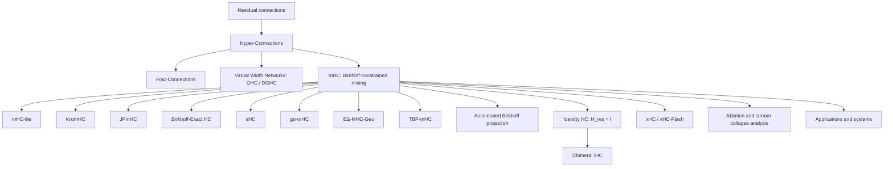

# Awesome Hyper-Connections

A curated and audited reading list for **Hyper-Connections (HC)**, **Manifold-Constrained Hyper-Connections (mHC)**, and closely related multi-residual-stream architectures.

本仓库聚焦 Zhu et al. 提出的 residual-stream Hyper-Connections 谱系：HC、Frac-Connections、GHC/DGHC、mHC、Identity HC/iHC、xHC，以及围绕流形约束、精确参数化、稳定性、系统优化、机制分析和下游应用的后续工作。

> **Last audited:** 2026-08-11  
> **Coverage:** 28 publication items under the inclusion policy below: 25 papers that directly develop, analyze, or materially apply HC/mHC, plus 3 adjacent/adoption papers kept in a separate section.  
> **Important limitation:** this is a high-confidence literature audit, not a claim of mathematically perfect exhaustiveness. Very new preprints can be delayed in search indexes, and papers that use HC only inside a large model may not mention it in the title or abstract.

## Contents

- [Inclusion policy](#inclusion-policy)
- [Background and notation](#background-and-notation)
- [Research lineage](#research-lineage)
- [1. Foundational and core architecture papers](#1-foundational-and-core-architecture-papers)
- [2. Direct mHC parameterizations, constraints, and systems work](#2-direct-mhc-parameterizations-constraints-and-systems-work)
- [3. Mechanistic and representation analysis](#3-mechanistic-and-representation-analysis)
- [4. Architectures, finetuning, inference, and domain applications](#4-architectures-finetuning-inference-and-domain-applications)
- [5. Adjacent and adoption papers](#5-adjacent-and-adoption-papers)
- [Identity HC / iHC provenance](#identity-hc--ihc-provenance)
- [Method comparison](#method-comparison)
- [Current frontier](#current-frontier)
- [Implementations](#implementations)
- [Contributing](#contributing)

## Inclusion policy

### Included in the main count

A paper is included when at least one of the following is true:

1. it proposes a new HC/mHC-family connection rule, constraint, parameterization, or systems implementation;
2. it directly analyzes the behavior of HC/mHC residual streams;
3. HC/mHC is a material architectural contribution in the paper rather than a passing baseline;
4. it adapts HC/mHC to a new training regime, inference algorithm, or application domain.

### Separated as adjacent/adoption

Papers are placed in the adjacent section when HC/mHC is important to the experiment or model, but the paper's main contribution is broader than hyper-connections.

### Excluded

- papers that only cite HC/mHC;
- unrelated uses of “hyperconnection,” “hyper-connected,” or “HC”;
- hypergraph, networking, neuroscience, and database papers that do not descend from the residual-stream formulation;
- blog posts, social-media experiments, and implementation notes without a formal paper. These may be mentioned for provenance, but are not counted as papers.

## Background and notation

A convenient generic form of the HC-family update is

```text
X_(l+1) = H_res,l X_l + H_post,l^T F_l(H_pre,l X_l),
```

where `X_l` contains `n` parallel residual streams:

- `H_pre` reads and aggregates information from the streams before the Transformer sublayer;
- `H_post` writes the transformed output back to the streams;
- `H_res` transports and mixes residual-stream states across depth.

The literature repeatedly revisits four questions:

1. How many residual streams should be maintained?
2. How should a sublayer read from and write to those streams?
3. What constraint on `H_res` prevents exploding, vanishing, or homogenizing matrix products?
4. How can expanded residual state and dynamic routing be implemented without becoming memory-bandwidth bound?

## Research lineage



## 1. Foundational and core architecture papers

| First public date | Paper | Contribution | Status |
|---|---|---|---|
| 2024-09-29 | **[Hyper-Connections](https://arxiv.org/abs/2409.19606)** — Defa Zhu et al. · [OpenReview](https://openreview.net/forum?id=9FqARW7dwB) | Introduces multiple residual streams and learnable/static or dynamic read, write, and residual-transition mappings. Motivated by the PreNorm/PostNorm trade-off between representation collapse and gradient vanishing. | ICLR 2025 |
| 2025-03-18 | **[Frac-Connections: Fractional Extension of Hyper-Connections](https://arxiv.org/abs/2503.14125)** — Defa Zhu et al. | Partitions an existing hidden state instead of expanding it to `nC`; retains part of HC's routing benefit with substantially lower hidden-state and memory-access overhead. This is the formal paper usually meant by “fraction-HC.” | arXiv preprint |
| 2025-11-14 | **[Virtual Width Networks](https://arxiv.org/abs/2511.11238)** — Seed et al. | Decouples virtual representation width from backbone width and develops generalized/dynamic generalized hyper-connections (GHC/DGHC) for routing between the expanded virtual state and fixed-width backbone. | arXiv preprint |
| 2025-12-31 | **[mHC: Manifold-Constrained Hyper-Connections](https://arxiv.org/abs/2512.24880)** — Zhenda Xie et al. · [later ICML/OpenReview version](https://openreview.net/forum?id=mDhyxu8WRb) | Constrains dynamic residual mixing to the Birkhoff polytope of doubly stochastic matrices through Sinkhorn-Knopp normalization and adds large-scale systems optimizations. | arXiv; ICML 2026 version |
| 2026-07-16 | **[xHC: Expanded Hyper-Connections](https://arxiv.org/abs/2607.14530)** — Xiangdong Zhang et al. | Makes residual-stream count a practical scaling axis beyond the common `N=4`: temporal feature augmentation enriches write-back, sparse updates modify `k=4` of `N=16` streams, and xHC-Flash reduces memory traffic. | arXiv technical report |
| 2026-07-30 | **[Chimera: Designing and Chinchilla-Scaling Hybrid Visual Diffusion Transformers](https://arxiv.org/abs/2607.28611)** — Chongjian Ge et al. | Formalizes and deploys **Identity Hyper-Connections (iHC)** in a visual diffusion Transformer: `H_res` is fixed to identity while adaptive cross-stream read/write remains. | arXiv preprint |

## 2. Direct mHC parameterizations, constraints, and systems work

| First public date | Paper | What changes relative to mHC? | Status |
|---|---|---|---|
| 2026-01-09 | **[mHC-lite: You Don't Need 20 Sinkhorn-Knopp Iterations](https://arxiv.org/abs/2601.05732)** — Yongyi Yang, Jianyang Gao | Replaces iterative Sinkhorn projection with an exact convex combination of permutation matrices. Double stochasticity holds by construction, but the complete permutation basis scales factorially with stream count. | arXiv preprint |
| 2026-01-29 | **[KromHC: Manifold-Constrained Hyper-Connections with Kronecker-Product Residual Matrices](https://arxiv.org/abs/2601.21579)** — Wuyang Zhou et al. · [OpenReview](https://openreview.net/forum?id=TI7Q2o6EIa) | Factorizes the residual mixer as Kronecker products of smaller doubly stochastic matrices, preserving exact constraints while reducing the stated parameter complexity from `O(n^3 C)` toward `O(n^2 C)`. | ICML 2026 |
| 2026-02-20 | **[JPmHC Dynamical Isometry via Orthogonal Hyper-Connections](https://arxiv.org/abs/2602.18308)** — Biswa Sengupta et al. | Controls Jacobian spectra using operator-norm-bounded manifolds, including bistochastic, Stiefel, and Grassmann variants; introduces Cayley-transform orthogonal mixing and implicit differentiation. | arXiv preprint |
| 2026-03-02 | **[Birkhoff-Exact Hyper-Connections: Exact Spectral Stability for Deep Residual Networks](https://openreview.net/forum?id=jpIjkN1B1Q)** — Hyunjun Kim | Uses exact Birkhoff-von Neumann mixtures rather than approximate Sinkhorn projection and studies spectral stability at extreme depth. | ICLR 2026 Sci4DL workshop |
| 2026-03-21 | **[Beyond the Birkhoff Polytope: Spectral-Sphere-Constrained Hyper-Connections](https://arxiv.org/abs/2603.20896)** — Zhaoyi Liu et al. | Proposes **sHC**, replacing the nonnegative Birkhoff polytope with a spectral-norm sphere. It permits negative/subtractive interactions, avoids Sinkhorn, and targets identity degeneration and expressivity limits. | arXiv preprint |
| 2026-04-02 | **[go-mHC: Direct Parameterization of Manifold-Constrained Hyper-Connections via Generalized Orthostochastic Matrices](https://arxiv.org/abs/2604.02309)** — Torque Dandachi, Sophia Diggs-Galligan | Gives an exact generalized-orthostochastic parameterization with `O(d^3)` scaling and a parameter that interpolates between an efficient boundary and fuller Birkhoff expressivity. | arXiv preprint |
| 2026-05-07 | **[The EΔ-MHC-Geo Transformer: Adaptive Geodesic Operations with Guaranteed Orthogonality](https://arxiv.org/abs/2605.06729)** — Arash Shahmansoori | Combines mHC, Cayley rotations, and a learned rotation/reflection gate to obtain input-adaptive orthogonal residual operators, including access to transformations excluded by a finite Cayley map. | Independent arXiv preprint |
| 2026-05-20 | **[TBP-mHC: Full Expressivity for Manifold-Constrained Hyper Connections through Transportation Polytopes](https://arxiv.org/abs/2605.21724)** — Anton Lyubinin | Introduces Transportation Birkhoff Polytope and recursive parameterizations with `(n-1)^2` degrees of freedom, aiming for exact double stochasticity and full Birkhoff-polytope expressivity without factorial enumeration. | arXiv preprint |
| 2026-05-26 | **[Accelerating Birkhoff Projection for Manifold-Constrained Hyper-Connections](https://arxiv.org/abs/2606.07574)** — Chenrui Wang, Yixuan Qiu | Specializes practical `4×4` projection to a low-dimensional dual problem, solves it with Newton's method, uses implicit differentiation, and implements a warp-level CUDA solver. | arXiv preprint |

## 3. Mechanistic and representation analysis

| First public date | Paper | Focus | Status |
|---|---|---|---|
| 2026-03-16 | **[Ablate and Rescue: A Causal Analysis of Residual Stream Hyper-Connections](https://arxiv.org/abs/2603.14833)** — William Peng et al. | Releases an open mHC language model and introduces stream-level ablation-and-rescue interventions to distinguish redundancy from asymmetric stream utilization. | arXiv preprint |
| 2026-06-02 | **[Analyzing Stream Collapse in Hyper-Connections: From Diagnosis to Mitigation](https://arxiv.org/abs/2606.03483)** — Ekaterina Alimaskina et al. | Finds residual mixers often remain close to identity while signal and interpretable features concentrate in a dominant stream; proposes symmetry-breaking initialization to improve utilization. | arXiv preprint |

## 4. Architectures, finetuning, inference, and domain applications

| First public date | Paper | HC/mHC role | Status |
|---|---|---|---|
| 2026-01-05 | **[mHC-GNN: Manifold-Constrained Hyper-Connections for Graph Neural Networks](https://arxiv.org/abs/2601.02451)** — Subhankar Mishra | Adapts Birkhoff-constrained multi-stream mixing to GNNs and studies over-smoothing, expressivity, and depth up to 128 layers. | arXiv preprint |
| 2026-01-22 | **[White-Box mHC: Electromagnetic Spectrum-Aware and Interpretable Stream Interactions for Hyperspectral Image Classification](https://arxiv.org/abs/2601.15757)** — Yimin Zhu et al. | Introduces ES-mHC, where residual streams correspond to physically meaningful electromagnetic-spectrum groups and structured interaction matrices expose information flow. | arXiv preprint |
| 2026-03-03 | **[mHC-HSI: Clustering-Guided Hyper-Connection Mamba for Hyperspectral Image Classification](https://arxiv.org/abs/2603.03418)** — Yimin Zhu et al. | Combines clustering-guided Mamba with mHC and interprets residual matrices as soft cluster-membership maps. The arXiv record explicitly notes text overlap with White-Box mHC. | arXiv preprint |
| 2026-03-20 | **[Hyper-Connections for Adaptive Multi-Modal MRI Brain Tumor Segmentation](https://arxiv.org/abs/2603.19844)** — Lokendra Kumar, Shubham Aggarwal | Uses dynamic HC as a drop-in residual replacement in several 3D segmentation architectures and analyzes modality-sensitive routing. | arXiv preprint |
| 2026-04-23 | **[Hyperloop Transformers](https://arxiv.org/abs/2604.21254)** — Abbas Zeitoun et al. | Adds hyper-connections at loop boundaries of recurrent/weight-tied Transformer blocks, targeting parameter-efficient language modeling with minimal extra cost. | arXiv preprint |
| 2026-06-25 | **[HyperDFlash: Hyper-Connection-Aligned Block Speculative Decoding with Gated Residual Reduction](https://arxiv.org/abs/2606.26744)** — Luxi Lin et al. | Designs a speculative drafter around the target model's multi-path HC residual state and reuses its HC head for lightweight gated reduction. | arXiv preprint |
| 2026-07-20 | **[Manifold-Constrained Hyper-Connections for Parameter-Efficient Finetuning](https://arxiv.org/abs/2607.18130)** — Valentijn Oldenburg et al. | Treats residual routing as a PEFT axis around frozen OLMo-2 backbones; reports that identity residual mixing often helps and that mHC+LoRA can outperform either alone in some settings. | arXiv preprint |
| 2026-08-06 | **[Beyond Residual Connections: Manifold-Constrained Hyper-Connections for Robust Speaker Representation Learning](https://arxiv.org/abs/2608.05549)** — Zezhong Jin et al. | Replaces residual connections with mHC in ECAPA-TDNN, ResNet-34, Res2Net, and E-Res2Net for speaker recognition. | arXiv preprint |

## 5. Adjacent and adoption papers

These papers are relevant, but are **not** treated as new HC-family connection rules.

| First public date | Paper | Why it is adjacent rather than core |
|---|---|---|
| 2026-01-30 | **[Avoiding Premature Collapse: Adaptive Annealing for Entropy-Regularized Structural Inference](https://arxiv.org/abs/2601.23039)** — Yizhi Liu | Studies annealing and Sinkhorn fixed-point stability, using mHC training as an important test case rather than proposing a new residual topology. |
| 2026-04-26 | **[DeepSeek-V4: Towards Highly Efficient Million-Token Context Intelligence](https://arxiv.org/abs/2606.19348)** — DeepSeek-AI | A major model report that adopts mHC as one of several architectural/optimization upgrades; important evidence of deployment, but not a new HC paper. |
| 2026-05-18 | **[SNLP: Layer-Parallel Inference via Structured Newton Corrections](https://arxiv.org/abs/2605.17842)** — Ligong Han et al. | Uses the residual mixing matrix of mHC-style architectures to define HC Newton corrections for layer-parallel inference; the main contribution is a broader numerical-solver framework. |

## Identity HC / iHC provenance

**Identity HC is a variant/ablation, not a standalone paper.**

1. The later ICML 2026 version of **[mHC](https://openreview.net/forum?id=mDhyxu8WRb)** contains an ablation named **Identity HC**.
2. Its defining simplification is

   ```text
   H_res,l = I
   ```

3. Dynamic/adaptive `H_pre` and `H_post` remain. Therefore, the sublayer can still read an input-dependent mixture of streams and write the result back with input-dependent weights. What disappears is the explicit `n×n` residual-state transition and its Sinkhorn projection.
4. **[Chimera](https://arxiv.org/abs/2607.28611)** later uses the full name **Identity Hyper-Connections (iHC)** and deploys the design as an architectural component.

Recommended citation convention:

- cite the later mHC/ICML version for the **Identity HC ablation provenance**;
- cite Chimera for the explicit **Identity Hyper-Connections (iHC)** terminology and its use in a model architecture.

Informal posts reporting large Identity-HC experiments are not counted as papers in this repository.

## Method comparison

| Method | Residual transition / constraint | Cross-stream interaction | State-width / systems profile | Main trade-off |
|---|---|---|---|---|
| Residual connection | Fixed identity | Single stream | `C` | Stable but rigid |
| HC | Unconstrained learned/dynamic `H_res` | Adaptive read, write, and residual mixing | About `nC` residual state | Expressive, but deep products can be unstable and memory traffic grows |
| Frac-Connections | Routing among hidden-state fractions | Interaction among partitions | About `C` residual state | Lower memory cost, but less virtual-width capacity |
| GHC / DGHC | Generalized carry/read/write maps | Flexible virtual-to-backbone routing | Configurable virtual width | General formulation; more routing machinery |
| mHC | Doubly stochastic `H_res` via Sinkhorn | Full residual mixing plus adaptive read/write | `nC` plus projection/routing overhead | Stable large-scale training, but projection and I/O add cost |
| mHC-lite / BE-HC | Exact Birkhoff construction | Full constrained residual mixing | Avoids iterative Sinkhorn; complete permutation bases can scale poorly | Exactness versus combinatorial basis size |
| KromHC | Kronecker-factorized exact doubly stochastic mixer | Structured residual mixing | Better stream-count scaling | Efficiency at the cost of factorized structure |
| go-mHC / TBP-mHC | Exact direct parameterizations | More complete Birkhoff coverage | No iterative Sinkhorn | Parameterization complexity and implementation maturity |
| JPmHC / EΔ-MHC-Geo | Orthogonal or spectrum-controlled manifolds | Rotation/reflection-style mixing | Geometry-dependent | Strong Jacobian/norm control with additional geometric machinery |
| sHC | Spectral-sphere constraint; negative entries allowed | Additive and subtractive mixing | Avoids Sinkhorn and permutation enumeration | More expressive feasible set under a different stability constraint |
| Identity HC / iHC | `H_res = I` | No direct residual-transition mixing; adaptive read/write remain | Removes dynamic `n×n` mixer and Sinkhorn | Simplicity and stability versus giving up explicit residual-stream exchange |
| xHC | Large-`N` sparse update with dense access | Rich read/write; subset of streams updated per layer | Demonstrated at `N=16`; xHC-Flash reduces memory traffic | Makes stream count scalable while retaining a wider persistent state |

## Current frontier

As of **2026-08-11**, the main research directions are:

- **Does learned residual mixing matter?** Identity HC/iHC and stream-collapse results suggest that adaptive read/write may provide much of the benefit even when `H_res` is identity or close to identity.
- **How should stability be imposed?** Birkhoff, permutation mixtures, Kronecker structure, orthogonal manifolds, spectral spheres, transportation polytopes, and identity transitions encode different assumptions about signal preservation and expressivity.
- **Can stream count become a genuine scaling axis?** xHC addresses the information and cubic-routing bottlenecks that prevented useful scaling beyond four streams.
- **Are all streams actually used?** Causal ablations and stream-collapse diagnostics reveal dominant-stream behavior and motivate symmetry-breaking or specialization mechanisms.
- **Can HC be hardware-efficient?** Projection solvers, fused kernels, sparse stream updates, recomputation, and HC-aware inference are increasingly central rather than secondary implementation details.

The newest direct application located in this audit is the speaker-representation paper submitted on **2026-08-06**. The newest core architecture items are **xHC** and **iHC/Chimera** in July 2026.

## Suggested reading order

1. **Hyper-Connections** — original motivation and multi-stream formulation.
2. **Frac-Connections** and **Virtual Width Networks** — memory-efficient and generalized virtual-width views.
3. **mHC** — instability of unconstrained products, Birkhoff constraints, and systems engineering.
4. **mHC-lite**, **KromHC**, **JPmHC**, **sHC**, **go-mHC**, and **TBP-mHC** — compare exactness, geometry, expressivity, and scaling.
5. **Ablate and Rescue** and **Analyzing Stream Collapse** — examine how residual streams are used in practice.
6. **Identity HC/iHC** and **xHC** — compare two recent extremes: eliminating residual mixing versus scaling to many streams.
7. Application and systems papers — evaluate transfer beyond LLM pre-training.

## Implementations

- [mHC-GNN](https://github.com/smlab-niser/mhc-gnn)
- [mHC-lite](https://github.com/FFTYYY/mhc-lite)
- [KromHC](https://github.com/wz1119/KromHC)
- [lucidrains/hyper-connections](https://github.com/lucidrains/hyper-connections) — independent PyTorch implementation covering multiple variants

Implementation links are listed for convenience. Inclusion does not imply that every repository is the official implementation of the corresponding paper.

## Contributing

Pull requests and issues are welcome. For a new entry, please include:

- exact title and authors;
- first public date and current venue/status;
- a primary source link, preferably arXiv, OpenReview, proceedings, project page, or an author repository;
- one or two sentences explaining how the work changes, analyzes, or materially uses HC/mHC;
- one category: core architecture, direct variant, systems, mechanistic analysis, application, or adjacent/adoption.

Please do not add a paper solely because it contains the word “hyperconnection” or cites arXiv:2409.19606 / arXiv:2512.24880. The residual-stream HC mechanism must be a material part of the work.
