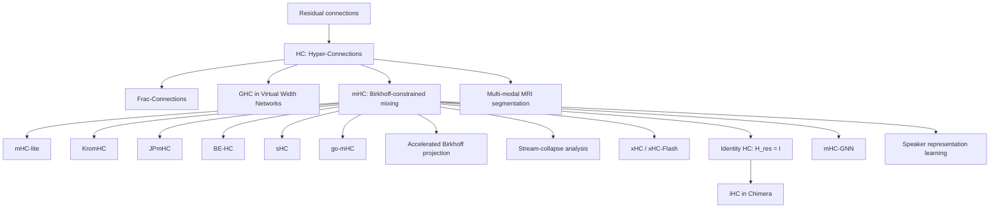

# Awesome Hyper-Connections

A curated reading list for **Hyper-Connections (HC)** and their descendants.

本仓库聚焦 Zhu et al. 提出的“多残差流（multi-residual-stream）Hyper-Connections”谱系，包括 HC、Frac-Connections、GHC、mHC、Identity HC/iHC、xHC，以及围绕稳定性、流形约束、精确参数化、系统优化、理论分析和下游应用的后续工作。

> **Last checked:** 2026-08-11  
> **Scope:** 这里的 HC 特指 residual-stream Hyper-Connections，不收录名称相同但与该架构谱系无关的 hyperconnection / hypergraph 文献。  
> **Naming note:** 社区口语中的 “fraction-HC” 通常指正式论文名 **Frac-Connections: Fractional Extension of Hyper-Connections**。

## Contents

- [Research lineage](#research-lineage)
- [Core architecture papers](#core-architecture-papers)
- [Stability, geometry, and exact parameterization](#stability-geometry-and-exact-parameterization)
- [Analysis and systems](#analysis-and-systems)
- [Applications](#applications)
- [Identity HC / iHC provenance](#identity-hc--ihc-provenance)
- [Method comparison](#method-comparison)
- [Suggested reading order](#suggested-reading-order)
- [Contributing](#contributing)

## Background

A convenient generic form of HC-family updates is

```text
X_(l+1) = H_res,l X_l + H_post,l^T F_l(H_pre,l X_l),
```

where `X_l` contains multiple residual streams:

- `H_pre` reads and aggregates information from the streams before the Transformer sublayer;
- `H_post` writes the sublayer output back to the streams;
- `H_res` transports and mixes residual-stream states across depth.

The research line can be understood as repeatedly revisiting four questions:

1. How many residual streams should be maintained?
2. How should the model read from and write to those streams?
3. What constraints should be imposed on `H_res` to avoid exploding, vanishing, or collapsing products?
4. How can the extra residual-state width and routing be implemented efficiently at scale?

## Research lineage



## Core architecture papers

| Date | Paper | Main contribution | Status / venue |
|---|---|---|---|
| 2024-09-29 | **[Hyper-Connections](https://arxiv.org/abs/2409.19606)** — Defa Zhu et al. · [OpenReview](https://openreview.net/forum?id=9FqARW7dwB) | Introduces multiple residual streams and learnable/dynamic `H_pre`, `H_post`, and `H_res`; targets the PreNorm/PostNorm trade-off between representation collapse and gradient vanishing. | ICLR 2025 Poster |
| 2025-03-18 | **[Frac-Connections: Fractional Extension of Hyper-Connections](https://arxiv.org/abs/2503.14125)** — Defa Zhu et al. | Splits the existing hidden state into fractions instead of expanding it to `n × C`; retains part of HC’s routing benefit while reducing memory-access and activation-width overhead. This is the formal work usually meant by “fraction-HC.” | arXiv preprint |
| 2025-11-14 | **[Virtual Width Networks](https://arxiv.org/abs/2511.11238)** — Seed et al. | Introduces **Generalized Hyper-Connections (GHC/DGHC)**, a formulation that unifies ideas from HC and Frac-Connections and routes between over-width hidden states and a fixed-width backbone. | arXiv preprint |
| 2025-12-31 | **[mHC: Manifold-Constrained Hyper-Connections](https://arxiv.org/abs/2512.24880)** — Zhenda Xie et al. · [ICML/OpenReview](https://openreview.net/forum?id=mDhyxu8WRb) | Constrains dynamic residual mixing to the Birkhoff polytope of doubly stochastic matrices using Sinkhorn–Knopp normalization; restores norm-controlled residual transport and adds large-scale systems optimizations. | ICML 2026 Spotlight |
| 2026-07-16 | **[xHC: Expanded Hyper-Connections](https://arxiv.org/abs/2607.14530)** — Xiangdong Zhang et al. | Scales residual-stream count beyond the common `N=4` regime: temporal feature augmentation enriches write-back; sparse updates modify only `k=4` of `N=16` streams; **xHC-Flash** reduces memory traffic. | Technical report / arXiv |
| 2026-07-30 | **[Chimera: Designing and Chinchilla-Scaling Hybrid Visual Diffusion Transformers](https://arxiv.org/abs/2607.28611)** — Chongjian Ge et al. | Uses and formalizes **Identity Hyper-Connections (iHC)** in a visual diffusion backbone: fixes `H_res = I` while preserving adaptive stream read/write, eliminating per-token residual mixing and Sinkhorn projection. | arXiv preprint |

## Stability, geometry, and exact parameterization

| Date | Paper | What changes relative to mHC? | Status / venue |
|---|---|---|---|
| 2026-01-09 | **[mHC-lite: You Don't Need 20 Sinkhorn-Knopp Iterations](https://arxiv.org/abs/2601.05732)** — Yongyi Yang, Jianyang Gao | Replaces iterative Sinkhorn projection with an exact convex combination of permutation matrices, guaranteeing double stochasticity by construction with standard matrix operations. | arXiv preprint |
| 2026-01-29 | **[KromHC: Manifold-Constrained Hyper-Connections with Kronecker-Product Residual Matrices](https://arxiv.org/abs/2601.21579)** — Wuyang Zhou et al. · [OpenReview](https://openreview.net/forum?id=TI7Q2o6EIa) | Factorizes the residual mixer into Kronecker products of smaller doubly stochastic matrices; preserves exact constraints while reducing the stated parameter complexity from `O(n^3 C)` toward `O(n^2 C)`. | ICML 2026 Poster |
| 2026-02-20 | **[JPmHC Dynamical Isometry via Orthogonal Hyper-Connections](https://arxiv.org/abs/2602.18308)** — Biswa Sengupta et al. | Controls Jacobian conditioning using operator-norm-bounded manifolds, including bistochastic, Stiefel, and Grassmann variants; includes Cayley-transform orthogonal mixing and spectral analysis. | arXiv preprint |
| 2026-03-02 | **[Birkhoff-Exact Hyper-Connections: Exact Spectral Stability for Deep Residual Networks](https://openreview.net/forum?id=jpIjkN1B1Q)** — Hyunjun Kim | Constructs exactly doubly stochastic mixers through Birkhoff–von Neumann combinations rather than approximate Sinkhorn projection; studies extreme-depth stability. | ICLR 2026 Workshop Sci4DL |
| 2026-03-21 | **[Beyond the Birkhoff Polytope: Spectral-Sphere-Constrained Hyper-Connections](https://arxiv.org/abs/2603.20896)** — Zhaoyi Liu et al. | Moves from a nonnegative Birkhoff polytope to a spectral-norm sphere. The resulting **sHC** permits negative/subtractive interactions, avoids Sinkhorn, and targets identity degeneration and expressivity limits. | arXiv preprint |
| 2026-04-02 | **[go-mHC: Direct Parameterization of Manifold-Constrained Hyper-Connections via Generalized Orthostochastic Matrices](https://arxiv.org/abs/2604.02309)** — Torque Dandachi, Sophia Diggs-Galligan | Gives an exact generalized-orthostochastic parameterization with `O(d^3)` scaling and an interpolation parameter controlling the efficiency–expressivity trade-off; can be composed with Kronecker factorization. | arXiv preprint |

## Analysis and systems

| Date | Paper | Focus | Status |
|---|---|---|---|
| 2026-05-26 | **[Accelerating Birkhoff Projection for Manifold-Constrained Hyper-Connections](https://arxiv.org/abs/2606.07574)** — Chenrui Wang, Yixuan Qiu | Specializes the practical `4 × 4` projection to a three-dimensional dual problem, applies Newton’s method and implicit differentiation, and implements a warp-level CUDA solver. | arXiv preprint |
| 2026-06-02 | **[Analyzing Stream Collapse in Hyper-Connections: From Diagnosis to Mitigation](https://arxiv.org/abs/2606.03483)** — Ekaterina Alimaskina et al. | Diagnoses dominant-stream behavior, residual mixers staying close to identity, and under-use of nominal multi-stream capacity; proposes symmetry-breaking initialization to improve stream diversity. | arXiv preprint |

## Applications

| Date | Paper | Domain and finding | Status / venue |
|---|---|---|---|
| 2026-01-05 | **[mHC-GNN: Manifold-Constrained Hyper-Connections for Graph Neural Networks](https://arxiv.org/abs/2601.02451)** — Subhankar Mishra | Adapts Birkhoff-constrained multi-stream mixing to GNNs; analyzes over-smoothing and expressivity and evaluates depths up to 128 layers. | arXiv preprint |
| 2026-03-20 | **[Hyper-Connections for Adaptive Multi-Modal MRI Brain Tumor Segmentation](https://arxiv.org/abs/2603.19844)** — Lokendra Kumar, Shubham Aggarwal | Uses dynamic HC as a drop-in residual replacement across several 3D segmentation architectures and studies modality-sensitive routing. | arXiv preprint |
| 2026-07-30 | **[Chimera](https://arxiv.org/abs/2607.28611)** — Chongjian Ge et al. | Applies iHC inside a hybrid long-context visual diffusion Transformer combining KDA, MLA, convolution, and sparse MoE components. | arXiv preprint |
| 2026-08-06 | **[Beyond Residual Connections: Manifold-Constrained Hyper-Connections for Robust Speaker Representation Learning](https://arxiv.org/abs/2608.05549)** — Zezhong Jin et al. | Replaces residual connections with mHC in ECAPA-TDNN, ResNet-34, Res2Net, and E-Res2Net for speaker recognition on VoxCeleb1. | INTERSPEECH 2026 |

## Identity HC / iHC provenance

**Identity HC is currently best treated as a variant/ablation, not as a standalone paper.**

1. The later **ICML 2026 version of [mHC](https://openreview.net/forum?id=mDhyxu8WRb)** contains an ablation named **Identity HC**.
2. Its defining simplification is to fix the residual-stream transition to the identity matrix:

   ```text
   H_res,l = I
   ```

   The dynamic/adaptive `H_pre` and `H_post` pathways are retained, so the model can still aggregate information across streams before a sublayer and distribute the transformed output back afterward. What is removed is the explicit per-layer residual-state mixing performed by `H_res`.
3. **[Chimera](https://arxiv.org/abs/2607.28611)** later gives the full name **Identity Hyper-Connections (iHC)**, dedicates a method subsection to it, and deploys it as an architectural component.

Therefore, a careful citation convention is:

- cite the later mHC/ICML version for the **Identity HC ablation provenance**;
- cite Chimera for the explicit **Identity Hyper-Connections (iHC)** terminology and its use as a named architecture component.

This distinction avoids incorrectly presenting Chimera as the first appearance of the Identity HC idea.

## Method comparison

| Method | Residual transition / constraint | Cross-stream interaction | State-width / systems profile | Main trade-off |
|---|---|---|---|---|
| Residual connection | Fixed identity | Single stream | `C` | Stable but rigid |
| HC | Unconstrained learned/dynamic `H_res` | Read, write, and residual mixing | Approximately `nC` residual state | Expressive, but deep products can become unstable |
| Frac-Connections | Fractional routing inside the original width | Interaction among hidden-state partitions | Approximately `C` residual state | Lower memory cost, but only partial virtual-width benefit |
| GHC / DGHC | Generalized carry/read/write matrices | Flexible routing between virtual and backbone states | Configurable fractional or expanded virtual width | Broader formulation; implementation is more general than standard HC |
| mHC | Doubly stochastic `H_res` via Sinkhorn | Full residual mixing plus adaptive read/write | `nC` plus projection and routing overhead | Stronger stability, but projection and memory traffic add cost |
| mHC-lite / BE-HC | Exact Birkhoff construction | Full constrained residual mixing | Avoids iterative Sinkhorn; permutation basis may scale poorly with stream count | Exactness versus basis/parameter growth |
| KromHC | Kronecker-factorized exact doubly stochastic mixer | Structured residual mixing | Better scaling in `n` | Efficiency gains at the cost of restricted factorized structure |
| JPmHC | Orthogonal or other spectrum-controlled manifolds | Structured residual mixing | Projection/parameterization dependent | Explicit Jacobian conditioning, more geometric machinery |
| sHC | Spectral-sphere constraint; negative entries allowed | Additive and subtractive mixing | No Sinkhorn/permutation enumeration | More expressive feasible set, with different stability assumptions |
| Identity HC / iHC | `H_res = I` | No residual-transition mixing; adaptive read/write remain | Removes `n × n` dynamic residual mixer and Sinkhorn | Maximum simplicity/stability, but gives up direct residual-stream exchange |
| xHC | Large-`N` sparse update with dense access; xHC-Flash kernel design | Rich read/write with only a subset of streams updated each layer | Demonstrated at `N=16`; optimized memory traffic | Makes residual-stream count a scaling axis, but retains a wider persistent state |

## Current frontier

As of **2026-08-11**:

- the newest method-level directions in this list are **xHC/xHC-Flash** for large residual-stream counts and **iHC** for eliminating learned residual-state transitions;
- the newest application paper located is the **INTERSPEECH 2026** speaker-representation work submitted on 2026-08-06;
- a central open question is whether performance gains primarily require learned residual mixing, or whether adaptive read/write over independently preserved streams is sufficient;
- another open question is how to scale the stream count without letting memory traffic, routing generation, or stream collapse erase the theoretical capacity gain.

## Suggested reading order

1. **Hyper-Connections** — learn the original multi-stream formulation and the PreNorm/PostNorm motivation.
2. **Frac-Connections** and **Virtual Width Networks** — understand memory-efficient and generalized virtual-width formulations.
3. **mHC** — study why unconstrained residual-matrix products are unstable and why the Birkhoff polytope is introduced.
4. **mHC-lite**, **KromHC**, **JPmHC**, **sHC**, and **go-mHC** — compare alternative notions of exactness, geometry, efficiency, and expressivity.
5. **Analyzing Stream Collapse in Hyper-Connections** — examine whether the extra streams are actually used as intended.
6. **xHC** and the **Identity HC/iHC** discussion — compare the two recent extremes: expanding the number of streams versus removing residual-stream mixing entirely.
7. The application papers — evaluate how well HC-family mechanisms transfer beyond LLM pre-training.

## Implementations mentioned by the papers

- [mHC-GNN](https://github.com/smlab-niser/mhc-gnn)
- [mHC-lite](https://github.com/FFTYYY/mhc-lite)
- [KromHC](https://github.com/wz1119/KromHC)
- [lucidrains/hyper-connections](https://github.com/lucidrains/hyper-connections) — independent PyTorch implementation covering several HC variants

Implementation links are listed for convenience; inclusion does not imply that every repository is an official implementation by the corresponding paper authors.

## Contributing

Pull requests and issues are welcome. For a new entry, please include:

- exact paper title and authors;
- first public date and current venue/status;
- primary source link, preferably arXiv, OpenReview, proceedings, project page, or author repository;
- one or two sentences explaining how the work changes or analyzes the HC family;
- whether the item is a core architecture paper, theoretical/system analysis, application, workshop paper, or informal technical note.

Please avoid adding papers that merely contain the word “hyperconnection” but do not descend from the residual-stream HC formulation introduced in arXiv:2409.19606.
